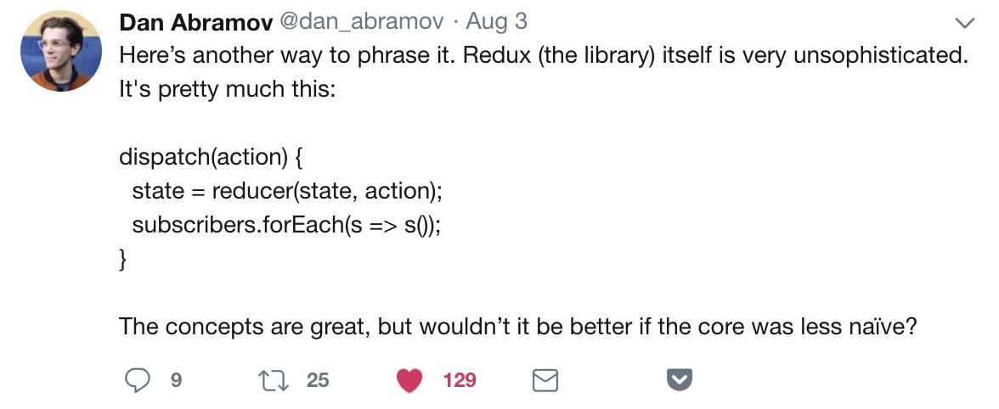

# Redux - бойлерплейт

Для начала разберем высказывания двух авторов Redux, которые сейчас работают в Facebook над ядром React'а.

## Andrew Clark: Что мы упустили?


> Redux - это простой EventEmitter c непропорционально крутой экосистемой инструментов, построенных на нем. Интересно, каковы издержки альтернативных возможностей этой экосистемы (какие возможности мы упустили). Представьте если бы они были построены на чем-то более мощном, например React'е.

А ведь действительно, какие возможности мы профукали? Что мы потеряли выбрав Redux, а не что-то другое? Может быть другая библиотека дала бы нам больше возможностей и потребовала меньшего написания кода? И сейчас, возможно, у Vue было бы в разы меньше звездочек.

## Dan Abramov: А надо ли что-то усложнять?


> Redux по сути очень прост. И его концепт великолепен. Но стало бы лучше, если ядро было менее примитивным? Сейчас его можно описать так:

```js
dispatch(action) {
  state = reducer(state, action);
  subscribers.forEach(s => s());
}
```

Меняем стейт через экшн и интерфейс магическим образом перерисовывается. Да, у редакса есть trade-offы - по дизайну требуется описывать стейт и его изменения как простые объекты и описывать логику простыми функциями. Действительно, куда проще? Ведь народ может дописать всякие помогайки под свои задачи. Вон как здорово Vue написали (сарказм). На самом деле, надо просто сильно взвесить подходит ли вам этот инструмент или нет. Вот есть хорошая статья от Дэна <https://medium.com/@dan_abramov/you-might-not-need-redux-be46360cf367>

## Давайте посмотрим на проблемы со стороны девелоперского опыта при работе с Redux

В августе 2018 я проводил опрос про redux. Спасибо всем кто принял в нем участие. Вопросы и ответы доступны по следующей ссылке  <https://docs.google.com/forms/d/1i7B3-61qmd5kC53qVG8aWrteyXU7gN2ffAPy_JLPxz8/edit#responses>
В двух словах, у половины любовь с Redux'ом и все хорошо, у другой половины отторжение.

Давайте пройдемся по жалобам и проблемам:

Первым делом все жалуются на обезьянство "добавь константу, добавь экшен, добавь обработку в редюсер". И действительно, самая большая боль в написании кучи кода. А когда у вас много кода, его долго читать, больше мест ошибиться и сложнее проводить рефакторинг. Но с другой стороны кто-то видит в этом хорошее разделение логики от представления и получает больше плюсов, чем минусов.

Вторая острая проблема в грамотном построении Стора. Советуют держать нормализованный стейт, не дублировать данные, бить редьюсеры на маленькие, переиспользовать action'ы в разных редьюсерах (1 action !== 1 handler в редьюсере). Мы все люди и с первого раза идеальный стор получить сложно. Всегда приходится что-то докручивать и изменять и рефакторить в последствии кучу кода.  

Третья проблема - это работа с сервером. Данные надо правильно переваривать и складывать в стор. В любом случае, для работы с сервером надо городить что-то свое и хорошо покрывать тестами.

Если что-то поменялось - структура стора или ответы сервера, то без тестов и статического анализа будет очень тяжело поправить код. Статический анализ - это проверка кода на корректность чтения/записи переменных и вызова функций без реального запуска кода. Он сильно помогает в рефакторинге. Прям реально сильно. Так вот, чтоб редакс хорошо покрыть типами, еще потребуется написать тележку кода к уже имеющемуся вагону.

Сам Redux прост и красив. Всю сложность мы уже сами накручиваем поверх него, а потом дружно жалуемся на бойлерплейт и проблемы со стором. Ну коль жалуемся, значит можно попробовать что-то другое, что будет приносить больше радости при решении наших задач.

## А что если с сервером и стором работать по другому?

Предположим ваше клиентское приложение работает с сервером у которого куча ендпоинтов с ресурсами. Периодически в АПИ на сервере может что-то меняться и добавляться. Как избежать ада с написанием и поддержкой кучи кода, который мы вынуждены писать с Redux?

Что если для работы с сервером существует что-то более удобное чем Redux/Flux? Да, такие инструменты уже существуют. Это фейсбуковский [Relay](https://facebook.github.io/relay/), которому уже больше 3 лет. И его более гибкий сommunity driven клон - [Apollo Client](https://www.apollographql.com/docs/react/). Они занимаются обслуживанием Store на клиентской стороне и выполнением сетевых запросов к серверу. Помимо этого Relay и Apollo сильно и очень удобно заточены под компонентный подход. Благодаря этому в них нет никаких редьюсеров, констант и экшенов. И даже проектировать Store вам не нужно. Все это удалось избежать благодаря более формализованному и гибкому АПИ - [GraphQL](https://graphql.org/). А самое главное Relay и Apollo используют интроспекцию GraphQL (его схему) для автоматической генерации тайпингов для Flow/Typescript согласно запрошенным данным с сервера. Если есть ошибки в запросе или отображении полученных данных, то вы сразу получите их на этапе разработки, а не в рантайме.

GraphQL - это новый язык запросов данных с сервера, приходящий на смену REST API. За последние три года GraphQL набрал огромную популярность за бугром. Сейчас его используют Facebook, GitHub, Shopify, KLM, PayPal, The New York Times, Twitter, Coursera, Atlassian и [другие](https://graphql.org/users/). GraphQL позволяет делать вложенные запросы, поддерживает аргументы, фрагменты, выбор полей в ответе, есть полиморфизм, есть документация и статически типизирован. О сравнении Swagger и GraphQL можно [почитать здесь](../swagger/README.md).

Если ваше приложение активно работает с сервером, и бекендеры могут предоставить вам GraphQL API - то однозначно берите [Apollo Client](https://www.apollographql.com/docs/react/) вместо Redux.

## Relay/ApolloClient

Исторически сложилось так, что с `Relay` я с тех времен, когда `Apollo` еще не было. Поэтому мой пример будет на `Relay`. На текущий момент развития они сильно похожи, и у каждого есть свои небольшие плюшки. Но суть компонентного подхода (описание компонентов и GraphQL фрагментов) у них шайба в шайбу.

Пример рабочего приложения на React/Relay/GraphQL можно [потыкать здесь](https://nodkz.github.io/relay-northwind/#/), а исходный код [посмотреть тут](https://github.com/nodkz/relay-northwind-app).

Основная магия компонентного подхода с GraphQL заключается в том, что при описании самого [компонента](https://github.com/nodkz/relay-northwind-app/blob/master/src/app/Address.js) вы тут же описываете фрагмент данных, который необходимо будет запросить с сервера перед его рендерингом. Также здесь прикручен статический анализ через Flowtype - пропса `address` описывается типом `Address_address`. Этот тип автоматически генерируется утилитой `relay-compiler` исходя из вашего GraphQL фрагмента. Если вы из пропсы `address` попытаетесь считать несуществующее поле (которое НЕ запросили с сервера) или некорректно его использовать (поделить строку на 10), то Flowtype отрапортует об статической ошибке.

```js
/* @flow */

import React from 'react';
import { createFragmentContainer, graphql } from 'react-relay';
import type { Address_address } from './__generated__/Address_address.graphql';

type Props = {
  address: ?Address_address,
};

class Address extends React.Component<Props> {
  render() {
    const { address } = this.props;
    if (!address) return null;

    return (
      <div>
        {address.street}
        <br />
        {address.city}, {address.region || ''} {address.postalCode}, {address.country}
        <br />
        {address.phone && (
          <span>
            <abbr title="Phone">P:</abbr> {address.phone}
          </span>
        )}
      </div>
    );
  }
}

export default createFragmentContainer(
  Address,
  graphql`
    fragment Address_address on CustomerAddress {
      street
      city
      region
      postalCode
      country
      phone
    }
  `
);
```

Выше был описан компонент `Address`, а теперь давайте посмотрим как его можно использовать в другом компоненте [Customer](https://github.com/nodkz/relay-northwind-app/blob/master/src/app/customers/Customer.js). Для этого необходимо просто импортировать компоненту `Address` и в проперти `address` правильно передать данные из фрагмента `Customer_customer`. А чтобы корректные данные появились в этом фрагменте, мы должны на типе `Customer` запросить поле с адресом и передать в него необходимый фрагмент `...Address_address`. Т.е. в компоненте `Customer` не указываются какие конкретно поля нужно запросить с сервера для отрисовки адреса. Мы просто передали инструкцию того, что когда запрашивается Customer, нужно спуститься на уровень ниже в компоненту `Address` и запросить необходимые для нее поля. Это очень удобно, когда компонента `Address` используется у вас в других частях приложения (для [Employee](https://github.com/nodkz/relay-northwind-app/blob/master/src/app/employees/Employee.js), [Order](https://github.com/nodkz/relay-northwind-app/blob/master/src/app/orders/Order.js), [Supplier](https://github.com/nodkz/relay-northwind-app/blob/master/src/app/suppliers/Supplier.js)) - если вы вдруг решите поменять набор необходимых полей с сервера для отрисовки `Address`, то вам не нужно будет ходить по всем родительским компонентам и менять в них запросы. Достаточно отредактировать файл `Address.js`.

```js
/* @flow */

import React from 'react';
import { createFragmentContainer, graphql } from 'react-relay';
import Address from 'app/Address';
import type { Customer_customer } from './__generated__/Customer_customer.graphql';

type Props = {
  customer: ?Customer_customer,
};

class Customer extends React.Component<Props> {
  render() {
    const { customer } = this.props;

    if (!customer) return <div>no customer data</div>;

    return (
      <div className="bordered">
        <dl className="dl-horizontal">
          <dt>CustomerID</dt>
          <dd>{customer.customerID}</dd>

          <dt>CompanyName</dt>
          <dd>{customer.companyName}</dd>

          <dt>ShipAddress</dt>
          <dd>
            <Address address={customer.address} />
          </dd>
        </dl>
      </div>
    );
  }
}

export default createFragmentContainer(
  Customer,
  graphql`
    fragment Customer_customer on Customer {
      customerID
      companyName
      address {
        ...Address_address
      }
    }
  `
);
```

Ну а для того чтобы отрисовать страницу заказчика по id, нам необходимо отправить запрос на GraphQL сервер и полученные данные передать в компоненту `Customer`. В Relay запросом данных занимается компонента `QueryRenderer`, а в Apollo  - `Query`. В эти компоненты передается корневой GraphQL-запрос и необходимые переменные. В пропсе `render` передается метод для отрисовки полученных данных (когда идет запрос, когда получена ошибка или когда успешно получены данные).

Загрузка заказчика по ID может выглядеть таким образом:

```js
/* @flow */

import * as React from 'react';
import { QueryRenderer, graphql } from 'react-relay';
import Customer from './Customer';
import BrokenPage from './BrokenPage';
import LoadingPage from './LoadingPage';

export default function LoadCustomer(customerId: string) {
  return (
    <QueryRenderer
      environment={relayEnv}
      query={graphql`
        query LoadCustomerQuery($_id: MongoId!) {
          customerById(_id: $_id) {
            ...Customer_customer
          }
        }
      `}
      variables={{ _id: customerId }}
      render={({ error, props }) => {
        if (error) {
          return <BrokenPage message={error.message} />;
        } else if (props) {
          return <Customer customer={props.customerById} />;
        }
        return <LoadingPage />;
      }}
    />
  );
}
```

Компонент `QueryRenderer` не только запрашивают данные, но и следит за изменением данных в своем внутреннем сторе. Теперь если произойдут какие-либо изменения в адресе, то HOC `createFragmentContainer` в компоненте `Address` запустит перерисовку с новыми данными. Также это работает в Apollo. И это очень похоже на то, как работает `connect` c Redux.

## В сухом остатке

Выглядит какой-то магией. Но вспомните себя, когда начинали работать с редаксом... Вся магия со временем улетучивается, когда начинаете лучше понимать инструмент.

Из примера выше (при работе с Relay/Apollo):

- **Мы не строили Store.** Стор строится автоматически на основе типизированной схемы данных, которые бэкендеры заложили в свой GraphQL на сервере. Все ваши компоненты привязаны к `типам` и `фрагментам`.
- **Мы не писали никакой прослойки к АПИ.** Никаких редаксовских редьюсеров, экшенов и миддлеваров. Из-за того что у нас GraphQL и единый endpoint, Relay/Apollo - знают как запрашивать данные и складировать их в сторе.
- **Малой кровью получили глубокий статический анализ.** Клиентское приложение строго проверяется с типами, которые объявлены на сервере. Стоит бэкендерам что-то зарефакторить в АПИ, вы тут же поймете какие конкретно компоненты у вас сломаются. Но для этого нужно использовать `Flowtype`/`Typescript` c `relay-compiler`/`apollo-cli`.

Неужели все так хорошо? Неее, своих минусов тоже хватает:

- Менять данные в сторе без взаимодействия с сервером станет чуть сложнее.
- Логику вычислений придется писать в компонентах (притянутый за уши минус. Положили логику в отдельный файл и импортировали его).
- Что-то придумывать свое с чисто клиентскими данными, которых нет на сервере и в работе накликиваются клиентом. У Аполло есть решение расширять на клиентской стороне GraphQL типы; но у меня не зашло.

## Дополнительные ссылки

- Хороший доклад от Вячеслава Слинько [GraphQL and Relay](https://www.youtube.com/watch?v=3Sl1Nf81dXY) - доклад 2016 года, но актуальность не потерял. Правда с тех пор сильно вырос Apollo с более лучшей документацией, комьюнити и теми же принципами работы, что и у Relay.
- Есть хорошие ссылки? Пожалуйста, добавьте через пулл-реквест.
