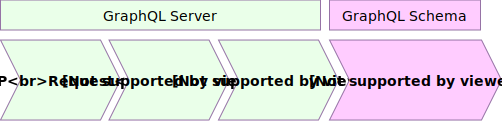

# Section #3

# АВТОРИЗАЦИЯ

-----

## Auth flow diagram

 <!-- .element: style="width: 90vw;" class="plain"  -->
<!-- https://drive.google.com/file/d/1G-Iu_fZdrois9NZY1-5YGWNwELJEzy6Y/view?usp=sharing -->

-----

### Но сперва вспомним, что такое...

|                    | <!-- .element: class="fragment" data-fragment-index="1" -->|
|--------------------|----------------------|
| **Аутентификация** | процедура проверки подлинности пользователя путём сравнения введённого им логина и пароля. <!-- .element: class="fragment" data-fragment-index="1" --> |
| **Идентификация**  | процедура распознания пользователя по токену, сессии или кукам. <!-- .element: class="fragment" data-fragment-index="1" --> |
| **Авторизация**    | процедура проверки прав доступа к ресурсам на выполнение определённых действий. <!-- .element: class="fragment" data-fragment-index="1" --> |

-----

## 1. Аутентификация — Sign In

- **Без GraphQL**
  - отправляем логин/пароль через старый добрый POST, получаем токен
  - используем OAuth, получаем токен

- **Через GraphQL**
  - крутим query или mutation, через аргументы передаем логин/пароль в респонсе получаем токен; плюс сразу можем получить вагон данных

-----

## В результате Аутентификации должен быть ТОКЕН

-----

## 2. Идентификация — JWT, cookie

<br/>

### В мире GraphQL для генерации токенов сильно прижился [JWT](https://jwt.io/)

<br/>

Читать про JSON Web Token в [википедии](https://ru.wikipedia.org/wiki/JSON_Web_Token).

-----

#### JWT-токен состоит из:

<p style="font-size: 1.2em; font-weight: bold;">
<span style="color: #00b9f1" class="fragment" data-fragment-index="1">header</span>.<span style="color: #d63aff" class="fragment" data-fragment-index="2">payload</span>.<span style="color: #fb015b" class="fragment" data-fragment-index="3">sign</span>
</p>

**Наример:**

<span style="color: #00b9f1" class="fragment" data-fragment-index="1">eyJhbGciOiJIUzI1NiIsInR5cCI6IkpXVCJ9.</span>
<br/><span style="color: #d63aff" class="fragment" data-fragment-index="2">eyJzdWIiOjEsImlhdCI6MTU0MTI1MDE2M30.</span>
<br/><span style="color: #fb015b" class="fragment" data-fragment-index="3">M7xYg8GuEgwbqTrta0xnN7WmNEXOCKiQGDdogt_Kduk</span>

**Внутрянка:**

<span style="color: #00b9f1" class="fragment" data-fragment-index="1">base64({ "alg": "HS256", "typ": "JWT" }).</span>
<br/><span style="color: #d63aff" class="fragment" data-fragment-index="2">base64({ "sub": 1, "iat": 1541250163 }).</span>
<br/><span style="color: #fb015b" class="fragment" data-fragment-index="3">HMACSHA256(base64UrlEncode(header) + "." + base64UrlEncode(payload), JWT_SECRET_KEY)</span>

-----

## C JWT легко работать на сервере

```js
import jwt from 'jsonwebtoken';

const JWT_SECRET_KEY = 'qwerty ;)';

// Генерация токена
const token = jwt.sign({ sub: 2 }, JWT_SECRET_KEY);

// Проверка токена
const payload = jwt.verify(token, JWT_SECRET_KEY);
// { "sub": 1, "iat": 1541250163 }
// sub - это subject, например id пользователя
// iat - это время генерации токена
// а еще есть `iss`, `aud`, `exp`, `nbf`, `jti` - смотри спеку

```

-----

## Где хранить ТОКЕН на клиенте?

<br />

- `Если браузер` — то в куках с флагом httpOnly
  - делается только бэкендером, фронтендеру ничего делать не нужно <!-- .element: class="fragment" -->
  - если фронтендер в браузере хоть как-то сохранит токен, то привет XSS ☠️ <!-- .element: class="fragment" -->
- `Если мобильное приложение` — то в "AsyncStorage"
  - передаем токен через HTTP-заголовки с каждым запросом <!-- .element: class="fragment" -->

-----

## ☝️ Пссс, Бэкендер! ☝️

### Ты должен:

- уметь принимать и ставить токен через httpOnly куки
- а если там пусто, то посмотреть в HTTP-заголовках
- иначе Индетификация не прошла и перед тобой аноним 👻

-----

## 3. Авторизация — Прикручиваем ACL

Ее можно и нужно настраивать на следующих уровнях:

- на уровне сервера (apollo, express, koa и пр.)
- на уровне GraphQL-схемы (глобально на первых полях схемы)
- на уровне полей (в resolve методах)
- на уровне связей между типами (в resolve методах)

-----

## 3.1. Авторизация на уровне сервера (apollo, express, koa и пр.)

- считать токен из кук, либо заголовков
- провалидировать токен и произвести индетификацию пользователя
- передать пользователя в `context` graphql
- либо завернуть запрос, если токен невалиден или пользователь забанен

-----

### Пишем функцию помогайку получения пользователя из реквеста:

```js
async function getUserFromReq(req: $Request) {
  const token = req?.cookies?.token || req?.headers?.authorization;
  if (token) {
    const payload = jwt.verify(token, JWT_SECRET_KEY);
    const userId = payload?.sub;
    if (userId) {
      const user = await users.find(userId);
      if (user) {
        if (user.isBanned) throw new Error('Looser!');
        return user;
      }
    }
  }
  return null;
}

```

<span class="fragment" data-code-focus="2" />
<span class="fragment" data-code-focus="4" />
<span class="fragment" data-code-focus="7" />
<span class="fragment" data-code-focus="9,10,14" />

-----

### Ну и на сервере формируем GraphQL-контекст

```js
const server = new ApolloServer({
  schema,
  context: async ({ req }) => {
    let user;
    try {
      user = await getUserFromReq(req);
    } catch (e) {
      throw new AuthenticationError('You provide incorrect token!');
    }
    const hasRole = (role) => { // Примитивный RBAC
      if (user && Array.isArray(user.roles)) return user.roles.includes(role);
      return false;
    }
    return { req, user, hasRole };
  },
});

```

<span class="fragment" data-code-focus="3" />
<span class="fragment" data-code-focus="6" />
<span class="fragment" data-code-focus="8" />
<span class="fragment" data-code-focus="10-13" />
<span class="fragment" data-code-focus="14" />

- `req`, `user` и `hasRole` будут доступны во всех резолверах вашей схемы: **_resolve(source, args, `context`, info)_**
- Новый контекст формируется для каждого http-запроса

-----

## 3.2. Авторизация на уровне GraphQL-схемы

## (глобально на верхних полях схемы)

-----

## Это когда на первом уровне в `Query` размещаются  так называемые namespace-типы.

## Еще их можно назвать поля-роли `viewer`, `me`, `admin` и пр.

-----

```graphql
query {
  viewer { # любые пользователи имееют доступ к получению данных
    getNews
    getAds
  }
  me { # здесь отображаются данные только для текущего пользователя
    nickname
    photo
  }
  admin { # а здесь методы, которые доступны только админам
    shutdown
    exposePersonalData
  }
}

```

Тоже самое можно применить к мутациям.

-----

## Как это работает?

### Если resolve-метод для поля вернул null, undefined или выбросил ошибку, то обработка вложенных полей не происходит.

-----

```js
const AdminNamespace = new GraphQLObjectType({
  name: 'AdminNamespace',
  fields: () => ({
    shutdown: { ... },
    exposePersonalData: { ... },
  }),
});

const Query = new GraphQLObjectType({
  name: 'Query',
  fields: () => ({
    viewer: { ... },
    me: { ... },
    admin: {
      type: AdminNamespace,
      resolve: (_, __, context) => {
        if (context.hasRole('ADMIN')) {
          // LIFEHACK: возвращаем пустой объект
          // чтоб GraphQL вызвал resolve-методы у вложенных полей
          return {};
        }

        // А теперь у нас два варианта. Либо выбросить ошибку:
        throw new Error('Hey, пошел прочь от советской власти!');

        // Либо тихо вернуть пустышку в ответе для поля `admin`
        // и не выполнять никакие вложенные резолверы
        return null;
      },
    },
  }),
});

```

<span class="fragment" data-code-focus="1-7" />
<span class="fragment" data-code-focus="12-14" />
<span class="fragment" data-code-focus="15-16" />
<span class="fragment" data-code-focus="17-21" />
<span class="fragment" data-code-focus="23-24" />
<span class="fragment" data-code-focus="26-28" />

-----

Неймспейсы еще хороши тем, что позволяют красиво нарезать ваше API и не делать из него помойку (как например это делает Prisma).

-----

 <!-- .element:  style="max-height: 80vh;" class="plain"  -->

-----

## 3.3. Авторизация на уровне полей

## (в resolve-методах)

-----

### Когда у вас в `context` есть информация о текущем пользователе и его роли, то можно настроить авторизацию для конкретных полей.

-----

### Дано:

У нас есть Пользователь и мы храним <br/> его последний IP-адрес в поле `lastIp`.

<br/>

### Задача:

Разрешить отображение ip-адреса <br/> только админу и самому пользователю.

-----

```js
const UserType = new GraphQLObjectType({
  name: 'User',
  fields: () => ({
    name: {
      type: new GraphQLNonNull(GraphQLString),
    },
    lastIp: {
      type: GraphQLString,
      resolve: (source, _, context) => {
        const { id, lastIp } = source;

        // return IP for ADMIN
        if (context.hasRole('ADMIN')) return lastIp;

        // return IP for current user
        if (id === context.user.id) return lastIp;

        // для всех остальных айпишник не светим
        return null;

        // либо можно выбросить ошибку
        // throw new Error('Hidden due private policy');
      },
    },
  }),
});

```

<span class="fragment" data-code-focus="2,4,7" />
<span class="fragment" data-code-focus="9" />
<span class="fragment" data-code-focus="10" />
<span class="fragment" data-code-focus="9,13" />
<span class="fragment" data-code-focus="9,10,16" />
<span class="fragment" data-code-focus="18-19,21-22" />

-----

## 3.4. Авторизация на уровне связей между типами

## (в resolve-методах)

-----

## Это практически тоже самое что и авторизация на уровне полей.

<br/>

### Но есть нюанс ☝️

-----

## Вы должны проверить не просто возможность получения связанных объектов,

## но и сами полученные объекты, на право отображания.

-----

```js
const UserType = new GraphQLObjectType({
  name: 'User',
  fields: () => ({
    name: {
      type: new GraphQLNonNull(GraphQLString),
    },
    metaList: {
      type: new GraphQLList(MetaDataType),
      resolve: async (source, _, context) => {
        const { id } = source;

        // тут если надо проверяем есть ли доступ (как в пункте 3)

        // если доступ есть, то получаем данные
        let metaList = await Meta.find(o => o.userId === id);

        // проверяем доступ на отображение полученных данных
        // (это отличие от пункта 3)
        metaList = metaList.filter(m => context.hasRole(m.forRole));

        return metaList;
      },
    },
  }),
});

```

<span class="fragment" data-code-focus="2,4,7" />
<span class="fragment" data-code-focus="8" />
<span class="fragment" data-code-focus="12" />
<span class="fragment" data-code-focus="14-15" />
<span class="fragment" data-code-focus="17-19" />

-----

## Авторизация на уровне связей между типами делает проверку

- до получения данных
- и после получения данных

#### <br/>Иначе можно отдать данные, <br/>которые отдавать не стоит 😉

-----

## RECAP: Мы разобрали с вами авторизацию

- на уровне сервера (apollo, express, koa и пр.)
- на уровне GraphQL-схемы (глобально на первых полях схемы)
- на уровне полей (в resolve-методах)
- на уровне связей между типами (в resolve-методах)

-----

## Что можно ещё накрутить с авторизацией?

-----

### А что если ограничивать доступ по путям полей в запросе?

```graphql
mutation {
  login { ... } # GUEST
  logout { ... } # USER
}

query {
  articles { ... } # USER
  me {
    debugInfo { ... } # only for ADMIN
    profile { ... } # USER
  }
}

```

-----

```graphql
mutation {
  login { ... } # GUEST
  logout { ... } # USER
}

query {
  articles { ... } # USER
  me {
    debugInfo { ... } # only for ADMIN
    profile { ... } # USER
  }
}

```

### Можно описать такой политикой

```yaml
ADMIN: # имеет доступ ко всему
  *
USER: # имеет доступ только к следующим путям графа
  articles.*
  me.profile.*
  logout.*
GUEST: # может вызвать только login
  login.*
  
```

-----

### Текущий путь поля в запросе можно получить из `info`:

```js
resolve: (source, args, context, info) => {

  const path = getPathFromInfo(info);

  if (!context.hasAccess(path)) return null;

  // ...
},

```

<span class="fragment" data-code-focus="3" />
<span class="fragment" data-code-focus="5" />

-----

#### Реализация `getPathFromInfo`

```js
function getPathFromInfo(info: GraphQLResolveInfo): Array<string | number> | false {
  if (!info || !info.path) return false;
  const res = [];
  let curPath = info.path;
  while (curPath) {
    if (curPath.key) {
      res.unshift(curPath.key);
      if (curPath.prev) curPath = curPath.prev;
      else break;
    } else break;
  }
  return res;
}

```

```js
// На входе в `info.path`
{ prev: { prev: { prev: undefined, key: 'articles' }, key: 0 }, key: 'author' }

// На выходе:
['articles', 0, 'author']

```

-----

### А как реализовать `context.hasAccess(path)`?<br/><br/>

#### <span>Ну это дело техники 😜<br/><br/></span> <!-- .element: class="fragment" -->

#### <span>Объявляется он как `hasRole` из раздела <br/>3.1. Авторизация на уровне сервера</span> <!-- .element: class="fragment" -->

-----

## Самое главное идею передать!

## 😉

-----

Подробнее про Авторизацию [читаем тут](https://github.com/nodkz/conf-talks/tree/master/articles/graphql/auth)
