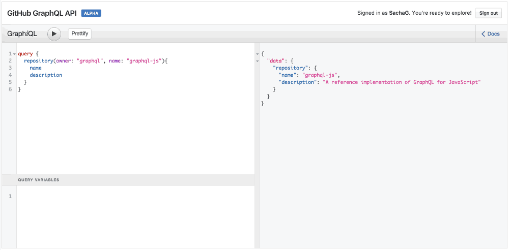

# Что такое GraphQL?

GraphQL — это новый стандарт запроса данных с сервера. Для большинства задач он более эффективен, удобней и гибче, чем REST API. Помимо языка запросов для клиентов, это еще система объявления типов и выполнения запросов на стороне сервера (которая реализована для большинства языков программирования).

Другими словами, GraphQL это синтаксис, который описывает как запрашивать данные с сервера.

В сравнении с REST API GraphQL имеет следующие преимущества:

- Позволяет точно указать, какие данные вернуть с сервера.
- Возможность передачи аргументов на любом уровне вложенности запроса.
- На стороне сервера проводит агрегацию данных из нескольких источников.
- Позволяет запросить несколько ресурсов в одном http-запросе.
- Использует систему типов для описания данных и позволяет настроить статический анализ запросов/ответов на стороне клиента.
- Позволяет удобно документировать API, помечать поля как устаревшие (deprecated).
- Имеет хорошие средства для проверки и выполнения запросов (GraphiQL, GraphQL Playground, eslint plugin).
- Есть экзотика полиморфизма - Interfaces, Union types.

GraphQL это не база данных. Это просто "умная" прослойка на сервере между вашими ресурсами и моделями, которой вы говорите как запрашивать и связывать между собой данные. Через GraphQL вы смесло сможете замиксовать получение данных от PostgreSQL, MongoDB, Redis, REST и не только.

Ну и чтоб закончить введение, вот замудренная фраза к прочтению несколько раз:
**На сервере объявляете о своих возможностях** в предоставлении данных (бэкендеры создают GraphQL схему), а **на клиенте заявляете о своих потребностях** в получении данных (фронтендеры пишут GraphQL запросы).

**Концептуальная разница GraphQL c REST API в том, что логику получения связанных ресурсов перенесли с клиента на сервер.** С REST API фронтендеры пишут кучу бойлерплейт кода, для получения связанных данных между ресурсами. На сервере GraphQL позволяет связи удобно запрограммировать, ведь бэкендеры хорошо знают эти самые связи между данными. Благодаря этому снимается жуткий головняк с фронтендеров 👍

- [Экосистема](./ecosystem)
- [GraphQL-типы](./types)
- [GraphQL-схема](./schema)
- [Способы построения GraphQL-схем](./schema-build-ways)
- [GraphQL-сервер](./server)
- [Аутентификация и Авторизация](./auth)
- [Работа с файлами](./fileUploads)
- [i18n — интернационализация в GraphQL](./i18n)
- [Как работать с ошибками в GraphQL?](./errors)
- [DataLoader - правильно решаем проблему N+1 запросов](./dataloader)

Дополнительно, рекомендую к ознакомлению хорошие статьи на русском:

- [Что же такое этот GraphQL?](https://habr.com/post/326986/), Sacha Greif перевод от @aliksend
- [Что такое GraphQL?](https://codenative.ru/article/chto_takoe_graphql), Paige Niedringhaus перевод от codenative.ru