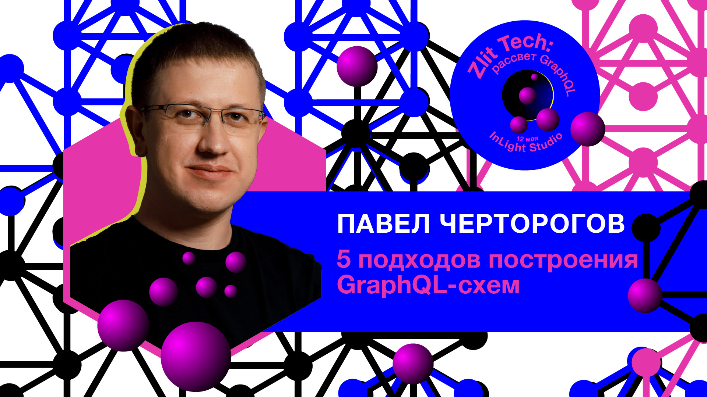

## 5 подходов построения GraphQL-схем

### graphql, graphql-tools, graphql-compose,

### type-graphql, nexus.

 <!-- .element: style="max-width: 300px;" class="plain"  -->

### Pavel Chertorogov :: @nodkz

#### Zlit Tech, Киев, 2019.05.12

---

 <!-- .element: style="max-width: 100%" class="plain"  -->

---

#### Чтобы листать презентацию, используйте ПРОБЕЛ.

  А то [Reveal.js](https://github.com/hakimel/reveal.js/) со своим листанием влево-вправо-вверх-вниз  ещё много кому ломает голову.

-----

## Ссылка на эту презентацию

<!-- QRCode generator: http://goqr.me/#t=url -->

 <!-- .element: class="plain" style="max-width: 500px"  -->

[http://bit.ly/graphql-kyiv](https://nodkz.github.io/conf-talks/talks/2019.05.12-zlit-tech-kyiv/index.html) <!-- .element: style="color: #ffffff" -->

-----

## Коротко о себе

 

- В веб-разработке с 2001 года (ужос 18 лет мучений) 🙀 <!-- .element: class="fragment" -->
- Фронтендер и бэкендер в одном флаконе 💑 <!-- .element: class="fragment" -->
- Использую GraphQL с 2015 года 💃 <!-- .element: class="fragment" -->

-----

## Мой OpenSource

- [graphql-compose](https://github.com/graphql-compose/graphql-compose) — генерация GraphQL-схем    <!-- .element: class="plain" style="padding-left: 250px; height: 40px; vertical-align: middle;" -->  <!-- .element: class="plain" style="height: 40px; vertical-align: middle;" -->
- [mongodb-memory-server](https://github.com/nodkz/mongodb-memory-server) — MongoDB для тестов    <!-- .element: class="plain" style="padding-left: 250px; height: 40px; vertical-align: middle;"  -->  <!-- .element: class="plain" style="height: 40px; vertical-align: middle;" -->
- [react-relay-network-layer](https://github.com/relay-tools/react-relay-network-layer) — NetworkLayer для Relay    <!-- .element: class="plain" style="padding-left: 250px; height: 40px; vertical-align: middle;"  -->  <!-- .element: class="plain" style="height: 40px; vertical-align: middle;" -->
- [lvovich](https://github.com/nodkz/lvovich) — склонение городов (from, to, in)   <!-- .element: class="plain" style="padding-left: 250px; height: 40px; vertical-align: middle;" -->  <!-- .element: class="plain" style="height: 40px; vertical-align: middle;" -->
- и пачка других

-----

### В самой кучерявой хостинговой компании  в Казахстане строим новый биллинг на GraphQL

 <!-- .element: style="max-width: 1000px;" class="plain"  -->