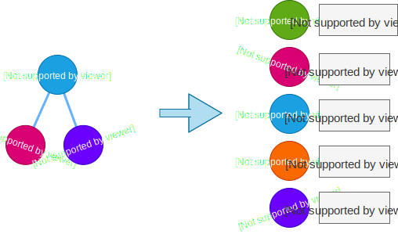

# GraphQL-клиенты

-----

## GraphQL-клиенты созданы чтобы штурмовать GraphQL-сервера.

-----

## И предоставлять полученные данные

### По простому в лоб<!-- .element: class="fragment orange" -->

### или жестко и изощренно <!-- .element: class="fragment green" -->

-----

## По простому в лоб

- 🛵 Отправили запрос получили ответ <!-- .element: class="fragment" -->
- 🚜 Возможно, по строке запроса закешировали <!-- .element: class="fragment" -->
- 🚕 Возможно, во время запроса сообщали о текущем состоянии, вызывая каллбэки и хуки <!-- .element: class="fragment" -->

-----

## А вот как жестко и изощренно

### надо разбирать подробнее

-----

<table><tr>
  <td style="vertical-align: middle">
    <h3 id="-">🔥 Жестко ... <small>(на этапе разработки)</small></h3>
    <ul>
      <li class="fragment">Позволяют сделать GraphQL-запросы составными из фрагментов</li>
      <li class="fragment">Генерируют тайп дефинишены из запросов</li>
      <li class="fragment">Позволяют сделать запросы персистентными</li>
    </ul>
  </td><td>
    
  </td>
</tr></table>

-----

<table><tr>
  <td>
    
  </td>
  <td style="vertical-align: middle">
    <h3 id="-">🔥 Жестко ... </h3>
    Цель: декомпозировать кодовую базу и проверять статическим анализатором.
      Упор на качество и стабильность кода.
  </td>
</tr></table>

-----

<table><tr>
  <td style="vertical-align: middle">
    <h3 id="-">🔥 ... изощренно <small>(в рантайме)</small></h3>
    <ul>
      <li class="fragment">Распилили ответ и положили в нормализованный стор</li>
      <li class="fragment">Предоставили подписки на изменение кусочков данных в сторе</li>
      <li class="fragment">Дали оптимистичные апдейты</li>
      <li class="fragment">Завели сборщик мусора</li>
      <li class="fragment">Предложили вручную изменять данные в сторе</li>
    </ul>
  </td><td>
    
  </td>
</tr></table>

-----

<table><tr>
  <td>
    
  </td>
  <td style="vertical-align: middle">
    <h3 id="-">🔥 ... изощренно <small>(в рантайме)</small></h3>
    Цель: эффективно работать со стором,   точечно получать уведомления на изменения интересующих данных в сторе.
      Упор на скорость и производительность.
  </td>
</tr></table>

-----

## Нормализированный кэш/стор

 <!-- .element: style="width: 800px;" class="plain"  -->

GlobalId обычно `base64(__typename + ':' + id)`

-----

#### С другим запросом пришли обновленные данные – обновились записи в нормализованном сторе

 <!-- .element: style="width: 800px;" class="plain"  -->

-----

### Все кто подписан на первый запрос получили обновление

 <!-- .element: style="width: 800px;" class="plain"  -->

-----

### С нормализованным стором

- вам не важно сколько раз вам вернулись данные
- насколько глубоко они вложены в графкуэль-ответе

Записи хранятся максимально компактно,
всегда обновляются,
и все заинтересованные уведомляются об изменениях.

-----

## Какие клиенты существуют

- 🔥 `Relay` – amazing performance (complexity)
- 🔥 `ApolloClient`  – balance between features and complexity
- 🚕 `graphql-hooks` – simple for React
- 🚕 `urql` – simple for React
- 🚕 `graphql.js` – simple for vanilla JS, support fragments
- 🚜 `Lokka` – simple for vanilla JS
- 🚜 `graphql-request` – 150 LoC wrapper for fetch
- 🛵 `fetch` – Fetch API

<https://github.com/nodkz/conf-talks/tree/master/articles/graphql/clients>

-----

## Будем разбирать и сравнивать

## `ApolloClient` и `Relay`

### У них есть генераторы, нормализованный стор и поддержка фрагментов.

-----

## Вообще я не хотел сравнивать

## Relay и Apollo

-----

#### Но 30 апреля 2019 Марк Цукерберг  презентовал новую версию [facebook.com](https://facebook.com)

 <!-- .element: style="max-width: 1000px;" class="plain"  -->

-----

## Теперь facebook.com cупер быстрый и оптимизированный <!-- .element: class="fragment green" -->

[Building the New facebook.com with React, GraphQL and Relay](https://developers.facebook.com/videos/2019/building-the-new-facebookcom-with-react-graphql-and-relay/)

40 минут увлекательного видео

## Трындец одним словом, опять задрали планку фронтендерам <!-- .element: class="fragment red" -->

-----

## Ну чтож, сейчас Relay получит

## второе дыхание хайпа.

####  И не говорить про него в своем докладе это кащунство. <!-- .element: class="fragment orange" -->
