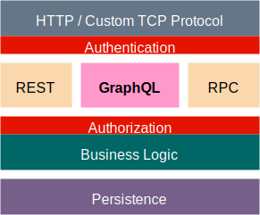

# Что такое GraphQL <br/> на сервере?

-----

## Это минимум 2 либы

 <!-- .element: style="width: 90vw;" class="plain"  -->

-----

## Фаза запуска приложения

 <!-- .element: style="width: 90vw;" class="plain"  -->

-----

# GraphQL Schema — это

### описание ваших типов данных на сервере, <!-- .element: class="fragment" -->

### связей между ними <!-- .element: class="fragment" -->

### и логики получения этих самых данных. <!-- .element: class="fragment" -->

-----

##### Hello world schema (startup phase)

```js
import { GraphQLSchema, GraphQLObjectType, GraphQLString } from 'graphql';

const schema = new GraphQLSchema({
  query: new GraphQLObjectType({
    name: 'RootQueryType',
    fields: {
      hello: {
        type: GraphQLString,
        resolve: () => 'world',
      }
    }
  }),
  // mutation: { ... },
  // subscription: { ... },
});

```

`build phase` – это когда вы описываете структуру своих данных и методы получения.

-----

## Runtime фаза

 <!-- .element: style="width: 90vw;" class="plain"  -->

-----

##### Hello world schema (runtime phase)

```js
import { graphql } from 'graphql';
import { schema } from './your-schema';

const query = '{ hello }';
const result = await graphql(schema, query);

// returns: { data: { hello: "world" } }

```

<span>`runtime phase` – это когда выполняется клиентский запрос через метод `graphql()`, который:</span> <!-- .element: class="fragment" -->

- производит парсинг GraphQL-запроса <!-- .element: class="fragment" -->
- производит валидацию запроса на соответствие GraphQL-схеме <!-- .element: class="fragment" -->
- выполняет запрос, пробегаясь по дереву схемы <!-- .element: class="fragment" -->
- валидирует возвращаемый ответ <!-- .element: class="fragment" -->

-----

 <!-- .element: style="width: 90vw;" class="plain"  -->
<!-- https://drive.google.com/file/d/1G-Iu_fZdrois9NZY1-5YGWNwELJEzy6Y/view?usp=sharing -->

-----

### Что обычно делает серверер?

<br />
<br />

### По некому протоколу обслуживать множество запросов от разных клиентов. <!-- .element: class="fragment" -->

<br />
<br />

<span>Это может быть `http(s)` или `websockets`, либо вообще что-то экзотическое типа `telnet`.</span> <!-- .element: class="fragment" -->

-----

### Что должен делать HTTP-сервер

- открыть порт и слушать http-запросы от клиентов
- вытаскивать из них GraphQL-запросы с переменными
- формировать `context` с данными текущего пользователя и глобальными ресурсами (в рамках запроса)
- откуда-то получить "сваренную" GraphQL-схему
- отправить на выполнение GraphQL-схему, запрос и `context` в пакет `graphql`
- из полученных данных от `graphql` сформировать http-ответ и отдать клиенту

-----

Подробнее о серверах, [читать тут](https://github.com/nodkz/conf-talks/tree/master/articles/graphql/server)

-----

 <!-- .element: style="width: 90vw;" class="plain"  -->

-----

### Запускаем сервер на NodeJS

```js
import { GraphQLSchema, GraphQLObjectType, GraphQLString } from 'graphql';
import { ApolloServer } from 'apollo-server';

const schema = new GraphQLSchema({
  query: new GraphQLObjectType({
    name: 'Query',
    fields: {
      hello: {
        type: GraphQLString,
        args: {
          name: { type: GraphQLString, defaultValue: 'world' },
        },
        resolve: (source, args, context) => {
          return `Hello, ${args.name} from ip ${context.req.ip}`;
        },
      },
    },
  }),
});

const server = new ApolloServer({
  schema,
  context: ({ req }) => ({ req }),
  playground: true,
});

server
  .listen({
    port: 5000,
    endpoint: '/',
    playground: '/playground',
  })
  .then(({ url }) => {
    console.log(`🚀  Server ready at ${url}`);
  });

```

<span class="fragment" data-code-focus="1-2" />
<span class="fragment" data-code-focus="4-18" />
<span class="fragment" data-code-focus="21-25" />
<span class="fragment" data-code-focus="27-35" />

-----

### Результат в браузере


-----

### Итак, грубо говоря <!-- .element: class="red" -->

GraphQL требует от бекендеров описать набор функций для получения данных. <!-- .element: class="fragment" -->

И потом, исходя из полученного GraphQL-запроса, сам вызывает только необходимые функции. <!-- .element: class="fragment" -->

-----

## Никакой магии, просто «строгий» вызывальщик функций

-----

## Авторизация, оптимизация, кэширование <br />– это за пределами GraphQL

-----

 <!-- .element: style="width: 600px;" class="plain"  -->

Авторизация, оптимизация, кэширование <br />– это за пределами GraphQL

-----

### REST API vs GraphQL

 <!-- .element: style="width: 1200px;" class="plain"  -->

<div class="grey" style="font-size:0.7em">
  Source: <a href="https://crystallize.com/comics/rest-vs-graphql" target="_blank">crystallize.com</a> – is a blazing fast headless commerce service
</div>
