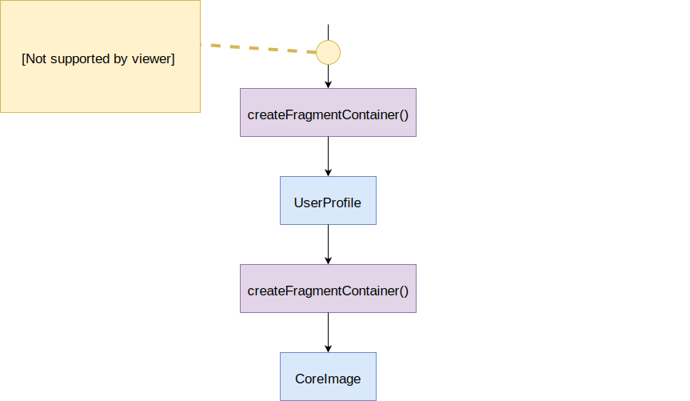
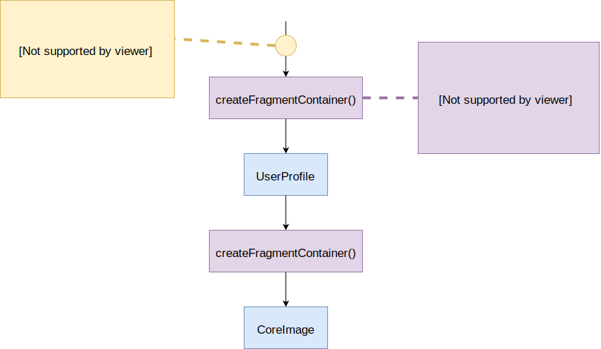
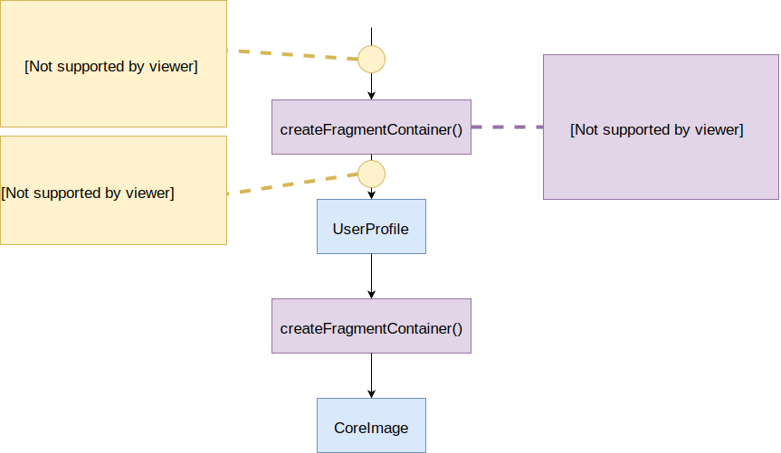
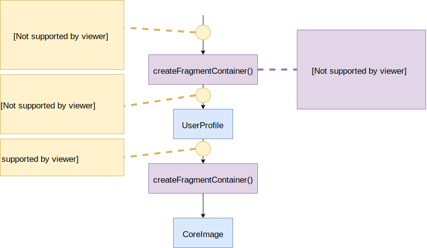
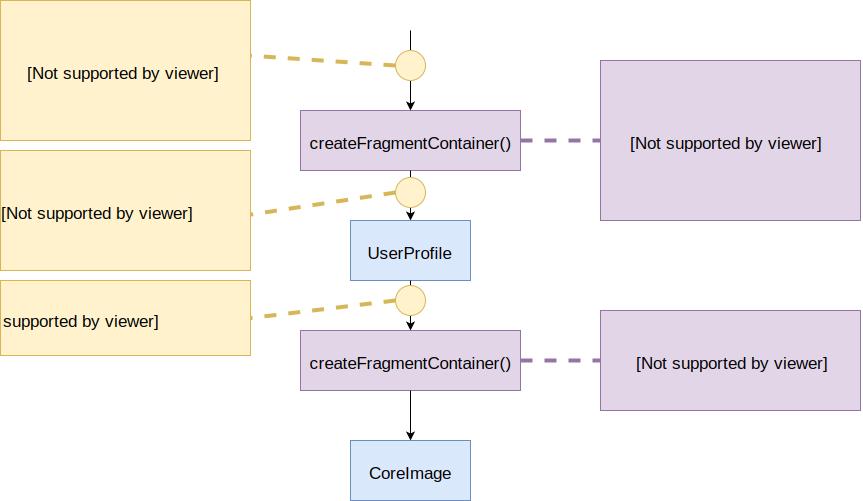
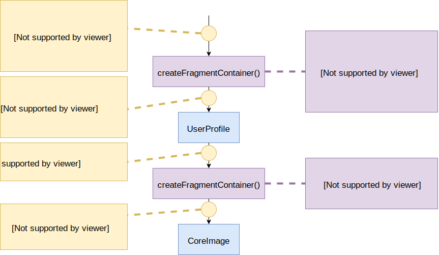

# 4. Fragment Models

-----

## Основа в `Fragment Models` это генерация моделей из GraphQL-запроса плюс <span class="green">инкапсуляция</span>

-----

### `Fragment Models` отличается <br/>от `Response Models` только тем,

## что любой GraphQL-фрагмент который разворачивается, становится черной коробкой. <!-- .element: class="fragment green" -->

-----

## Т.е. вместо наследования интерфейсов, используются явные методы получения данных для вложенных фрагментов.

-----

```graphql
fragment CoreImage_data on Image {
  url
  size
}

fragment UserProfile on User {
  nickname
  avatar {
    ...CoreImage_data
  }
}

```

```typescript
export interface CoreImage {
  url: string | null;
}

export interface UserProfile {
  nickname: string;
  avatar: {
    _asCoreImageData(): CoreImage
  }
}

```

<span class="fragment" data-code-focus="9" data-code-block="1" />
<span class="fragment" data-code-focus="8" data-code-block="2" />

Note:
<!-- ```graphql
fragment UserProfile on User {
  ...AppPic
}

# Squares App fragment
fragment AppPic on HasPicture {
  squarePic: picture(style: SQUARE) {
    ...CoreImage
  }
}
```

```java
// Shared across apps
interface UserProfile {
  AppPic asAppPic();
}
interface CoreImage { ... }

// Squares App model
interface AppPic {
  SquarePic getSquarePic();

  interface SquarePic {
    CoreImage asCoreImage();
  }
}
``` -->

-----

## Под каждый вложенный фрагмент есть метод, который возвращает только его данные.

-----

### Пример на React + Relay

```jsx
function CoreImage({ data }: Props) {
  return </img>;
}

export default createFragmentContainer(CoreImage, {
  data: graphql`
    fragment CoreImage_data on Image {
      url
      size
    }
  `,
});

```

<span class="fragment" data-code-focus="5" data-code-block="1">
  <code>createFragmentContainer</code> – это HOC, который вызывает метод <code>_asCoreImageData</code> для получения инкапсулированных данных от родителя
</span>

-----

<span class="fragment" style="position: absolute; width: 100%; margin-left: -50%">
  
</span>
  
<span class="fragment" style="position: absolute; width: 100%; margin-left: -50%">
  
</span>

<span class="fragment" style="position: absolute; width: 100%; margin-left: -50%">
  
</span>

<span class="fragment" style="position: absolute; width: 100%; margin-left: -50%">
  
</span>

<span class="fragment" style="position: absolute; width: 100%; margin-left: -50%">
  
</span>

<span class="fragment" style="position: absolute; width: 100%; margin-left: -50%">
  
</span>

-----


## Вы в своей компоненте, перестаете видеть "чужие" данные из соседней компоненты. <!-- .element: class="green" -->

-----

## Теперь вы спокойно можете удалять поля из своего фрагмента,

## зная, что кроме вас их никто не может использовать вверх по дереву. <!-- .element: class="fragment orange" -->

-----

## Если `UserProfile` пекут в США, <br/> а `CoreImage` в Китае <br/>– то отсутствие возможности сломать друг друга код дорогого стоит.  

-----

## Вывод по Fragment Models

- ~~Опечатки (typos)~~ <!-- .element: class="fragment green" -->
- ~~Отсутствие типовой безопасности (type safety)~~ <!-- .element: class="fragment green" -->
- ~~Недополучения данных (underfetch)~~ <!-- .element: class="fragment green" -->
- ~~Получение лишних данных (overfetch)~~ <!-- .element: class="fragment green" -->

-----

### В общем, как понимаете, с Fragment Models

## <br/>И бастықи сыты и қызметкерлер целы! <!-- .element: class="green" -->

# <br/> 👍
