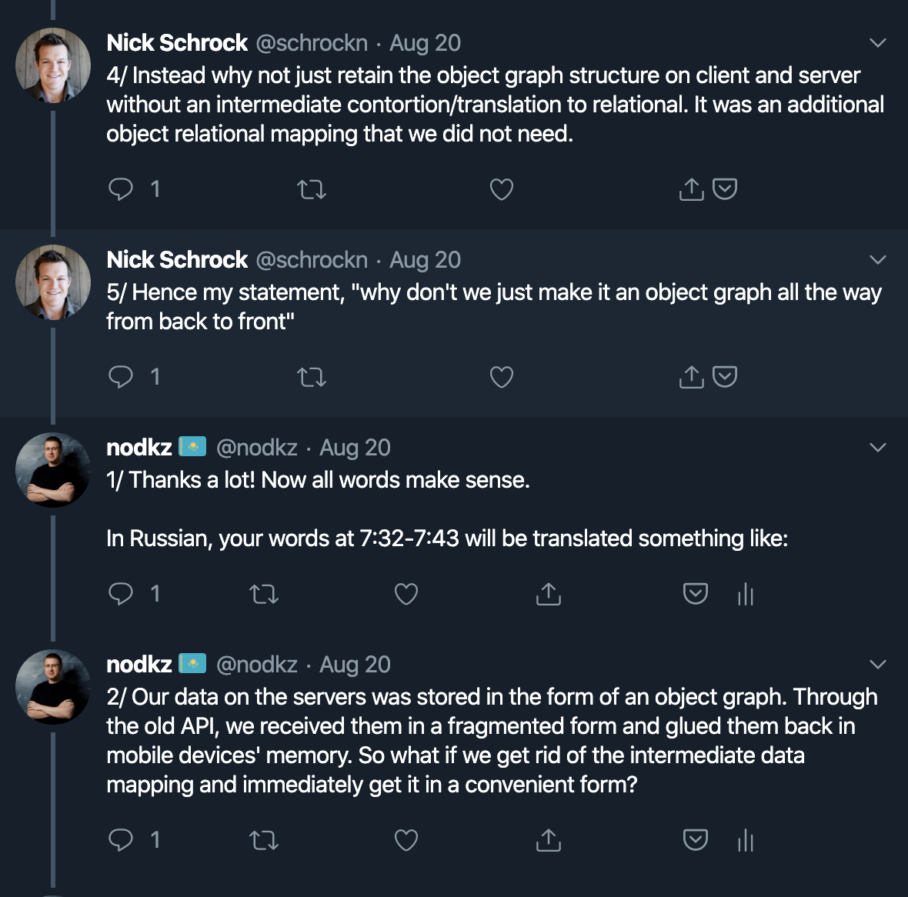

## GraphQL: The Documentary

#### Русская версия

-----

## Респект [Honeypot](https://www.honeypot.io)  за прекрасно снятый фильм,  за согласие на перевод  и предоставление материалов.

 <!-- .element: class="plain" style="max-width: 300px; border-radius: 50%;" -->

-----

 <!-- .element: class="plain" style="max-width: 200px; border-radius: 50%;" -->
 <!-- .element: class="plain" style="max-width: 200px; border-radius: 50%;" -->

<!-- ## Респект  Саше и Холи за организацию перевода этого фильма. -->
<!-- ## Респект  Александру Канунникову  и HolyJS  за организацию перевода этого фильма. -->
## Респект HolyJS, Александру Канунникову и команде  за организацию перевода фильма.

 <!-- .element: class="plain" style="max-width: 100px; border-radius: 50%;" -->
 <!-- .element: class="plain" style="max-width: 100px; border-radius: 50%;" -->
 <!-- .element: class="plain" style="max-width: 100px; border-radius: 50%;" -->
 <!-- .element: class="plain" style="max-width: 100px; border-radius: 50%;" -->

-----

## Респект Нику Шроку  за прояснение реального смысла слов

-----

## Готовы трейлер посмотреть?

-----

<iframe width="1200" height="677" data-src="https://www.youtube.com/embed/mYDsL6EiUE8?rel=0&showinfo=0&autoplay=1" frameborder="0" allow="accelerometer; autoplay; encrypted-media; gyroscope; picture-in-picture" allowfullscreen data-autoplay></iframe>

-----

## GraphQL: The Documentary <!-- .element: class="orange" -->

### Русская версия <!-- .element: class="orange" -->

#  Сегодня в 20-30 <!-- .element: class="green" -->

### во 2-м зале <!-- .element: class="green" -->
