<!-- # Британ...   Бразильские ученные -->

# GraphQL и как его боготворит академическая среда <!-- .element: class="orange" -->

# 🤣

## Lightning talk в 21-00 <!-- .element: class="green" -->

-----

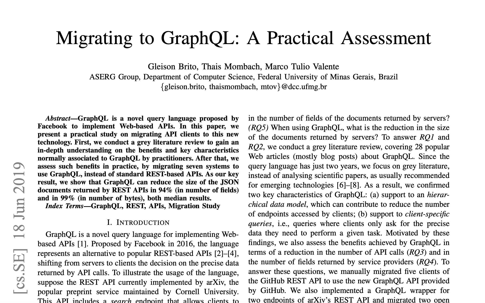

-----

### [Migrating to GraphQL: A Practical Assessment](https://arxiv.org/abs/1906.07535)

### В академической среде появилась "серая" научная работа, которая уж больно круто описывает возможности GraphQL:

-----

### As our key result, we show that GraphQL can reduce the size of the JSON documents returned by REST APIs in 94% (in number of fields) and in 99% (in number of bytes), both median results.

 

## reduce the number of fields in 94% <!-- .element: class="orange fragment" -->

## reduce the number of bytes in 99% <!-- .element: class="orange fragment" -->

## 🤯 ФИГАСЕ! 🤯 <!-- .element: class="red fragment" -->

-----

## GraphQL конечно хорош <!-- .element: class="green" -->

## но не настолько! <!-- .element: class="red fragment" -->

-----

### Давайте разбираться, где обманывают

-----

## Работа опубликована на серьезном ресурсе [https://arxiv.org](https://arxiv.org)

### Submissions to arXiv should conform to Cornell University academic standards.

-----

### Авторы с научными степенями: <!-- .element: class="green" -->

- Gleison Brito, PhD 1993 года рождения, <https://twitter.com/glebritto>
- Thais Mombach
- Marco Tulio Valente, Associate Professor (доцент), <https://twitter.com/mtov>, <https://homepages.dcc.ufmg.br/~mtov/>

-----

### Сам документ на 11 страниц <!-- .element: class="green" -->

### выглядит "богато" <!-- .element: class="green" -->

### как настоящий научный труд. <!-- .element: class="green" -->

-----

<h3 class="green">Заголовок, авторы, две колонки, RQ'шки</h3>

-----

### Схемы, сноски, формулы <!-- .element: class="green" -->

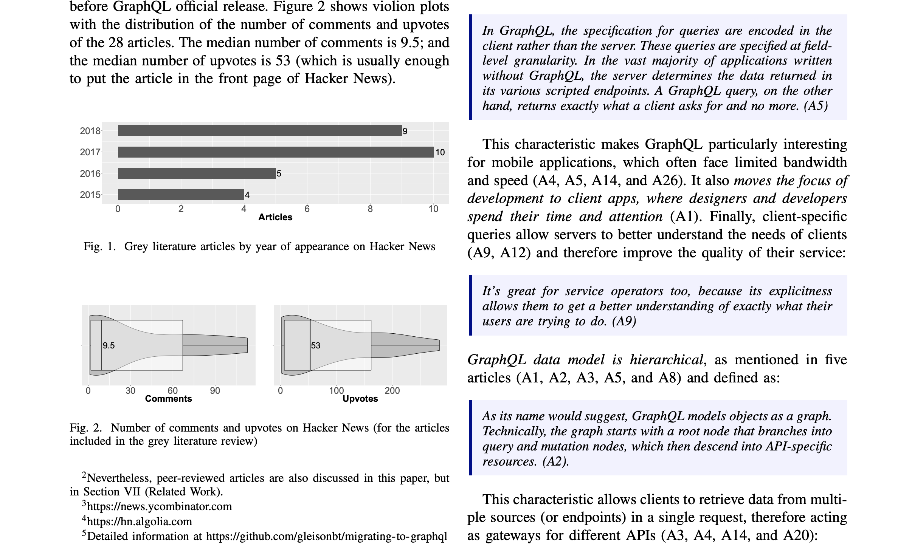

-----

### Графики <!-- .element: class="green" -->

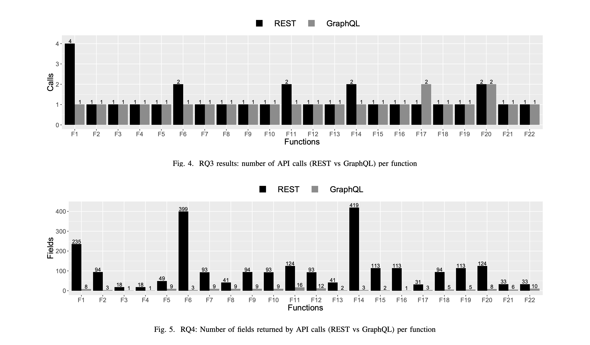

-----

### Куча серьезных референсов <!-- .element: class="green" -->

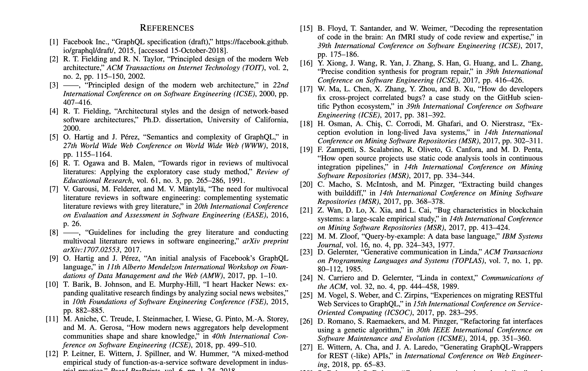

-----

## GraphQL vs REST

### Reduce the number of fields in 94% <!-- .element: class="orange" -->

### Reduce the number of bytes in 99% <!-- .element: class="orange" -->

## Блин, всё-таки где-то дурят,  надо вчитываться! <!-- .element: class="red fragment" -->

-----

<h4 class="orange fragment"> a <code>grey literature</code> review to gain an in-depth understanding</h4>

<h4 class="orange fragment"> <code>migrating seven systems</code> to use GraphQL, instead of standard REST-based APIs</h4>

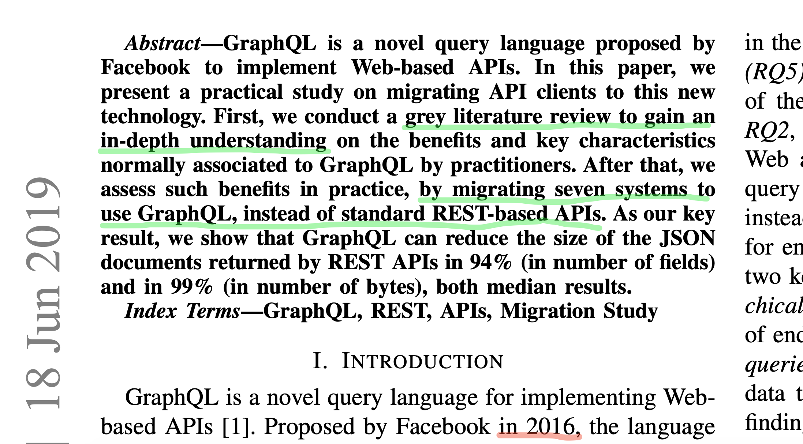

-----

<table>
  <tr>
    <td>
      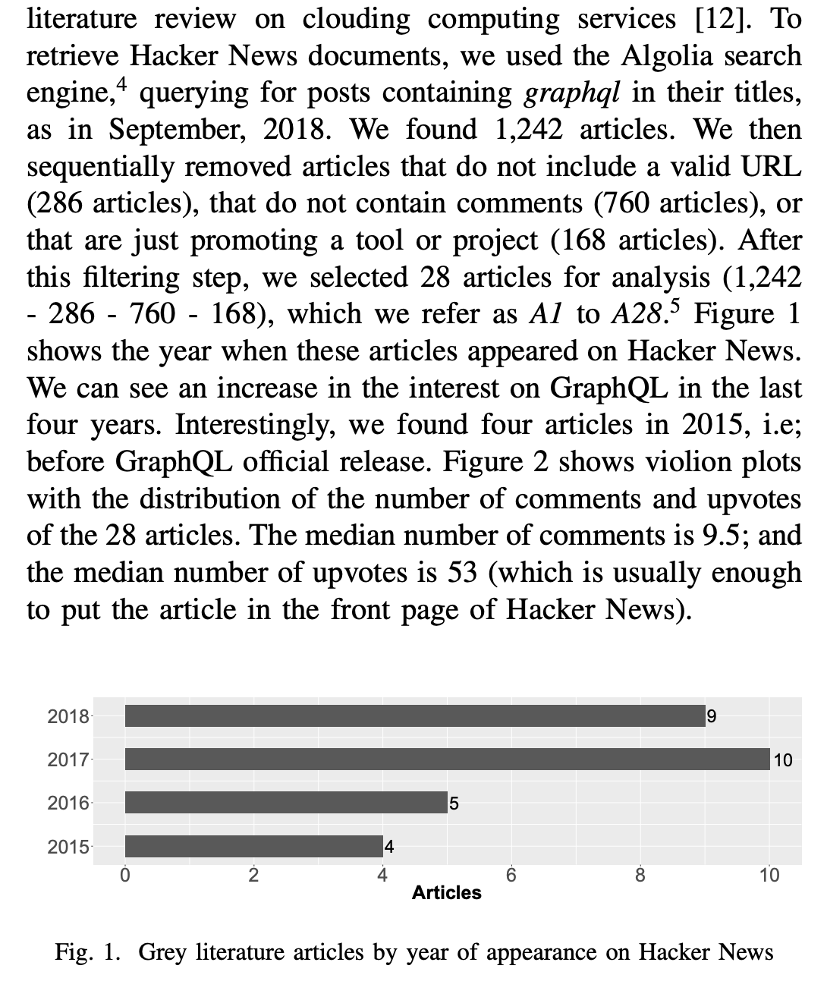
    </td>
    <td style="vertical-align: middle">
      <h5 class="orange">"Серая литература"</h5>
      <ul>
      <li class="fragment">взяли HackerNews</li>
      <li class="fragment">через Algolia нашли 1242 статей</li>
      <li class="fragment">выбрали 28 заплюсованных статей</li>
      <li class="fragment">... and carefully read them ...</li>
      </ul>
    </td>
  </tr>
</table>

-----

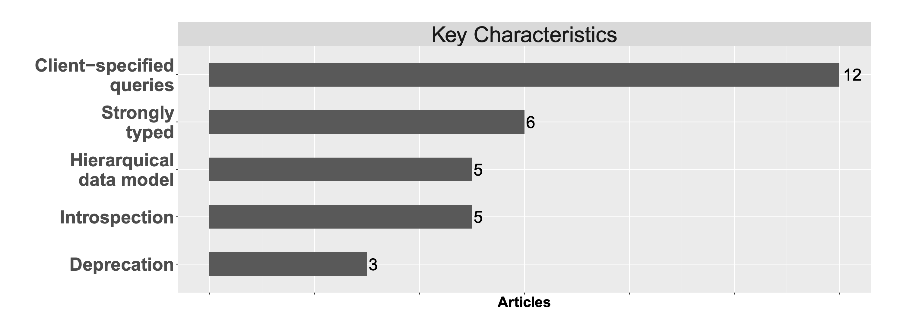

##### Fig. 3. Summary of grey literature findings

-----

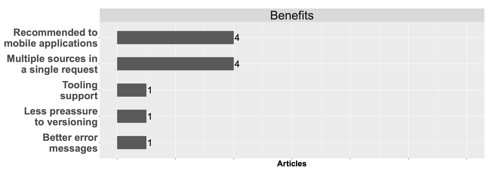

##### Fig. 3. Summary of grey literature findings

-----

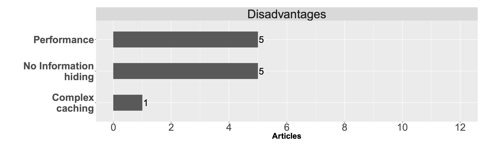

##### Fig. 3. Summary of grey literature findings

-----

### Потом они взяли 7 приложений на REST API и переписали на GraphQL

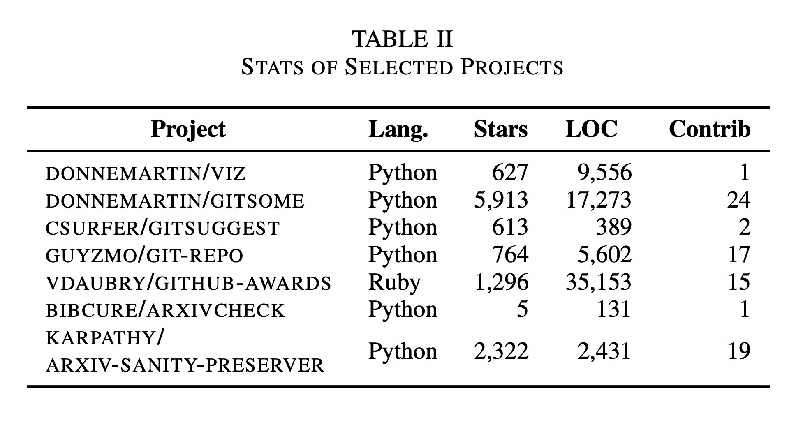

-----

### Увидели что кол-во полей снизилось с 93.5 до 5.5

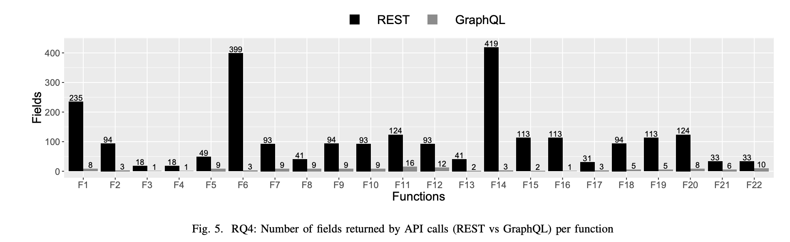

## F1-F20 – это запросы к GitHub <!-- .element: class="orange fragment" -->

-----

### Взяли "жирнючий" GitHub'абовский REST API который не умеет фильровать поля и вывели:

## reduce the number of fields in 94% <!-- .element: class="fragment orange" -->

### ох уж эти теоретические исследователи  :facepalm <!-- .element: class="fragment red" -->

-----

### Так-с, а что там тогда с размером ответов?

## Взяли с конференций ICSE 2017 и MSR 2017 несколько paper'ов <!-- .element: class="fragment orange" -->

## которые опять таки исследуют GitHub  :facepalm <!-- .element: class="fragment red" -->

-----

### Ух, там одно исследование Q11

### тянуло `400mb` через REST API

### а через GraphQL всего `77kb`

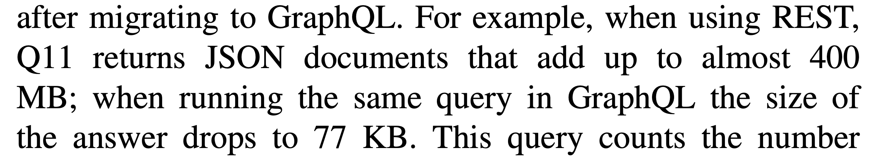

## опять таки это запросы к GitHub <!-- .element: class="orange fragment" -->

-----

#### Вывели графики с `логарифмической` шкалой

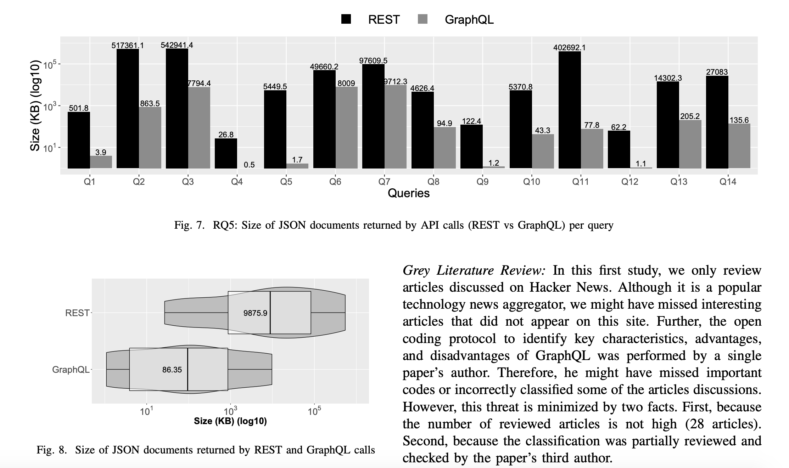 <!-- .element: style="max-width: 1000px" -->

-----

### И получили свои заветные

## reduce the number of bytes in 99% <!-- .element: class="orange fragment" -->

-----

### Мой Conclusion 1  <!-- .element: class="gray" -->

## У GitHub отвратительно жирное REST API v3 без фильтрации полей

-----

### Мой Conclusion 2 <!-- .element: class="gray" -->

## Как же приходится жутко изголяться ~~фронтендерам~~ учённым на кривых апи без участия бэкендеров или прямого доступа к БД.

-----

### Мой Conclusion 3  <!-- .element: class="gray" -->

## А ничё так, кстати, зашёл GraphQL для анализа связных данных

-----

Ссылка на научную работу для самостоятельного изучения:

[Migrating to GraphQL: A Practical Assessment](https://arxiv.org/abs/1906.07535)

([https://arxiv.org/abs/1906.07535](https://arxiv.org/abs/1906.07535))
