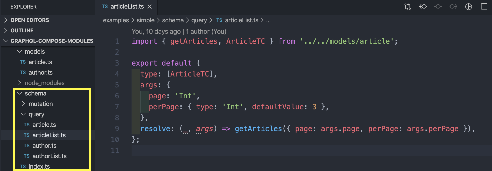

# Подходы к построению схем

 <!-- .element: style="width: 90vw;" class="plain"  -->

-----

- `graphql` — жестко и квадратно, нельзя редактировать типы.
- `graphql-tools` — описываете типы в SDL и отдельно резолверы.
- `graphql-compose` — упрощенный синтаксис создания типов, можно использовать SDL. Позволяет читать и редактировать типы. Удобно для написания собственных функций генераторов.
- `type-graphql` — свежак, использует декораторы поверх ваших классов (TypeScript).
- `nexus` – декларативный конструктор схемы со встроенным генератором дефинишенов для TypeScript.

-----

### `graphql` — vanilla

```js
import {
  GraphQLSchema,
  GraphQLObjectType,
  GraphQLString,
  GraphQLInt,
  GraphQLList,
  GraphQLNonNull,
} from 'graphql';
import { authors, articles } from './data';

const AuthorType = new GraphQLObjectType({
  name: 'Author',
  description: 'Author data',
  fields: () => ({
    id: { type: GraphQLInt },
    name: { type: GraphQLString },
  }),
});

const ArticleType = new GraphQLObjectType({
  name: 'Article',
  description: 'Article data with related Author data',
  fields: () => ({
    title: {
      type: new GraphQLNonNull(GraphQLString),
    },
    text: {
      type: GraphQLString,
    },
    authorId: {
      type: new GraphQLNonNull(GraphQLInt),
      description: 'Record id from Author table',
    },
    author: {
      type: AuthorType,
      resolve: source => {
        const { authorId } = source;
        return authors.find(o => o.id === authorId);
      },
    },
  }),
});

const Query = new GraphQLObjectType({
  name: 'Query',
  fields: {
    articles: {
      args: {
        limit: { type: GraphQLInt, defaultValue: 3 },
      },
      type: new GraphQLList(ArticleType),
      resolve: (_, args) => {
        const { limit } = args;
        return articles.slice(0, limit);
      },
    },
    authors: {
      type: new GraphQLList(AuthorType),
      resolve: () => authors,
    },
  },
});

const schema = new GraphQLSchema({
  query: Query,
});

export default schema;

```

[https://github.com/graphql/graphql-js](https://github.com/graphql/graphql-js)

<span class="fragment" data-code-focus="1-9" />
<span class="fragment" data-code-focus="11-18" />
<span class="fragment" data-code-focus="20-34" />
<span class="fragment" data-code-focus="44-58" />
<span class="fragment" data-code-focus="64-68" />

-----

### `graphql-tools` — typeDefs & resolvers

```js
import { makeExecutableSchema } from 'graphql-tools';
import { authors, articles } from './data';

const typeDefs = `
  "Author data"
  type Author {
    id: Int
    name: String
  }

  "Article data with related Author data"
  type Article {
    title: String!
    text: String
    "Record id from Author table"
    authorId: Int!
    author: Author
  }

  type Query {
    articles(limit: Int = 10): [Article]
    authors: [Author]
  }
`;

const resolvers = {
  Article: {
    author: source => {
      const { authorId } = source;
      return authors.find(o => o.id === authorId);
    },
  },
  Query: {
    articles: (_, args) => {
      const { limit } = args;
      return articles.slice(0, limit);
    },
    authors: () => authors,
  },
};

const schema = makeExecutableSchema({
  typeDefs,
  resolvers,
});

export default schema;

```

[https://github.com/apollographql/graphql-tools](https://github.com/apollographql/graphql-tools)

<span class="fragment" data-code-focus="1-2" />
<span class="fragment" data-code-focus="5-9" />
<span class="fragment" data-code-focus="11-18" />
<span class="fragment" data-code-focus="20-23" />
<span class="fragment" data-code-focus="26-40" />
<span class="fragment" data-code-focus="42-47" />

-----

### `graphql-compose` — sugared vanilla + SDL

```js
import { TypeComposer, schemaComposer } from 'graphql-compose';
import { authors, articles } from './data';

// SDL
const AuthorType = TypeComposer.create(`
  "Author data"
  type Author {
    id: Int
    name: String
  }
`);

// Sugared vanilla
const ArticleType = TypeComposer.create({
  name: 'Article',
  description: 'Article data with related Author data',
  fields: {
    title: 'String!',
    text: 'String',
    authorId: 'Int!',
    author: {
      type: () => AuthorType,
      resolve: source => {
        const { authorId } = source;
        return authors.find(o => o.id === authorId);
      },
    },
  },
});

schemaComposer.Query.addFields({
  articles: {
    args: {
      limit: { type: 'Int', defaultValue: 3 },
    },
    type: [ArticleType],
    resolve: (_, args) => {
      const { limit } = args;
      return articles.slice(0, limit);
    },
  },
  authors: {
    type: [AuthorType],
    resolve: () => authors,
  },
});

const schema = schemaComposer.buildSchema();

export default schema;

```

[https://github.com/graphql-compose/graphql-compose](https://github.com/graphql-compose/graphql-compose)

<span class="fragment" data-code-focus="1-2" />
<span class="fragment" data-code-focus="4-11" />
<span class="fragment" data-code-focus="13-27" />
<span class="fragment" data-code-focus="31-45" />
<span class="fragment" data-code-focus="48-50" />

-----

### `graphql-compose` — like in `graphql-tools`

```js
import { TypeComposer, schemaComposer } from 'graphql-compose';
import { authors, articles } from './data';

const typeDefs = `...`; // like in `graphql-tools`
const resolvers = { ... }; // like in `graphql-tools`

schemaComposer.addTypeDefs(typeDefs);
schemaComposer.addResolveMethods(resolvers);

const schema = schemaComposer.buildSchema();
export default schema;

```

<span class="fragment" data-code-focus="4,7" />
<span class="fragment" data-code-focus="5,8" />
<span class="fragment" data-code-focus="10-11" />

-----

### `type-graphql` — decorators (TypeScript)

```js
import 'reflect-metadata';
import {
  ObjectType, Field, ID, String, type ResolverInterface,
} from 'type-graphql';
import { authors, articles } from './data';

@ObjectType({ description: 'Author data' })
class Author {
  @Field(type => ID)
  id: number;

  @Field(type => String, { nullable: true })
  name: string;
}

@ObjectType({ description: 'Article data with related Author data' })
class Article {
  @Field(type => String)
  title: string;

  @Field(type => String, { nullable: true })
  text: string;

  @Field(type => ID)
  authorId: number;

  @Field(type => Author)
  get author(): ?Object {
    return authors.find(o => o.id === this.authorId);
  }
}

@Resolver(of => Article)
class ArticleResolver {
  @Query(returns => [Article])
  articles(@Arg('limit', { nullable: true, defaultValue: 3 }) limit: number): Array<Article> {
    return articles.slice(0, limit) as any;
  }

  @FieldResolver()
  author(@Root() article: Article) {
    return authors.find(o => o.id === article.authorId);
  }
}

@Resolver(of => Author)
class AuthorResolver {
  @Query(returns => [Author])
  authors(): Array<Author> {
    return authors as any;
  }
}

const schema = await buildSchema({
  resolvers: [ArticleResolver, AuthorResolver],
  // Or it may be a GLOB mask:
  // resolvers: [__dirname + '/**/*.ts'],
});

```

[https://github.com/19majkel94/type-graphql](https://github.com/19majkel94/type-graphql)

<span class="fragment" data-code-focus="1-5" />
<span class="fragment" data-code-focus="7-14" />
<span class="fragment" data-code-focus="16-30" />
<span class="fragment" data-code-focus="33-44" />
<span class="fragment" data-code-focus="46-52" />
<span class="fragment" data-code-focus="54-58" />

-----

### `nexus` – декларативный конструктор схемы

```js
import { objectType, queryType, intArg, makeSchema } from 'nexus';
import { authors, articles } from './data';

const Author = objectType({
  name: 'Author',
  definition(t) {
    t.int('id', { nullable: true });
    t.string('name', { nullable: true });
  },
});

const Article = objectType({
  name: 'Article',
  definition(t) {
    t.string('title');
    t.string('text', { nullable: true });
    t.int('authorId', { description: 'Record id from Author table' });
    t.field('author', {
      nullable: true,
      type: 'Author',
      resolve: source => {
        const { authorId } = source;
        return authors.find(o => o.id === authorId) as any;
      },
    });
  },
});

const Query = queryType({
  definition(t) {
    t.list.field('articles', {
      nullable: true,
      type: Article,
      args: {
        limit: intArg({ default: 3, required: true })
      },
      resolve: (_, args) => {
        const { limit } = args;
        return articles.slice(0, limit);
      },
    });
    t.list.field('authors', {
      nullable: true,
      type: Author,
      resolve: () => authors,
    });
  },
});

const schema = makeSchema({
  types: [Query, Article, Author],
  outputs: {
    schema: __dirname + '/nexus-generated/schema.graphql',
    typegen: __dirname + '/nexus-generated/typings.ts',
  },
});

export default schema;

```

[https://github.com/prisma/nexus](https://github.com/prisma/nexus)

<span class="fragment" data-code-focus="1-2" />
<span class="fragment" data-code-focus="4-10" />
<span class="fragment" data-code-focus="12-26" />
<span class="fragment" data-code-focus="29-43" />
<span class="fragment" data-code-focus="50-58" />

-----

<table style="zoom: 0.6;">
<thead>
<tr>
<th></th>
<th align="center">graphql</th>
<th align="center">graphql-tools</th>
<th align="center">graphql-compose</th>
<th align="center">type-graphql</th>
<th align="center">nexus</th>
</tr>
</thead>
<tbody><tr>
<td>Дата создания</td>
<td align="center">2012/2015</td>
<td align="center">2016.04</td>
<td align="center">2016.07</td>
<td align="center">2018.02</td>
<td align="center">2018.11</td>
</tr>
<tr>
<td>GitHub starts</td>
<td align="center"></td>
<td align="center"></td>
<td align="center"></td>
<td align="center"></td>
<td align="center"></td>
</tr>
<tr>
<td>NPM downloads</td>
<td align="center"></td>
<td align="center"></td>
<td align="center"></td>
<td align="center"></td>
<td align="center"></td>
</tr>
<tr>
<td>Язык для разработки схемы</td>
<td align="center">JS, TS, Flow</td>
<td align="center">JS, TS, Flow</td>
<td align="center">JS, TS, Flow</td>
<td align="center">TS</td>
<td align="center">JS, TS</td>
</tr>
<tr>
<td>Schema-first (SDL-first)</td>
<td align="center">-</td>
<td align="center">да</td>
<td align="center">да</td>
<td align="center">-</td>
<td align="center">-</td>
</tr>
<tr>
<td>Code-first</td>
<td align="center">да</td>
<td align="center">-</td>
<td align="center">да</td>
<td align="center">да</td>
<td align="center">да</td>
</tr>
<tr>
<td>Редактирование GraphQL-типов</td>
<td align="center">-</td>
<td align="center">-</td>
<td align="center">да</td>
<td align="center">-</td>
<td align="center">-</td>
</tr>
<tr>
<td>Статическая типизация в резолверах</td>
<td align="center">1/5<br/>нет</td>
<td align="center">3/5<br/>через сторонние пакеты</td>
<td align="center">2/5<br/>кроме аргументов</td>
<td align="center">5/5<br/>из коробки через рефлексию</td>
<td align="center">4/5<br/>через генерацию файлов из коробки</td>
</tr>
<tr>
<td>Простота в изучении</td>
<td align="center">3/5</td>
<td align="center">5/5</td>
<td align="center">2/5</td>
<td align="center">4/5</td>
<td align="center">4/5</td>
</tr>
<tr>
<td>Чистота в коде схемы</td>
<td align="center">1/5</td>
<td align="center">5/5</td>
<td align="center">4/5</td>
<td align="center">4/5</td>
<td align="center">3/5</td>
</tr>
<tr>
<td>Типы полей (модификатор по-умолчанию)</td>
<td align="center">optional</td>
<td align="center">optional</td>
<td align="center">optional</td>
<td align="center">Required or <a href="https://github.com/19majkel94/type-graphql/issues/297" target="_blank">optional</a></td>
<td align="center">Required</td>
</tr>
</tbody></table>

-----

Также рекомендую прочитать хорошую статью <br/>[про разницу в подходах Schema-first и Code-first](https://www.prisma.io/blog/the-problems-of-schema-first-graphql-development-x1mn4cb0tyl3)

-----

#### А еще я готовлю 6-ой подход

### [graphql-compose-modules](https://github.com/graphql-compose/graphql-compose-modules)

 <!-- .element: class="plain"  -->

#### Надо ещё опробировать и потом рассказать отдельно. <!-- .element: class="orange fragment" -->
