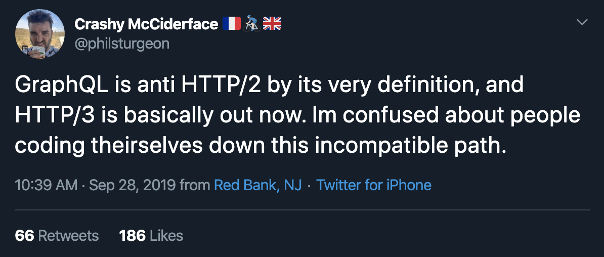

# GraphQL vs REST

-----

#### Минусы REST API, даже со Swagger'ом: <!-- .element: class="red" -->

- Каждый эндпоинт описывается примитивными типами, нет "сложных" типов <!-- .element: class="fragment" -->
- Нет связей; неизвестно, как оптимальнее всего запросить связанные ресурсы <!-- .element: class="fragment" -->
- Жирные ответы, если не прикрутить фильтр по полям <!-- .element: class="fragment" -->
- Нет возможности построить сложный агрегированный запрос <!-- .element: class="fragment" -->
- Частенько много сетевых запросов <!-- .element: class="fragment" -->
- Боль с вложенными агрументами <!-- .element: class="fragment" -->

-----

#### Самый жирный минус: <!-- .element: class="red" -->

## С REST API фронтендеры пишут кучу бойлерплейт кода, для получения связанных данных между ресурсами. <!-- .element: class="fragment" -->

-----

## Концептуальная разница GraphQL и REST API в том, <!-- .element: class="green" -->

## что логику получения связанных ресурсов перенесли с клиента на сервер. <!-- .element: class="fragment" -->

Сняли жуткий головняк с фронтендеров 👍 <!-- .element: class="fragment orange" -->

-----

#### Более подробнее расписано тут

- [Swagger vs GraphQL](https://github.com/nodkz/conf-talks/blob/master/articles/swagger/README.md)

-----

### C GraphQL как в ресторане: <!-- .element: class="green" -->

— Вот вам, пожалуйста, меню, выбирайте. 
— Будьте любезны салатик 🥗, рыбку на пару 🐟   и бокальчик красного 🍷.

-----

### C REST API как в армии: <!-- .element: class="orange" -->

— Жрите, что дали, а то голодным останешься, И наваливают кучу чего-то 🤐

 PS. Swagger — это контрактная армия 😂 <!-- .element: class="fragment" -->

-----

### По поводу того, что REST API наваливает кучу данных, есть академическое иследование:

## reduce the number of fields in 94% <!-- .element: class="orange" -->

## reduce the number of bytes in 99% <!-- .element: class="orange" -->

-----

Ссылка на научную работу для самостоятельного изучения:

### [Migrating to GraphQL: A Practical Assessment](https://arxiv.org/abs/1906.07535)

[https://arxiv.org/abs/1906.07535](https://arxiv.org/abs/1906.07535)

-----

### А еще графкуэль со своими фрагментами отлично дополняет компонентный подход! <!-- .element: class="green" -->

#### GraphQL-фрагменты на клиенте (HolyJS Moscow 2019.11)

-----

## Минусы GraphQL: <!-- .element: class="red" -->

- Берет и выкидывает все выработанные годами  практики <!-- .element: class="fragment" -->
  - [кеширования](https://blog.usejournal.com/caching-with-graphql-what-are-the-best-options-e161b0f20e59) <!-- .element: class="fragment" -->
  - [авторизации](https://github.com/nodkz/conf-talks/tree/master/articles/graphql/auth) <!-- .element: class="fragment" -->
- Добавляет новых задач <!-- .element:  class="fragment" style="padding-top: 25px" -->
  - [Query cost](https://github.com/slicknode/graphql-query-complexity) <!-- .element: class="fragment" -->
  - [N+1 query](https://github.com/nodkz/conf-talks/tree/master/articles/graphql/dataloader) <!-- .element: class="fragment" -->

-----

## Минусы GraphQL: <!-- .element: class="red" -->

- Не для передачи бинарных данных <!-- .element: class="fragment" -->
- Не поддерживает рекурсивные типы <!-- .element: class="fragment" -->
- Отдает денормализованный ответ (повтор в данных) <!-- .element: class="fragment" -->
- Проблемы с Union-типами (нет скаляров, пока нет инпутов) <!-- .element: class="fragment" -->

-----

## GraphQL в эру HTTP2

<https://apisyouwonthate.com/blog/lets-stop-building-apis-around-a-network-hack>

 <!-- .element: class="plain"  -->

-----

## GraphQL в эру HTTP2

Does your GraphQL replacement have:

- a type system 
- schema introspection 
- and GraphiQL-like API explorer that works out of the box? 

<https://twitter.com/southpolesteve/status/1183846300690898951>

-----

### Более развернуто про HTTP2 и GraphQL

<https://medium.com/@__xuorig__/is-graphql-still-relevant-in-an-http2-world-64964f207b8>
<https://habr.com/ru/company/ruvds/blog/472340/>