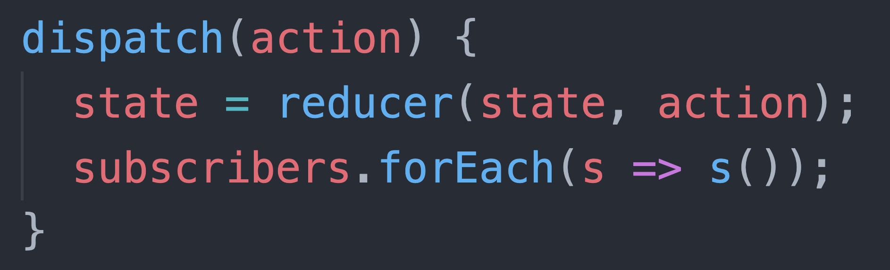

# За что мы не любим Redux?

-----

## Сперва 2 хороших твита из 2018 года

-----

Redux – это тупой EventEmitter c непропорционально крутой экосистемой инструментов, построенных на нём.

Интересно, какие возможности мы упустили для этой экосистемы.

Представьте если бы эти инструменты сразу создавались не на тупом EventEmitter'е, а на React'е.

-----

Redux по сути очень прост. И его концепт великолепен. Но стало бы лучше, если ядро было менее примитивным?

-----

## Ядро Redux (великолепный концепт):

 <!-- .element: class="plain"  -->

-----

### Redux asks you to:

- Describe application state as plain objects and arrays.
- Describe changes in the system as plain objects.
- Describe the logic for handling changes as pure functions.

-----

In fact these are pretty strong constraints...

<https://medium.com/@dan_abramov/you-might-not-need-redux-be46360cf367>

-----

### Эти ограничения позволяют: <!-- .element: class="green" -->

- Подписываться на изменения в Сторе
- Сохранять состояние в LocalStorage
- Boot состояния с сервера или LocalStorage
- Сохранение данных экшенов (тайм-тревелинг и дебаг)
- Возможно реализовать Undo операции
- Изоляция бизнес-логики от UI компонент

-----

### Всё ли так радужно с Redux? <!-- .element: class="orange" -->

Результаты небольшого опроса (август 2018) <https://docs.google.com/spreadsheets/d/1JsjzDeiUiPkapN2q5ueN5cOYwLNbjNnjwagon3sniJE/edit?usp=sharing>

-----

### Используете ли вы статический анализ? <!-- .element: class="orange" -->

- 37.9 – Typescript
- 37.9 – Flowtype
- 24.1 – нет

-----

### С каким серверным API используете Redux? <!-- .element: class="orange" -->

- 41.1% – REST
- 20.7% – REST + Swagger
- 13.8% – GraphQL

-----

### Что бы вы посоветовали использовать вместо Redux? <!-- .element: class="orange" -->

- 38% – Mobx (стал "расходиться" с React)
- 23% – лучше Redux, только Redux
- 15% – Cerebral
- 15% – Apollo

-----

### Первая проблема <!-- .element: class="gray" -->

## БОЙЛЕРПЛЕЙТ <!-- .element: class="red" -->

 

Все жалуются на "обезьянство": добавь константу, добавь экшен, добавь обработку в редюсер. <!-- .element: class="fragment" -->

-----

### Вторая проблема <!-- .element: class="gray" -->

## грамотное построение Стора <!-- .element: class="red" -->

 

Советуют держать нормализованный стейт, не дублировать данные, бить редьюсеры на маленькие, переиспользовать action'ы в разных редьюсерах. <!-- .element: class="fragment" -->

-----

### Третья проблема <!-- .element: class="gray" -->

### маппинг серверных данных в Стор <!-- .element: class="red" -->

 

Фигово, если АПИ часто меняется.  Надо хорошо покрывать тестами.  Пляски со статической типизацией.  Здорово, если есть Swagger. <!-- .element: class="fragment" -->

-----

## А что если с Сервером и Стором работать иначе? <!-- .element: class="green" -->

- не строить Стор руками <!-- .element: class="fragment" -->
- не писать никакого маппера данных с сервера в Стор <!-- .element: class="fragment" -->
- иметь статический анализ для серверных данных <!-- .element: class="fragment" -->

-----

## ApolloClient и GraphQL   берут на себя проблемы получения и хранения данных в Сторе.

-----

### Если получаете много разных данных с сервера <!-- .element: class="orange" -->

### И бекендеры могут дать GraphQL API <!-- .element: class="fragment" -->

### То однозначно пробуйте Apollo Client! <!-- .element: class="fragment green" -->

-----

### C Redux вы императивно управляете Стором. <!-- .element: class="orange" -->

## А с ApolloClient – декларативно! <!-- .element: class="green fragment" -->

-----

Чуть подробнее про Redux vs Apollo в статье <https://github.com/nodkz/conf-talks/tree/master/articles/redux>
