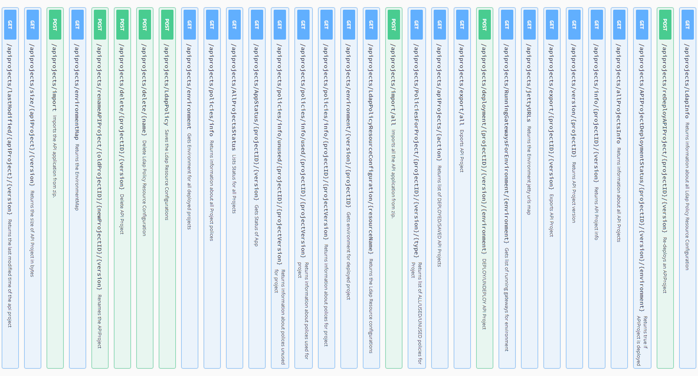

# За что мы не любим REST API?

-----

### Мы не любим REST API за <!-- .element: class="gray" -->

## 1. Жирные ответы <!-- .element: class="red" -->

-----

### Мы получаем и парсим поля,  которые не нужны клиенту.

-----

### Есть прикольный научный бразильский труд:

### [Migrating to GraphQL: A Practical Assessment](https://arxiv.org/abs/1906.07535)

-----

### О том, что REST API наваливает кучу данных:

### reduce the number of fields in 94%  reduce the number of bytes in 99% <!-- .element: class="orange" -->

<https://www.youtube.com/watch?v=1L7tGvtCzPY>

-----

## Учёные брали «жирнючий» GitHub'абовский REST API v3 и сравнивали его с GraphQL v4

-----

## А я еще помню времена, когда GitHub REST API v3 был эталоном 

# ☝️

-----

## Просто со временем в АПИ добавляются новые поля. 

## И «сказка» начинает заплывать жиром. <!-- .element: class="fragment red" -->

-----

### Мы не любим REST API за <!-- .element: class="gray" -->

## 2. За операции изменения данных <!-- .element: class="red" -->

-----

-----

### Мы не любим REST API за <!-- .element: class="gray" -->

## 3. Скорость получения связных данных <!-- .element: class="red" -->

-----

 <!-- .element: style="width: 750px" -->

-----

### Тратится время на сетевые задержки между клиентом и сервером. <!-- .element: class="red" -->

### Когда надо дождаться данных, чтобы сделать следующий запрос.

-----

### Мы не любим REST API за <!-- .element: class="gray" -->

## 4. Сложность получения связных данных <!-- .element: class="red" -->

-----

### PayPal experience

When we took a closer look, we found that UI developers were spending less than 1/3 of their time actually building UI. The rest of that time spent was figuring out where and how to fetch data, filtering/mapping over that data and orchestrating many API calls.

<https://medium.com/paypal-engineering/graphql-a-success-story-for-paypal-checkout-3482f724fb53>

-----

### Проще говоря <!-- .element: class="gray" -->

### PayPal подсчитал, что фронтендеры тратят

- ⅓ времени на реальную разработку UI <!-- .element: class="green" -->
- ⅔ на прояснение того что, где и как взять <!-- .element: class="red" -->

-----

