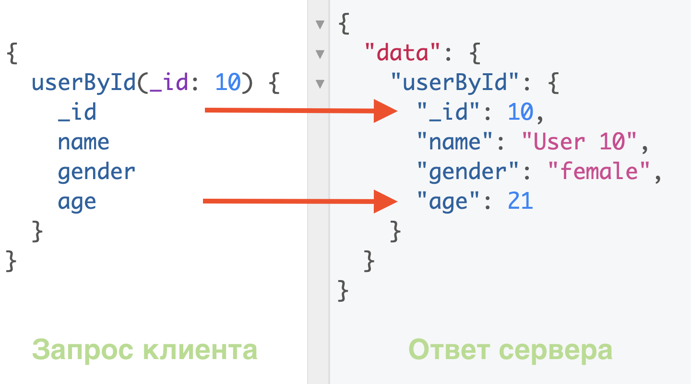
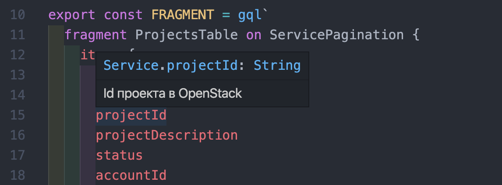
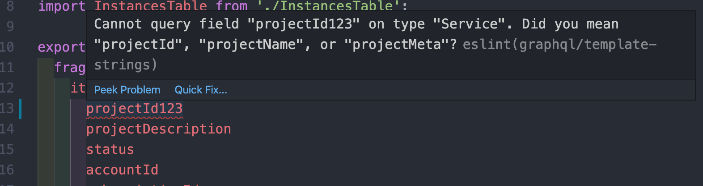
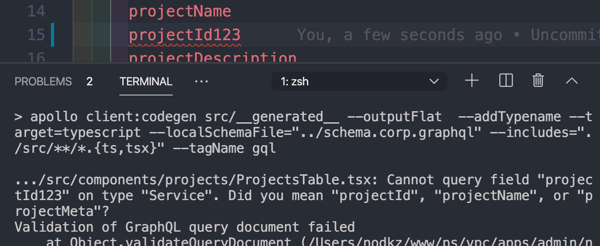
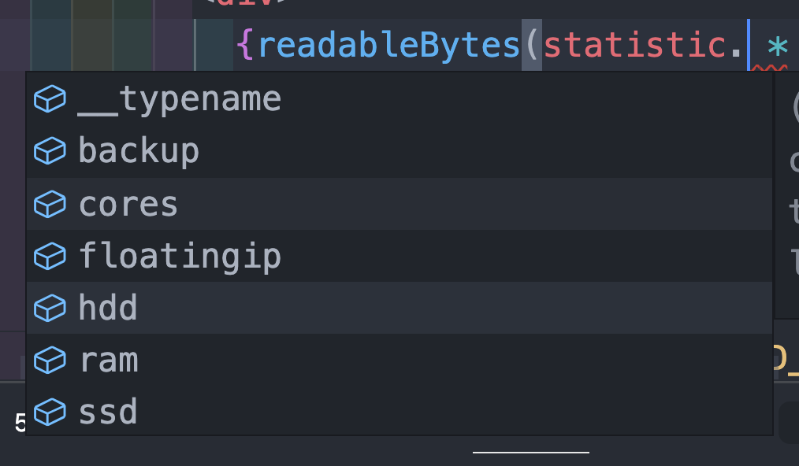
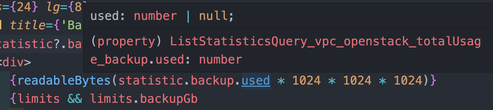
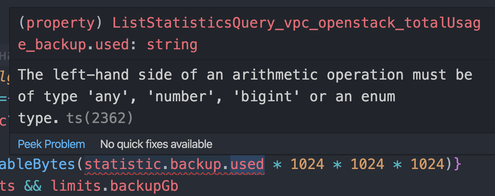

# GraphQL – альтернативный подход

-----

### GraphQL – это язык запросов для API

 <!-- .element: class="plain" style="width: 800px" -->

#### Что запрашиваете, только то и получаете <!-- .element: class="green fragment" -->

-----

### GraphQL – статически типизированный

 <!-- .element: class="plain" style="width: 800px" -->

-----

### Один эндпоинт для получения и изменения данных <!-- .element: class="green" -->

Нет проблем с определением адреса куда стучаться. <!-- .element: class="fragment" -->

-----

### Сервер объявляет о своих возможностях,  клиент заявляет о своих потребностях <!-- .element: class="green" -->

-----

### Сервер объявляет о своих возможностях... <!-- .element: class="green" -->

Через интроспекцию отдает схему данных... <!-- .element: class="fragment apollo" -->

- Удобное написание запросов <!-- .element: class="fragment" -->
  - автоподстановка, браузерные IDE <!-- .element: class="orange fragment" -->
- Валидация запросов <!-- .element: class="fragment" -->
  - без сервера можно проверить корректность запроса <!-- .element: class="orange fragment" -->
- Документация <!-- .element: class="fragment" -->

-----

### ...клиент заявляет о своих потребностях <!-- .element: class="green" -->

Через написание GraphQL-запроса... <!-- .element: class="fragment apollo" -->

- Получаете только те поля, которые есть в запросе <!-- .element: class="fragment" -->
  - вы готовы, если АПИ начнет пухнуть <!-- .element: class="orange fragment" -->
- Можете сразу запросить связанные ресурсы за 1 реквест <!-- .element: class="fragment" -->
  - фронтендеры сами пишут агрегационные запросы <!-- .element: class="orange fragment" -->
  - нет мульёна рест-ручек <!-- .element: class="orange fragment" -->

-----

### GraphQL – это совершенно новый уровень Developer Experience <!-- .element: class="green" -->

-----

## Проверка кода в IDE и при билде <!-- .element: class="green" -->

- Линтинг запросов, через Eslint <!-- .element: class="fragment" -->
  - Бэкендеры удалили поле, вы поймали поломанные запросы <!-- .element: class="orange fragment" -->
- Статическая типизация <!-- .element: class="fragment" -->
  - Бэкендеры изменили тип у поля, вы поймали некорректную работу с переменной <!-- .element: class="orange fragment" -->

-----

### Автоподстановка полей из серверного Типа

-----

### Документация при наведении на тип

-----

### Ошибка при запросе несуществующего поля

-----

### Ошибка на линтинге в CI

-----

### Ошибка при билде в CI

-----

### Автоподстановка полей только из запроса,  а не всех полей которые есть на сервере  (TypeScript)

-----

### Статическая типизация (TypeScript)

-----

### Ошибка при смене типа на сервере (TypeScript)

-----

## Но всё нужно готовить заново <!-- .element: class="green" -->

- Сервер <!-- .element: class="fragment" -->
  - Писать GraphQL-сервер с нуля <!-- .element: class="orange fragment" -->
  - Но можно и обернуть существующие REST-эндпоинты <!-- .element: class="orange fragment" -->
  - Самое главное хорошо задизайнить GraphQL-схему <!-- .element: class="red fragment" -->
- Клиент <!-- .element: class="fragment" -->
  - Для работы со стейтом брать ApolloClient или Relay <!-- .element: class="orange fragment" -->
  - Писать GraphQL-запросы <!-- .element: class="orange fragment" -->
  - Самое главное хорошо настроить Tooling (DX) <!-- .element: class="red fragment" -->
