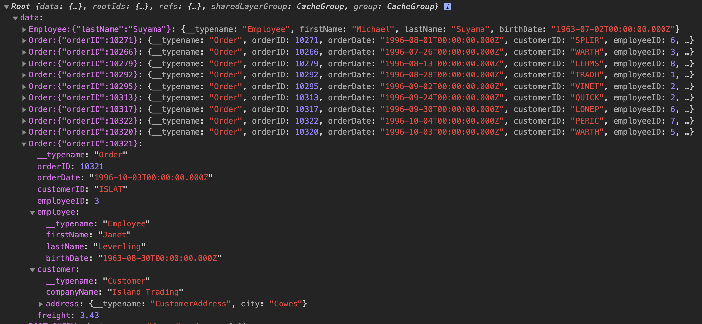
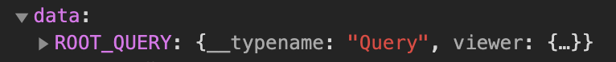

# ApolloClient 3 <!-- .element: class="grey" -->

# EntityCache

-----

### Новая логика нормализованного стора `EntityCache`

- Идеи и наработки взяты у Ian MacLeod (@nevir) из <https://github.com/convoyinc/apollo-cache-hermes>
  - <https://github.com/convoyinc/apollo-cache-hermes/blob/master/docs/Motivation.md>
  - <https://github.com/convoyinc/apollo-cache-hermes/blob/master/docs/Design%20Exploration.md#entities>

-----

## Что такое нормализованный стор? <!-- .element: class="orange" -->

 

[ApolloClient или Relay с фрагментами, «волосатый» GraphQL (HolyJS Piter 2019)](https://youtu.be/VdoPraj0QqU) <!-- .element: class="fragment" -->

-----

## Задачи нормализованного стора <!-- .element: class="green" -->

- Хранить данные компактно (дедубликация) <!-- .element: class="fragment" -->
- Вложенные объекты хранить на верхнем уровне <!-- .element: class="fragment" -->
  - А куда они были вложены, оставить ссылку <!-- .element: class="fragment" -->
- При изменении любого объекта вызвать "перерисовку" <!-- .element: class="fragment" -->

-----

## Проблема старого стора

## – глубокая нормализация <!-- .element: class="fragment orange" -->

- это ресурсоемкая операция! <!-- .element: class="fragment red" -->
  - хорошо потребляет CPU <!-- .element: class="fragment red" -->
  - хорошо кушает память <!-- .element: class="fragment red" -->
- частенько ужасно нормализуется <!-- .element: class="fragment red" -->

-----

#### К примеру, прилетели данные с сервера

[<!-- .element: style="width: 600px" -->](https://graphql-compose.herokuapp.com/northwind?query=query%20OrderListQuery(%24page%3A%20Int!%2C%20%24perPage%3A%20Int!)%20%7B%0A%20%20viewer%20%7B%0A%20%20%20%20orderPagination(page%3A%20%24page%2C%20perPage%3A%20%24perPage)%20%7B%0A%20%20%20%20%20%20...OrderList_pagination%0A%20%20%20%20%20%20__typename%0A%20%20%20%20%7D%0A%20%20%20%20__typename%0A%20%20%7D%0A%7D%0A%0Afragment%20OrderList_pagination%20on%20OrderPagination%20%7B%0A%20%20count%0A%20%20items%20%7B%0A%20%20%20%20...OrderRow_order%0A%20%20%20%20__typename%0A%20%20%7D%0A%20%20pageInfo%20%7B%0A%20%20%20%20pageCount%0A%20%20%20%20currentPage%0A%20%20%20%20__typename%0A%20%20%7D%0A%20%20__typename%0A%7D%0A%0Afragment%20OrderRow_order%20on%20Order%20%7B%0A%20%20orderID%0A%20%20orderDate%0A%20%20customerID%0A%20%20employeeID%0A%20%20employee%20%7B%0A%20%20%20%20firstName%0A%20%20%20%20lastName%0A%20%20%20%20birthDate%0A%20%20%20%20__typename%0A%20%20%7D%0A%20%20customer%20%7B%0A%20%20%20%20...Customer_data%0A%20%20%20%20__typename%0A%20%20%7D%0A%20%20freight%0A%20%20__typename%0A%7D%0A%0Afragment%20Customer_data%20on%20Customer%20%7B%0A%20%20companyName%0A%20%20address%20%7B%0A%20%20%20%20city%0A%20%20%20%20__typename%0A%20%20%7D%0A%20%20__typename%0A%7D%0A&operationName=OrderListQuery&variables=%7B%22page%22%3A1%2C%22perPage%22%3A10%7D)

-----

#### И "древовидный" ответ трансформируют в плоский вид:

 <!-- .element: class="plain" -->

-----

#### А если не тюнить кэш через `dataIdFromObject`, то так:

 <!-- .element: class="plain" -->

##### 💩💩💩💩💩💩

-----

## С кэшем в ApolloClient 2 всё сложно! <!-- .element: class="red" -->

-----

## C EntityCache (Hermes) <!-- .element: class="green" -->

## в ApolloClient 3 всё гораздо лучше <!-- .element: class="green" -->

-----

## Зачем нормализовывать все подряд? <!-- .element: class="red" -->

## Когда можно нормализовывать только бизнес-сущности (объекты с id) <!-- .element: class="fragment green" -->

-----

#### Если известны Entity c id, то они нормализуются:

 <!-- .element: class="plain" -->

-----

#### Вложенные объекты остаются как есть (без ссылок):

 <!-- .element: class="plain" -->

-----

#### Если вообще нет Entity c id

 <!-- .element: class="plain" -->

#### то ничего не нормализуется,  и это гораздо лучше, чем в ApolloClient 2 👍 <!-- .element: class="fragment" -->
