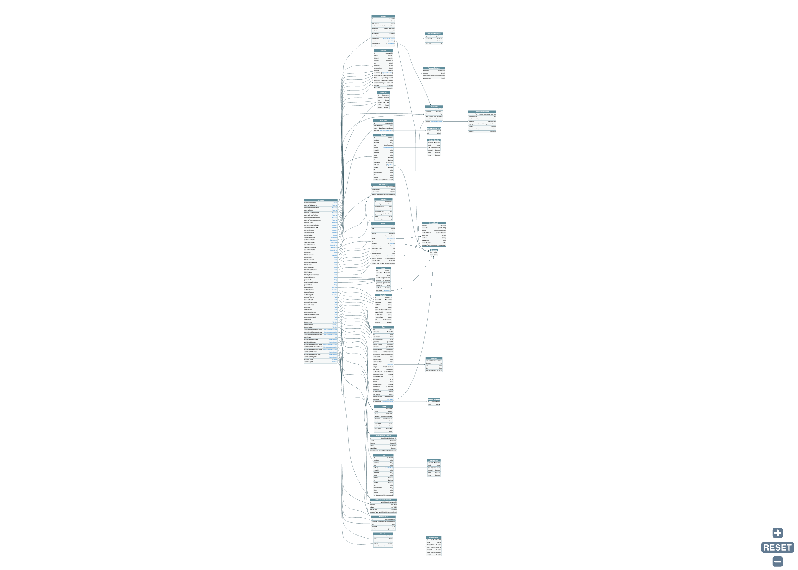
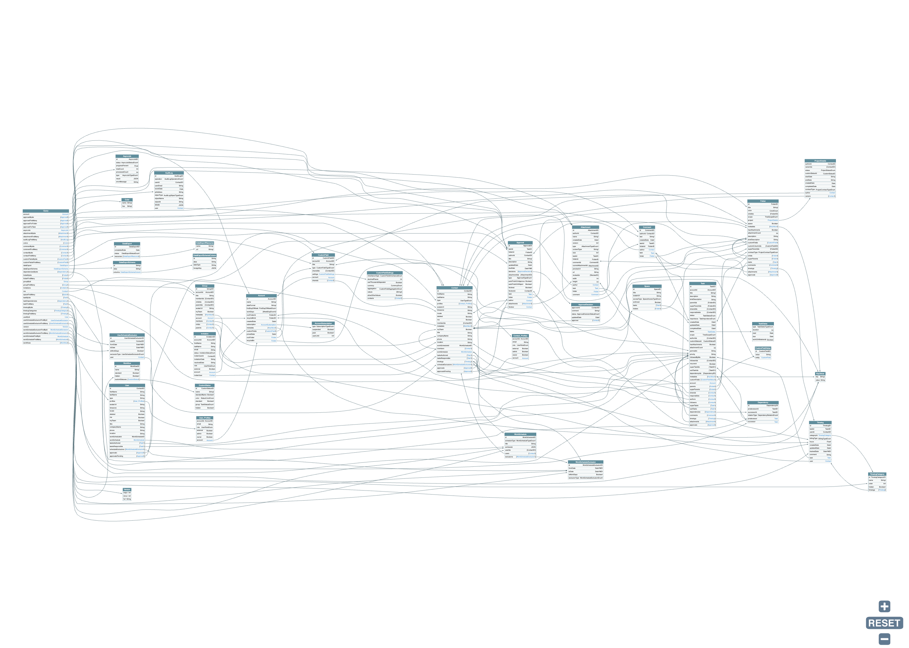
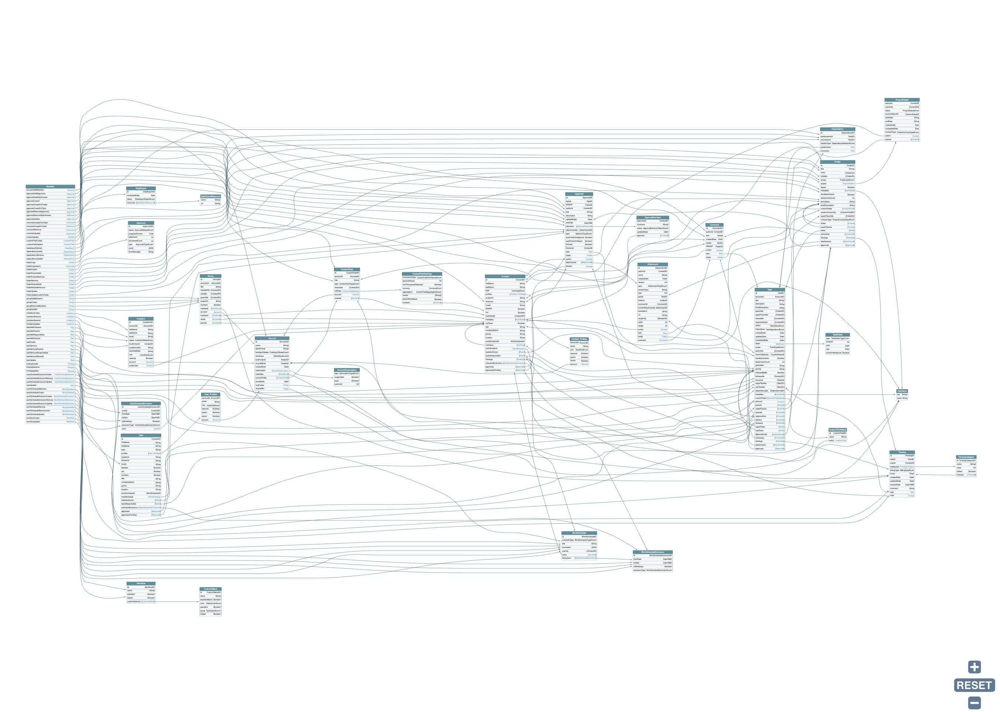

# GraphQL как прокси  к REST API

-----

## А реально обернуть REST API в GraphQL? <!-- .element: class="red" -->

-----

## И как сделать R&D такого подхода? <!-- .element: class="orange" -->

-----

#### Обычно обкатку технологии принято делать на TodoMVC.

 <!-- .element: style="max-width: 800px;" class="plain" -->

-----

## Так и поступим!

-----

### А коль я непростой человек,  то придется мне брать  и непростое Todo-приложение 😈

-----

### Возьму-ка систему управления проектами Wrike.

 <!-- .element: style="max-width: 1200px;" class="plain" -->

-----

## Открою их REST API <https://developers.wrike.com/api/v4>

 <!-- .element: style="max-width: 800px;" class="plain" -->

-----

## Фи, делов-то **на пару дней!** <!-- .element: class="orange" -->

– подумал я.

-----

## И вшатал **160 часов!** <!-- .element: class="orange" -->

– только на демку, без слайдов <!-- .element: class="fragment" -->
– из-за чёртового оптимизма <!-- .element: class="fragment" -->

-----

## В REST API у Wrike оказалось:

- 22 entity
- 87 методов

-----

## И GraphQL получился таким: <!-- .element: class="orange" -->

- 134 GraphQL-типа
- 1002 поля и аргумента
- 51 явная прямая связь между entity
- 26 неявных обратных связей

-----

## Нормально так Wrike прокачал свой "TodoMVC" за 14 лет 😉

-----

## И теперь, у еще одного 🦄 появилось удобное GraphQL апи

-----

## Сперва, у меня получился вот такой RestQL

-----

##### RestQL Query (операции чтения)

 <!-- .element: style="max-width: 800px;" class="plain" -->

-----

##### RestQL Mutation (операции изменения данных)

 <!-- .element: style="max-width: 800px;" class="plain" -->

-----

## Но потом добавил связей,   которые есть в Data Domain  и получил полноценный  "волосатый" GraphQL

-----

##### GraphQL Query (операции чтения)

 <!-- .element: style="max-width: 800px;" class="plain" -->

-----

##### GraphQL Mutation (операции изменения данных)

 <!-- .element: style="max-width: 800px;" class="plain" -->

-----

 <!-- .element: style="max-width: 1100px;" class="plain" -->

-----

 <!-- .element: style="max-width: 1100px; filter: saturate(500);" class="plain" -->

-----

<iframe src="https://graphql-wrike.herokuapp.com/?query=mutation%20CreateTask%20%7B%0A%20%20taskCreate%28%0A%20%20%20%20folderId%3A%20%22IEADMUW4I4OE37IV%22%2C%0A%20%20%20%20task%3A%20%7B%0A%20%20%20%20%20%20title%3A%20%22Make%20Holy%20JS%20Talk%22%2C%0A%20%20%20%20%20%20status%3A%20Deferred%2C%0A%20%20%20%20%20%20responsibles%3A%20%5B%22KUAHNM4I%22%5D%0A%20%20%20%20%7D%0A%20%20%29%20%7B%0A%20%20%20%20id%0A%20%20%20%20title%0A%20%20%20%20responsibles%20%7B%0A%20%20%20%20%20%20firstName%0A%20%20%20%20%20%20lastName%0A%20%20%20%20%20%20tasksResponsible%28%0A%20%20%20%20%20%20%20%20filter%3A%20%7B%20status%3A%20Deferred%20%7D%20%0A%20%20%20%20%20%20%20%20limit%3A%205%2C%20%0A%20%20%20%20%20%20%20%20sort%3A%20CREATED_DATE_DESC%29%20%0A%20%20%20%20%20%20%7B%0A%20%20%20%20%20%20%20%20%20%20id%0A%20%20%20%20%20%20%20%20%20%20title%0A%20%20%20%20%20%20%20%20%20%20status%0A%20%20%20%20%20%20%20%20%20%20description%0A%20%20%20%20%20%20%20%20%20%20createdDate%0A%20%20%20%20%20%20%7D%0A%20%20%20%20%7D%0A%20%20%7D%0A%7D%0A%0Aquery%20CustomData%20%7B%0A%20%20lastTwoCompletedTasks%3A%20taskFindMany%28%0A%20%20%20%20filter%3A%20%7B%20status%3A%20Completed%20%7D%0A%20%20%20%20limit%3A%202%0A%20%20%20%20sort%3A%20COMPLETED_DATE_DESC%0A%20%20%29%20%7B%0A%20%20%20%20id%0A%20%20%20%20title%0A%20%20%20%20status%0A%20%20%20%20completedDate%0A%20%20%7D%0A%20%20lastTwoNewTasks%3A%20taskFindMany%28%0A%20%20%20%20filter%3A%20%7B%20status%3A%20Active%7D%0A%20%20%20%20limit%3A%203%0A%20%20%20%20sort%3A%20CREATED_DATE_DESC%0A%20%20%29%20%7B%0A%20%20%20%20id%0A%20%20%20%20title%0A%20%20%20%20status%0A%20%20%20%20createdDate%0A%20%20%7D%0A%7D" width="100%" height="720px" />
