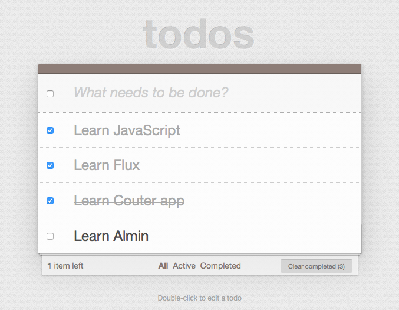
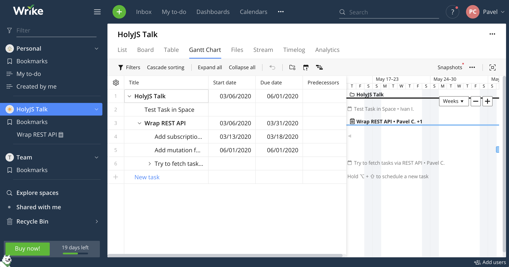
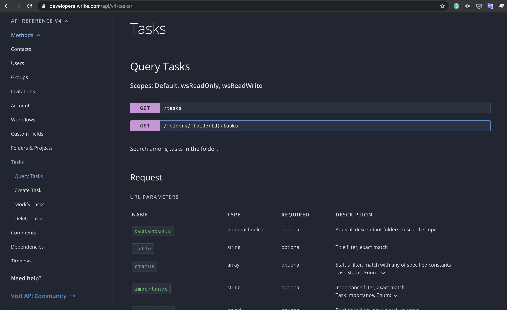
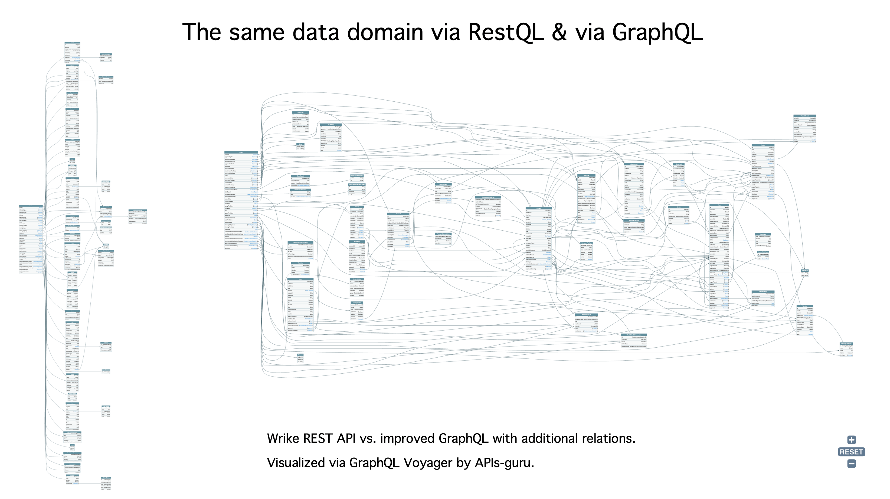
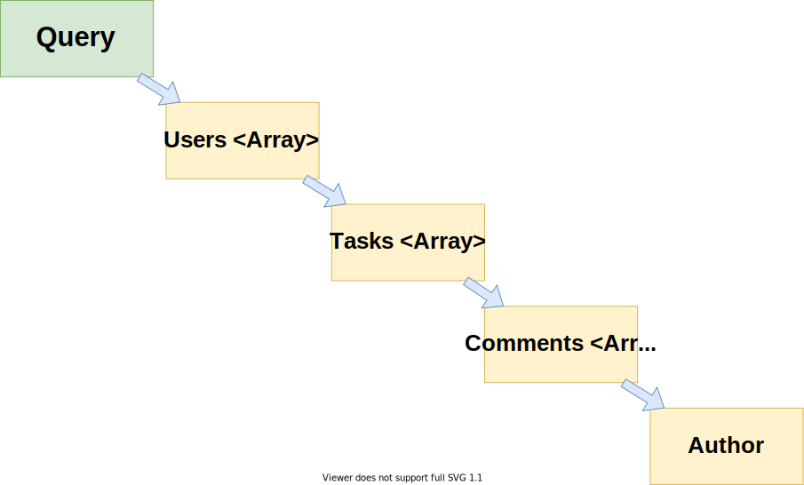

# GraphQL как прокси  к REST API

-----

## А реально обернуть REST API в GraphQL? <!-- .element: class="red" -->

- C авторизацией <!-- .element: class="fragment" -->
- Без проблемы N+1 (DataLoader) <!-- .element: class="fragment" -->
- С защитой от DoS (QueryCost) <!-- .element: class="fragment" -->

-----

# РЕАЛЬНО! <!-- .element: class="green" -->

-----

#### Обычно обкатку технологии принято делать на TodoMVC.

 <!-- .element: style="max-width: 800px;" class="plain" -->

-----

## Так и поступим!

-----

### А коль я непростой человек,  то придется мне брать  и непростое Todo-приложение 😈

-----

### Возьму-ка систему управления проектами Wrike

 <!-- .element: style="max-width: 1200px;" class="plain" -->

-----

## Открою их REST API <https://developers.wrike.com/api/v4>

 <!-- .element: style="max-width: 800px;" class="plain" -->

-----

## Фи, делов-то **на пару дней!** <!-- .element: class="orange" -->

– подумал я.

-----

## И вшатал **160 часов!** <!-- .element: class="orange" -->

- только на демку, без слайдов <!-- .element: class="fragment" -->
- из-за чёртового оптимизма <!-- .element: class="fragment" -->

-----

## В REST API у Wrike оказалось: <!-- .element: class="red" -->

- 22 entity
- 87 методов

-----

## Ну, нормально так Wrike прокачал свой "TodoMVC" за 14 лет 😅

-----

## В итоге,  GraphQL получился таким: <!-- .element: class="orange" -->

- 22 entity
- 41 поле в Query
- 65 полей в Mutation

-----

## Сперва, у меня получился RestQL

## слабосвязный GraphQL

-----

## Но потом добавил связей,   которые есть в Data Domain  и получил полноценный  "волосатый" GraphQL

-----

### Любые генераторы REST API в GraphQL  выдадут RestQL (то что слева) <!-- .element: class="red" -->

 <!-- .element: style="max-width: 1100px;" class="plain" -->

-----

### И только люди могут передать данные о связях для полноценного GraphQL (то что справа) <!-- .element: class="green" -->

 <!-- .element: style="max-width: 1100px; filter: saturate(500);" class="plain" -->

-----

## Немного итоговых GraphQL цифр: <!-- .element: class="orange" -->

- 134 GraphQL-типа
- 1002 поля и аргумента
- 51 явная прямая связь между entity
- 26 неявных обратных связей

-----

## И теперь, у еще одного 🦄  появилось удобное  "волосатое" GraphQL апи

-----

## Ну если АПИ есть, пора бы что-то нехитрое запросить

-----

### За один запрос получим (а-ля LEFT JOIN):

 <!-- .element: style="max-width: 500px; class="plain" -->

-----

<iframe src="https://graphql-wrike.herokuapp.com/?query=query%20UsersTasksWithComments%20%7B%0A%20%20contactFindMany%20%7B%0A%20%20%20%20firstName%0A%20%20%20%20lastName%0A%20%20%20%20tasksResponsible%28limit%3A2%2C%20sort%3ACREATED_DATE_ASC%29%20%7B%0A%20%20%20%20%20%20title%0A%20%20%20%20%20%20status%0A%20%20%20%20%20%20createdDate%0A%20%20%20%20%20%20comments%20%7B%20%23%20REST%20API%20does%20not%20support%20filtering%20%26%20sorting%20for%20comments%0A%20%20%20%20%20%20%20%20text%0A%20%20%20%20%20%20%20%20createdDate%0A%20%20%20%20%20%20%20%20author%20%7B%0A%20%20%20%20%20%20%20%20%20%20firstName%0A%20%20%20%20%20%20%20%20%20%20lastName%0A%20%20%20%20%20%20%20%20%7D%0A%20%20%20%20%20%20%7D%0A%20%20%20%20%7D%0A%20%20%7D%0A%7D" width="100%" height="720px" />
