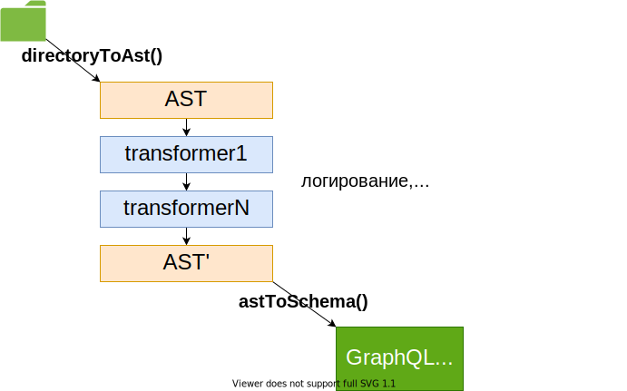
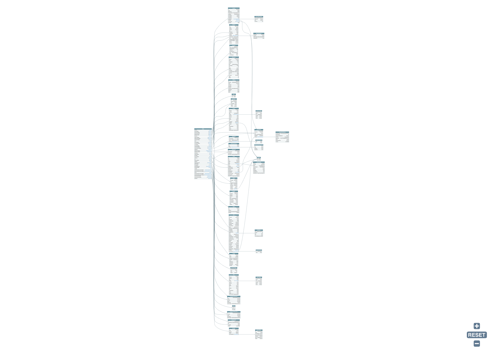

## M4: Описание точек входа в граф

-----

### Описываем входные точки

- `query`
- `mutation`
- `subscription`

-----

### За 5 лет я перепробовал кучу подходов в построении схем <!-- .element: class="orange" -->

<https://github.com/nodkz/conf-talks/tree/master/articles/graphql/schema-build-ways>

<https://youtu.be/RmGxUfmksck>

  

-----

### И сейчас использую  `graphql-compose-modules` ☝️

 

Подход начала 2020 года <!-- .element: class="gray fragment" -->

-----

 <!-- .element: style="max-width: 800px;" class="plain" -->

TODO: улучшить графики

-----

 <!-- .element: style="max-width: 800px;" class="plain" -->

-----

### А еще это удобный способ работы со схемой: <!-- .element: class="green" -->

- удобно смотреть схему через файлы <!-- .element: class="fragment" -->
- легкий рефакторинг схемы <!-- .element: class="fragment" -->
- удобный код ревью <!-- .element: class="fragment" -->
- тестирование схемы по кускам <!-- .element: class="fragment" -->

-----

### Смотрим `schema/entrypoints` и `server.ts`

-----

##### По завершению этого этапа (M4)  получаем `RestQL` (графкуэль без связей)

 <!-- .element: style="max-width: 800px;" class="plain" -->

-----

### Грубая оценка M4

- 41 query + 65 mutation entrypoints
- 1034 + 1454 LoC
- ~ `⏱ 40 часов`
