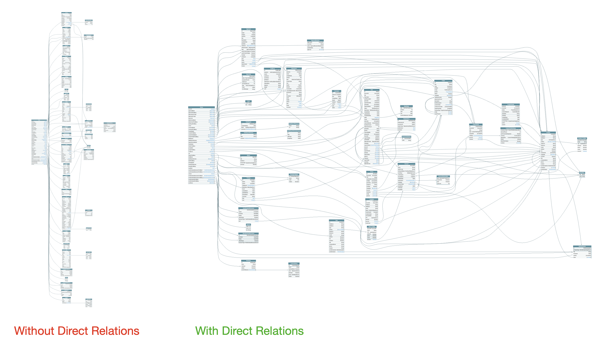

## M5: Расширение Entity прямыми связями по id

-----

### В Entity, где есть поля с ID на другие Entity...

```js
export const TaskTC = schemaComposer.createObjectTC({
  name: 'Task',
  fields: {
    accountId: AccountID.NonNull,
    parentIds: FolderID.NonNull.List,
    superParentIds: FolderID.NonNull.List,
    sharedIds: ContactID.NonNull.List,
    responsibleIds: ContactID.NonNull.List,
    authorId: ContactID.NonNull,
    followerIds: ContactID.NonNull.List,
    superTaskIds: TaskID.NonNull.List,
    subTaskIds: TaskID.NonNull.List,
    dependencyIds: DependencyID.NonNull.List,
  },
});

```

-----

### ...добавляем новые поля с резолверами:

```js
TaskTC.addFields({
  ...
  // authorId: ContactID.NonNull,
  author: {
    type: () => ContactTC,
    resolve: async (source, args, context, info) => {
      // метод из папки `vendor/`
      return contactFindById(source?.authorId, context);
    },
  },
  ...
});

```

<span class="fragment" data-code-focus="3">
<span class="fragment" data-code-focus="4-10">
<span class="fragment" data-code-focus="5">
<span class="fragment" data-code-focus="8">

-----

## Делаем что-то типа `LEFT JOIN` по id

Вы когда пишете SQL запрос с JOIN'ами, то база за вас берёт поле с одной таблицы (source) и по его значение фильтрует и вытягивает записи из другой.

При этом, вы можете и не знать этого значения.

С REST API пока не получите значение, следующий запрос сделать не сможете.

-----

### Добавили 51 связь, и GraphQL [преобразился](https://graphql-wrike.herokuapp.com/voyager)

 <!-- .element: style="max-width: 1000px;" class="plain" -->

-----

### Смотрим `schema/entities/TaskTC.ts`

-----

### Грубая оценка M5

- 51 связь
- ~ `⏱ 10 часов`

-----

### Делается быстро, но чревато проблемой N+1 <!-- .element: class="red" -->
