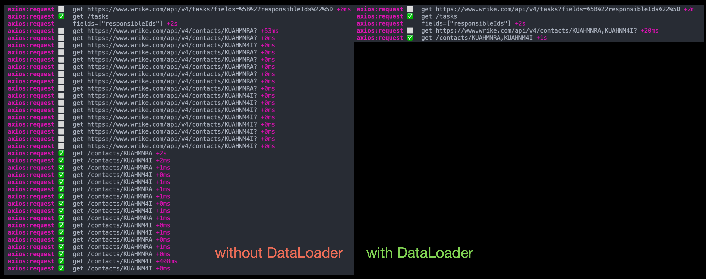

## M6: Создание DataLoaders (N+1)

-----

### Что такое DataLoader?

### `schema/dataLoaders`

-----

### DataLoader – это batch loader: <!-- .element: class="orange" -->

- у него запрашивают кучу Entity по id <!-- .element: class="fragment" -->
- возвращает Promise на каждый запрос <!-- .element: class="fragment" -->
- на nextTick группирует все id и делает 1 запрос findMany(ids) <!-- .element: class="fragment" -->
- получает ответ и разрезолвивает промисы в шаге 2 <!-- .element: class="fragment" -->

-----

### Проблема N+1 хорошо расписана у меня в REPO: <https://github.com/nodkz/conf-talks/blob/master/articles/graphql/dataloader/N+1.md>

-----

### В нашем примере ДатаЛоадеры позволяют решить проблему N+1 и сократить кол-во HTTP запросов к REST API.

-----

### В RestAPI я выделяю 3 типа DataLoader'ов <!-- .element: class="orange" -->

- Глобальный на сервер
- Глобальный на запрос
- Локальный на поле в запросе

-----

### Дата-лоадеры в демо wrike-graphql <!-- .element: class="orange" -->

- **0 глобальных на сервер** <span class="gray">(обычно жесткие справочники)</span>
- **8 глобальных на запрос** <span class="gray">(записи возвращаются полностью, смело можно использовать глобально в рамках запроса)</span>
- **4 fieldNode-specific** <span class="gray">(зависят от запрошенных полей в запросе)</span>

12 DataLoaders serves 51 direct relations ☝️ <!-- .element: class="fragment green" -->

-----

### Писать руками DataLoader'ы достаточно муторно, много копипасты – поэтому их генерируем через `resolveOneViaDL`:

```diff
TaskTC.addFields({
  author: {
    type: () => ContactTC,
-    resolve: async (source, args, context, info) => {
-      // метод из папки `vendor/`
-      return contactFindById(source?.authorId, context);
-    },
+    resolve: resolveOneViaDL('ContactID', (s) => s.authorId),
  },
});

```

-----

### `resolveOneViaDL()` возвращает resolve метод для GraphQL

``` js
export function resolveOneViaDL(
  entityName: DataLoaderEntityNames,
  idGetter: (s, a, c, i) => string
): GraphQLFieldResolver<any, any> {
  return (source, args, context, info) => {
    const id = idGetter(source, args, context, info);
    if (!id) return null;
    return getDataLoader(entityName, context, info).load(id);
  };
}

```

<span class="fragment" data-code-focus="8">и используем еще один генератор `getDataLoader()`</span>


-----

### `getDataLoader()`

```js
/**
 * Get DataLoader instance, global o fieldNode specific
 */
function getDataLoader(
  entityName: keyof typeof DataLoadersCfg,
  context: Record<string, any>,
  info: GraphQLResolveInfo
) {
  if (!context.dataLoaders) context.dataLoaders = new WeakMap();
  const { dataLoaders } = context;

  // determine proper key in Context for DataLoader
  const cfg = DataLoadersCfg[entityName];
  let contextKey: any;
  if (cfg.kind === DataLoaderKind.FieldNode) {
    // available for only current fieldNode
    contextKey = info.fieldNodes;
  } else {
    // available for all field levels
    contextKey = cfg;
  }

  // get or create DataLoader in GraphQL context
  let dl: DataLoader<any, any> = dataLoaders.get(contextKey);
  if (!dl) {
    dl = cfg.init(context, info);
    dataLoaders.set(contextKey, dl);
  }
  return dl;
}

/**
 * Mapper config EntityID name to Dataloader creator
 */
const DataLoadersCfg = {
  // Global DataLoaders
  ApprovalID: { init: approvalDLG, kind: DataLoaderKind.OperationGlobal } as DLCfg,
  AttachmentID: { init: attachmentDLG, kind: DataLoaderKind.OperationGlobal } as DLCfg,
  CommentID: { init: commentDLG, kind: DataLoaderKind.OperationGlobal } as DLCfg,
  DependencyID: { init: dependencyDLG, kind: DataLoaderKind.OperationGlobal } as DLCfg,
  CustomFieldID: { init: customFieldDLG, kind: DataLoaderKind.OperationGlobal } as DLCfg,
  TimelogID: { init: timelogDLG, kind: DataLoaderKind.OperationGlobal } as DLCfg,
  TimelogCategoryID: { init: timelogCategoryDLG, kind: DataLoaderKind.OperationGlobal } as DLCfg,
  WorkScheduleID: { init: workScheduleDLG, kind: DataLoaderKind.OperationGlobal } as DLCfg,
  // FieldNodes specific loaders
  AccountID: { init: accountDL, kind: DataLoaderKind.FieldNode } as DLCfg,
  ContactID: { init: contactDL, kind: DataLoaderKind.FieldNode } as DLCfg,
  FolderID: { init: folderDL, kind: DataLoaderKind.FieldNode } as DLCfg,
  TaskID: { init: taskDL, kind: DataLoaderKind.FieldNode } as DLCfg,
};

/**
 * Example of one dataloader creator
 */
export function contactDL(context: any, info: GraphQLResolveInfo) {
  return new DataLoader<string, any>(async (ids) => {
    const results = await contactFindByIds({ ids, info }, context);
    return ids.map(
      (id) => results.find((x) => x.id === id) ||
      new Error(`Contact: no result for ${id}`)
    );
  });
}

```

-----

#### Compare requests number with DataLoaders

 <!-- .element: style="max-width: 1100px;" class="plain" -->

-----

### Грубая оценка

- 13 файлов
- 291 LoC
- Рефакторинг M5 на M6
- ~ `⏱ 20 часов`
