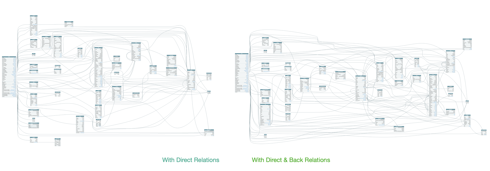

## M7: Создание Резолверов

-----

### FieldConfig > Резолвер > Relations

-----

### GraphQL FieldConfig состоит из <!-- .element: class="orange" -->

### type, <br/>args, <br/>resolve, <br/><span class="gray">description, <br/>deprecationReason,<br/> extensions</span>

-----

### Резолвер – это генератор, который создает FieldConfig

```js
export function getRelationContactIds(
  sourceFieldName: string
): ObjectTypeComposerFieldConfigDefinition<any, any> {
  return {
    type: () => ContactTC.NonNull.List,
    resolve: resolveManyViaDL('ContactID', (s) => s[sourceFieldName]),
    projection: { [sourceFieldName]: 1 },
  };
}

```

-----

### В нашем случаем, мы создаем Резолверы для создания Relations между Entity.

-----

### Relations-резолверы позволяют избавиться от копипасты.

### Т.е. из одного резолвера вы можете сгенерировать множество FieldConfigs для разных частей вашей схемы <!-- .element: class="fragment green" -->

-----

### А еще ваши Relations могут содержать аргументы для фильтрации и сортировки

```js
export function getRelationTasksBySpaceId(
  sourceFieldName: string
): ObjectTypeComposerFieldConfigDefinition<any, any> {
  return {
    type: () => TaskTC.NonNull.List,
    args: {
      filter: TaskFilterByRelation,
      sort: TaskFindManySortEnum,
      limit: 'Int',
      pageSize: 'Int',
    },
    resolve: (source, args, context, info) => {
      return taskFindMany(
        {
          info,
          filter: {
            ...args.filter,
            spaceId: source[sourceFieldName],
          },
          limit: args.limit,
          pageSize: args.pageSize,
          ...args.sort,
        },
        context
      );
    },
    projection: { [sourceFieldName]: 1 },
  };
}

```

Представьте, что этот код вам надо переиспользовать несколько раз в вашей схеме <!-- .element: class="fragment red" -->

-----

### Резолверы позволяют генерировать FieldConfigs ☝️

-----

## В демке `wrike-graphql` <!-- .element: class="orange" -->

- рефакторим M6, превращая 12 DataLoaders в Relations <!-- .element: class="fragment" -->
- добавляем 26 новых "обратных" Relations <!-- .element: class="fragment" -->

-----

### А ещё надо добавить <span class="red">"Обратные" Relations</span>

-----

## "Обратные" Relations – это те которые используют доступные фильтры из REST API.

-----

### Например, к entity `User` можно добавить поля

- tasksAuthored
- tasksResponsible

<br/><br/>

<span class="fragment">Если знать, что существует endpoint `GET /tasks`, <br/>который принимает два параметра <br/>для фильтрации тасков – `authors`, `responsibles`.</span>

-----

### Смотрим `schema/relations`

-----

### Грубая оценка M7

- 14 файлов
- 1142 LoC
- Рефакторинг M6 на M7
- Поиск и добавление обратных связей с фильтрацией
- ~ `⏱ 20 часов`

-----

### 110 relations VS 135 relations (38 nodes)

 <!-- .element: style="max-width: 1100px;" class="plain" -->

-----

### Особой разницы не видно.

### Но ценность в передачи знания о новых 25 связях между Entity.

### А в большой системе их порой ой-как сложно найти.

-----

### 110 relations VS 135 relations (38 nodes)

 <!-- .element: style="max-width: 1100px; filter: saturate(500);" class="plain" -->
