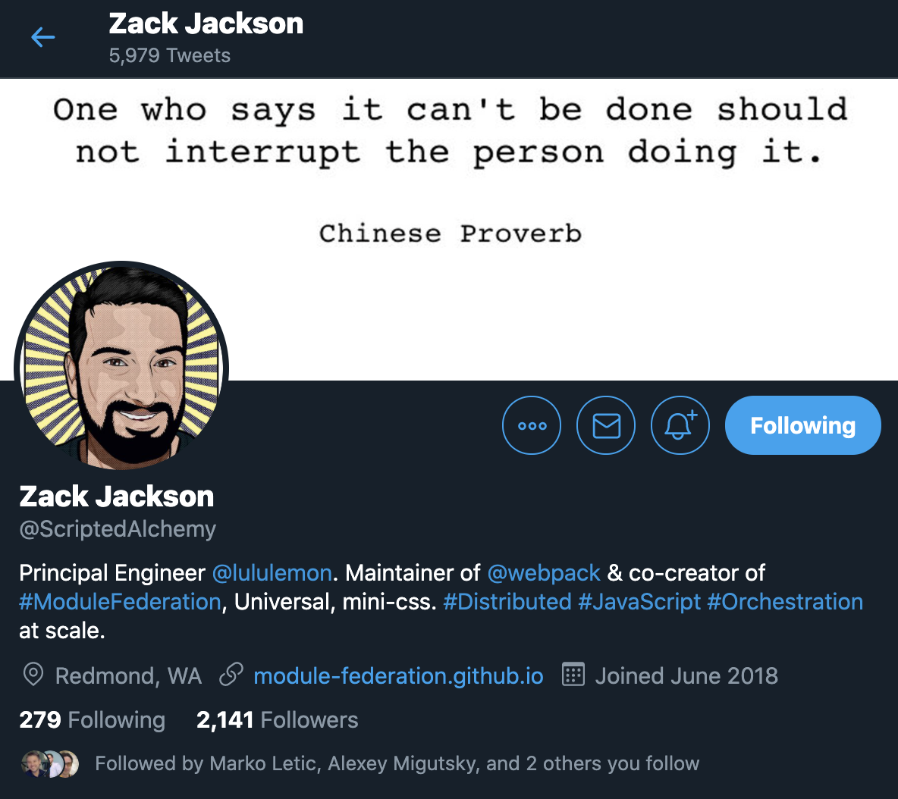
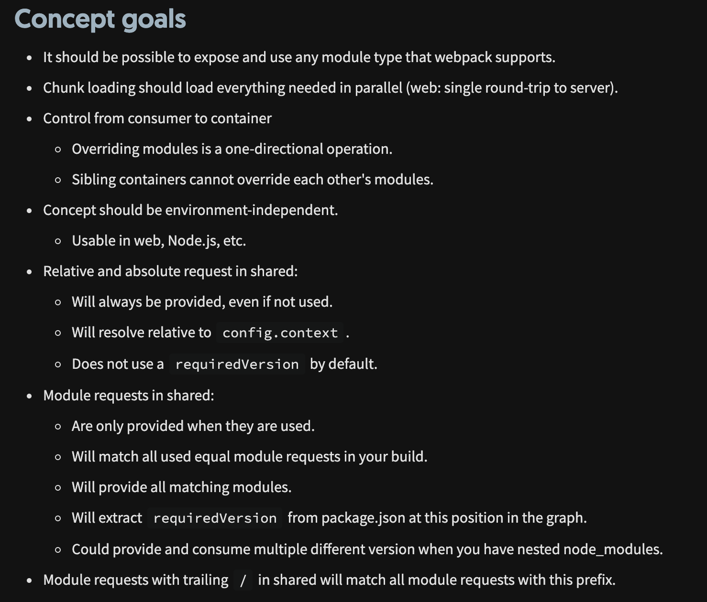

# 4. Описание Module Federation

-----

### Module Federation invented and prototyped  by Zack Jackson

 <!-- .element: class="plain" style="background-color: white" width="800" -->

-----

<https://twitter.com/scriptedalchemy>

 <!-- .element: class="plain" style="background-color: white" width="700" -->

-----

## История появления <!-- .element: class="green" -->

 <!-- .element: class="plain" style="background-color: white" width="1000" -->

-----

## История появления <!-- .element: class="green" -->

- Ресерч и прототипирование началось в середине 2017
- Первое обсуждение в декабре 2018 [github issue #8524](https://github.com/webpack/webpack/issues/8524)
- Первый анонс в виде статьи в [октябре 2019 года, medium](https://medium.com/@ScriptedAlchemy/micro-fe-architecture-webpack-5-module-federation-and-custom-startup-code-9cb3fcd066c)
- Это "адское" обсуждение в 389 комментов, 61 участник с 7 февраля по 7 октября 2020 [issue #10352](https://github.com/webpack/webpack/issues/10352)
- Зарелизили в октябре 2020 как [core-плагин](https://webpack.js.org/concepts/module-federation/) к Webpack 5

-----

### MF was co-authored into Webpack 5  by Zack Jackson and Marais Rossouw  with lots of guidance, pair-programming,  and assistance from Tobias Koppers. 

<https://medium.com/swlh/webpack-5-module-federation-a-game-changer-to-javascript-architecture-bcdd30e02669>

-----

#### Знаете почему Webpack 5 так долго релизился?   <!-- .element: class="red" -->

### The investment from Tobias has been a major factor in the ability to refine this system and  make substantial changes to Webpack core  to support this technology

-----

## Module federation позволяет одному Webpack-приложению динамически подгружать код из другого Webpack-приложения.

-----

## MF это webpack-plugin, который позволяет импортировать chunk'и из стороннего webpack bundle в рантайме.

-----

## Если DLLPlugin делает это при билде, то MF в рантайме.

-----

## Грубо говоря, MF позволяет смерджить в рантайме два Webpack manifest'а. И заставить их работать вместе, как будто вы их скомпилировали с самого начала.

-----

## Все что может сбандлить Webpack  (css, images, fonts, ...)  с MF может быть зашарено между микрофронтендами.

-----

## MF может шарить между собой общие зависимости, если совпадает semver.

 

К примеру если React уже загружен, то он не будет повторно грузиться со стороннего webpack приложения.

-----

## MF могут быть развернуты на разных доменах и деплоиться независимо.

-----

## "Сборка" происходит на лету при запуске приложения в браузере.

-----

## The concept goals <!-- .element: class="orange" --> from [Webpack docs](https://webpack.js.org/concepts/module-federation/#concept-goals)

[ <!-- .element: width="700" class="plain" -->](https://webpack.js.org/concepts/module-federation/#concept-goals)

-----

## The goals of MF by Zack Jackson <!-- .element: class="orange" --> ([link](https://levelup.gitconnected.com/micro-frontend-architecture-dynamic-import-chunks-from-another-webpack-bundle-at-runtime-1132d8cb6051))

- Нет перезагрузкам страниц при переходе между MFE <!-- .element: class="fragment" -->
- Не грузить vendor code, который уже предоставлен другой Webpack-сборкой (например React) <!-- .element: class="fragment" -->
- Каждый MFE может быть standalone (без внешних зависимостей). <!-- .element: class="fragment" -->
- Не нужно пересобирать основное приложение, если поменялся shared-модуль (например навигация) <!-- .element: class="fragment" -->
- Оркестрация должна происходить на стороне пользователя, позволяя загружать чанки без "умного сервера" (чтоб спокойно раздаваться с CDN и не только). <!-- .element: class="fragment" -->

-----

## Про Server Side Rendering <!-- .element: class="orange" -->

- Module Federation спроектирован как Universal (works in any environment).
- Server-side rendering federated code is completely possible.
- Для SSR можно научить Webpack, чтоб он работал как браузер, только на сервере. Чтоб можно было чанки грузить по внутренней сети.
  - server builds должны использовать `target: commonjs`
  - для загрузки можно использовать `fs` вместо `http`
  - чанки можно шарить через S3 Streaming, ESI или по старинке через npm

-----

## RECAP важных вещей <!-- .element: class="orange" -->

- у каждого микрофронтенда может быть свой репозиторий <!-- .element: class="fragment" -->
- независимые билды и деплои <!-- .element: class="fragment" -->
- микрофронтенд может быть запущен как standalone SPA <!-- .element: class="fragment" -->
- в браузере всё работает как монолит <!-- .element: class="fragment" -->

Note:
It’s important to note that this system is designed so that each completely standalone build/app can be in its own repository, deployed independently, and run as its own independent SPA.
