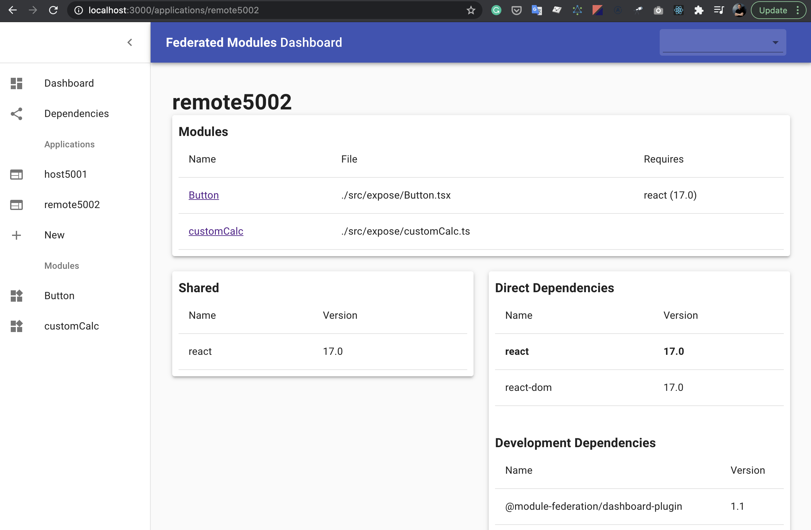

# 5. Архитектура Module Federation

-----

#### Первая диаграмма MF (дек 2018) <br/> <https://github.com/webpack/webpack/issues/8524>

 <!-- .element: class="plain" style="background-color: white" width="700" -->

-----

### Одна из последних диаграмм

 <!-- .element: class="plain" style="background-color: white" width="1200" -->

<https://youtu.be/gmUm7CTsNhk> by Tobias Koppers
<https://github.com/sokra/slides/blob/master/content/ModuleFederationWebpack5.md>

-----

## Terminology <!-- .element: class="orange" -->

- <!-- .element: class="fragment" --><span class="green">Host (consumers)</span> – бандл который первый инициализировался во время загрузки страницы <span class="gray">(корень)</span>
- <!-- .element: class="fragment" --><span class="green">Remote (consumable)</span> – другой бандл, чьи некоторые части может импортировать "host" <span class="gray">(лист)</span>
- <!-- .element: class="fragment" --><span class="green">Bidirectional host</span> – бандл, который может быть или "host", или "remote" <span class="gray">(корень или лист)</span>
- <!-- .element: class="fragment" --><span class="green">Omnidirectional host</span> – бандл, который одновременно может быть и "host", и "remote" <span class="gray">(внутренний узел)</span>

-----

 <!-- .element: class="plain" style="background-color: white" width="800" -->

Diagram by Tobias Koppers

-----

## Terminology <!-- .element: class="orange" -->

- <!-- .element: class="fragment" --><span class="green">Exposed modules</span> – модули которые будут доступны другим приложением для импорта
- <!-- .element: class="fragment" --><span class="green">Shared modules</span> – модули которые могут быть общими для всего приложения (vendor eg React)

-----

 <!-- .element: class="plain" style="background-color: white" width="900" -->

-----

## Scope explanation

```js
// <script src="//site2.com/remoteEntry.js" /> ~7kb
// init global var with some name, e.g. site2scope

site2scope.init({
  react: {
    '17.0.1': {
      get: () => Promise.resolve().then(() => () => require('react')),
    },
  },
});

const asyncModule = site2scope.get('./Button');

// const RemoteButton = React.lazy(() => asyncModule);
// <React.Suspense fallback="...">
//   <RemoteButton />
// </React.Suspense>

```

-----

## Много подробностей и диаграмм <br/>от Tobias Koppers

<https://github.com/sokra/slides/blob/master/content/ModuleFederationWebpack5.md>

-----

video: <https://youtu.be/HDRIvks0yyk>

src: [webpack/lib/container/ModuleFederationPlugin.js](https://github.com/webpack/webpack/blob/master/lib/container/ModuleFederationPlugin.js)

```js
/*
  MIT License http://www.opensource.org/licenses/mit-license.php
  Author Tobias Koppers @sokra and Zackary Jackson @ScriptedAlchemy
*/

"use strict";

const { validate } = require("schema-utils");
const schema = require("../../schemas/plugins/container/ModuleFederationPlugin.json");
const SharePlugin = require("../sharing/SharePlugin");
const ContainerPlugin = require("./ContainerPlugin");
const ContainerReferencePlugin = require("./ContainerReferencePlugin");

/** @typedef {import("../../declarations/plugins/container/ModuleFederationPlugin").ExternalsType} ExternalsType */
/** @typedef {import("../../declarations/plugins/container/ModuleFederationPlugin").ModuleFederationPluginOptions} ModuleFederationPluginOptions */
/** @typedef {import("../../declarations/plugins/container/ModuleFederationPlugin").Shared} Shared */
/** @typedef {import("../Compiler")} Compiler */

class ModuleFederationPlugin {
  /**
   * @param {ModuleFederationPluginOptions} options options
   */
  constructor(options) {
    validate(schema, options, { name: "Module Federation Plugin" });

    this._options = options;
  }

  /**
   * Apply the plugin
   * @param {Compiler} compiler the compiler instance
   * @returns {void}
   */
  apply(compiler) {
    const { _options: options } = this;
    const library = options.library || { type: "var", name: options.name };
    const remoteType =
      options.remoteType ||
      (options.library &&
      schema.definitions.ExternalsType.enum.includes(options.library.type)
        ? /** @type {ExternalsType} */ (options.library.type)
        : "script");
    if (
      library &&
      !compiler.options.output.enabledLibraryTypes.includes(library.type)
    ) {
      compiler.options.output.enabledLibraryTypes.push(library.type);
    }
    compiler.hooks.afterPlugins.tap("ModuleFederationPlugin", () => {
      if (
        options.exposes &&
        (Array.isArray(options.exposes)
          ? options.exposes.length > 0
          : Object.keys(options.exposes).length > 0)
      ) {
        new ContainerPlugin({
          name: options.name,
          library,
          filename: options.filename,
          exposes: options.exposes
        }).apply(compiler);
      }
      if (
        options.remotes &&
        (Array.isArray(options.remotes)
          ? options.remotes.length > 0
          : Object.keys(options.remotes).length > 0)
      ) {
        new ContainerReferencePlugin({
          remoteType,
          remotes: options.remotes
        }).apply(compiler);
      }
      if (options.shared) {
        new SharePlugin({
          shared: options.shared,
          shareScope: options.shareScope
        }).apply(compiler);
      }
    });
  }
}

module.exports = ModuleFederationPlugin;

```

-----

[<!-- .element: class="plain" style="background-color: white" width="1000" -->](https://github.com/sokra/slides/blob/master/content/ModuleFederationWebpack5/28.png)

-----

### Practical advice <!-- .element: class="green" -->

## <b class="orange">State manager у каждого приложения должен быть своим.</b>

- <!-- .element: class="fragment" --> Глобальный стейт будет нарушать инкапсуляцию микросервисов.
- <!-- .element: class="fragment" --> Если два микрофронтенда имеют много чего общего в стейте – скорее всего их следует объединить в один микрофронтенд.

-----

## One More Thing

## Module Federation Dashboard <!-- .element: class="green fragment" -->

-----

<!-- .element: class="plain" style="background-color: white" width="800" -->

<https://www.npmjs.com/package/@module-federation/dashboard-plugin>
