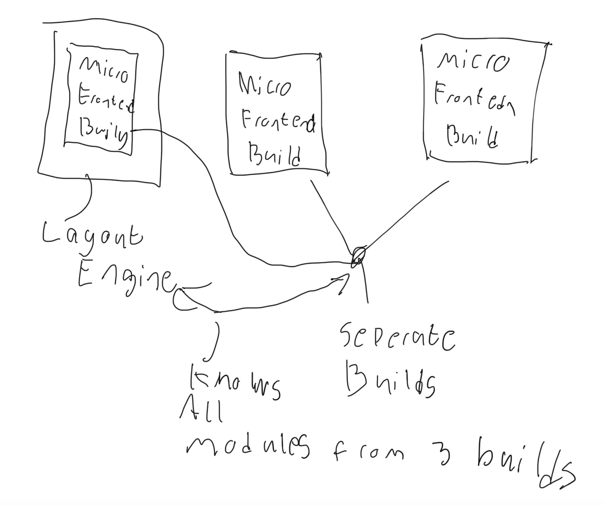
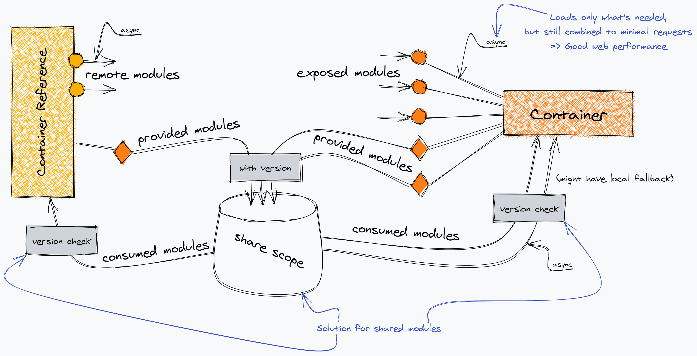
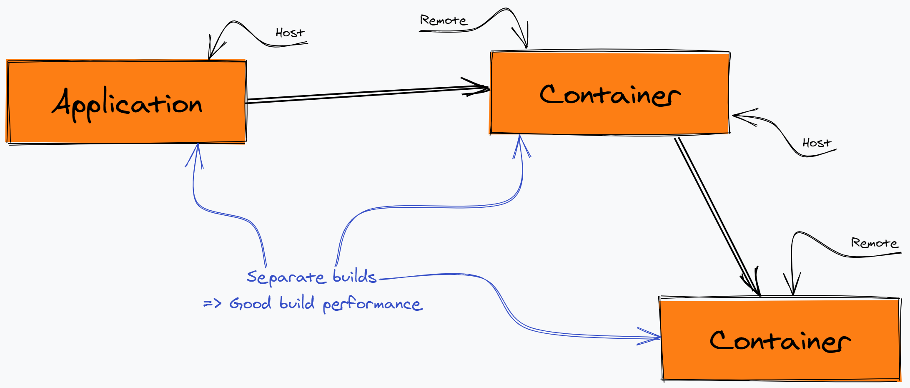

# 5. Архитектура Module Federation

-----

#### Первая диаграмма MF (дек 2018) <br/> <https://github.com/webpack/webpack/issues/8524>

 <!-- .element: class="plain" style="background-color: white" width="700" -->

-----

### Одна из последних диаграмм

 <!-- .element: class="plain" style="background-color: white" width="1200" -->

<https://youtu.be/gmUm7CTsNhk> by Tobias Koppers
<https://github.com/sokra/slides/blob/master/content/ModuleFederationWebpack5.md>

-----

## Terminology <!-- .element: class="orange" -->

- <!-- .element: class="fragment" --><span class="green">Host (consumers)</span> – бандл который первый инициализировался во время загрузки страницы <span class="gray">(корень)</span>
- <!-- .element: class="fragment" --><span class="green">Remote (consumable)</span> – другой бандл, чьи некоторые части может импортировать "host" <span class="gray">(лист)</span>
- <!-- .element: class="fragment" --><span class="green">Bidirectional host</span> – бандл, который может быть или "host", или "remote" <span class="gray">(корень или лист)</span>
- <!-- .element: class="fragment" --><span class="green">Omnidirectional host</span> – бандл, который одновременно может быть и "host", и "remote" <span class="gray">(внутренний узел)</span>

-----

 <!-- .element: class="plain" style="background-color: white" width="800" -->

Diagram by Tobias Koppers

-----

## Terminology <!-- .element: class="orange" -->

- <!-- .element: class="fragment" --><span class="green">Exposed modules</span> – модули которые будут доступны другим приложением для импорта
- <!-- .element: class="fragment" --><span class="green">Shared module</span> – модули которые могут быть общими для всего приложения (vendor eg React)

-----

## Мой взгляд на то, как работает MF

 <!-- .element: class="plain" style="background-color: white" width="800" -->

-----

## Много подробностей и диаграмм от Tobias Koppers

<https://github.com/sokra/slides/blob/master/content/ModuleFederationWebpack5.md>

-----

[](https://github.com/sokra/slides/blob/master/content/ModuleFederationWebpack5/28.png) <!-- .element: class="plain" style="background-color: white" width="800" -->

-----

TODO remoteEntry.js

```
new ModuleFederationPlugin({
  name: 'remote5002',
  // вспомнить почему
  library: { type: 'var', name: 'remote5002' },
  filename: 'remoteEntry.js',
  exposes: {
    './Button': './src/expose/Button.tsx',
    './customCalc': './src/expose/customCalc.ts',
  },
  shared: {
    react: {
      requiredVersion: '17.0.1',
      singleton: true,
    },
  },
})
```

-----

TODO scope explanation

```
globalScope.init({
  react: {
    '16-branch': {
      get: () => Promise.resolve().then(() => () => require('react')),
    },
  },
});
```

-----

TODO https://github.com/webpack/webpack/blob/master/lib/container/ModuleFederationPlugin.js

TODO find video

-----

### Practical advice <!-- .element: class="green" -->

## <b class="orange">State manager у каждого приложения должен быть своим.</b>

- <!-- .element: class="fragment" --> Глобальный стейт будет нарушать инкапсуляцию микросервисов.
- <!-- .element: class="fragment" --> Если два микрофронтенда имеют много чего общего в стейте – скорее всего их следует объединить в один микрофронтенд. 
