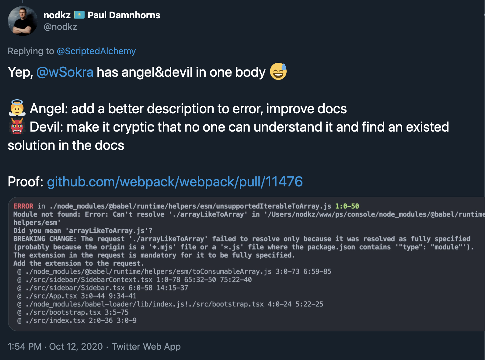

# 7. Минусы Module Federation

-----

## Это Webpack <!-- .element: class="red" -->

- возможно это vendor lock
- слезы и нервы при настройке/дебаге

-----

[<!-- .element: class="plain" width="1000" -->](https://github.com/webpack/webpack/pull/11476)

-----

### ☝️ Не забудьте при переезде на Webpack 5

```js
module: {
  rules: [
    {
      // https://github.com/webpack/webpack/issues/11467#issuecomment-691702706
      // https://github.com/vercel/next.js/pull/17095
      test: /\.m?js/,
      resolve: {
        fullySpecified: false,
      },
    },
    ...
  ],
}

```

А то будите думать, что он бажнутый и нифига не работает. <!-- .element: class="gray" -->

-----

## Новые проблемы в рантайме <!-- .element: class="red" -->

- проблемы с сетью
- нарушение контрактов (интерфейсов)
- версионирование

-----

## С тестированием пока все сложно <!-- .element: class="red" -->

### Если поменяете интерфейс exposed модуля, то ваше приложение сломается точно так же, как если бы вы поменяли схему своего REST API

-----

## В руках "мастеров" может превратиться в черную дыру node_modules <!-- .element: class="red" -->

### Можно увлечься и наимпортировать вагон интерфейсов и библиотек

-----

## SSR есть, но он tricky <!-- .element: class="red" -->

### Webpack в серверной сборке

Отзыв: ну его нахер вебпак в рантайм сервера тащить, <br/>как его дебажить??? <!-- .element: class="gray fragment" -->

-----

## Не все паттерны и стратегии еще выработаны. <!-- .element: class="red" -->

### Нам дали мяч, а вот с правилами игры пока не все ясно.

Ждем адаптацию фреймворков, таких как next.js и пр. <!-- .element: class="gray fragment" -->

-----

## Все еще новая технология. <!-- .element: class="red" -->

### Но точно будет развиваться и набирать популярность.

Module Federation Dashboard хороший пример развивающегося интрументария. <!-- .element: class="gray fragment" -->
