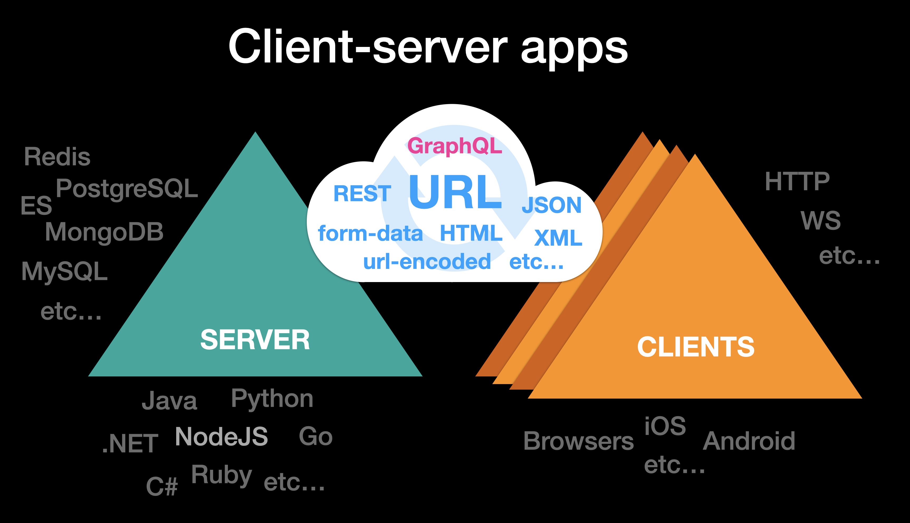
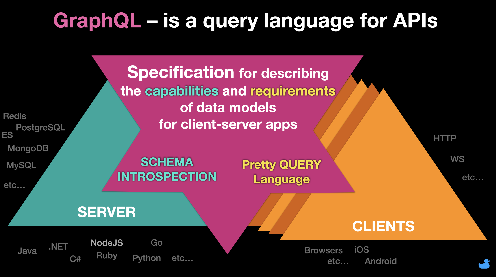
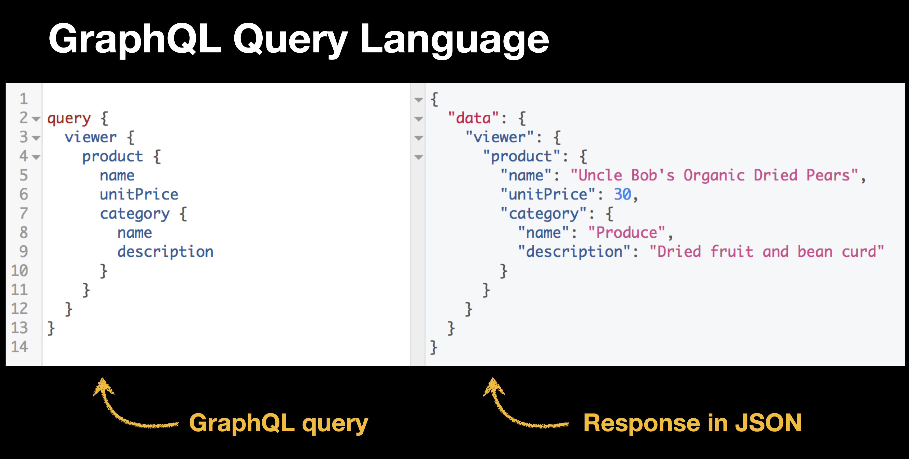
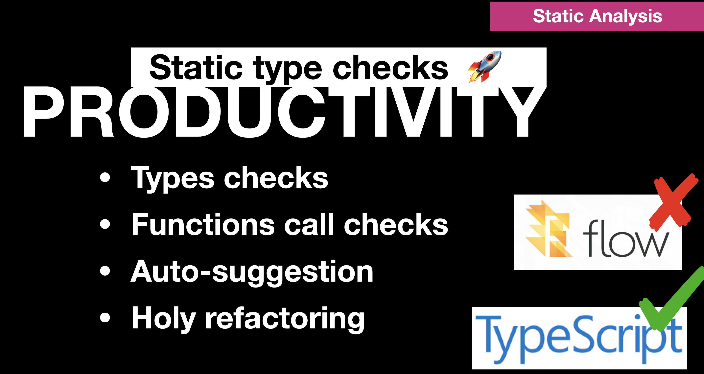
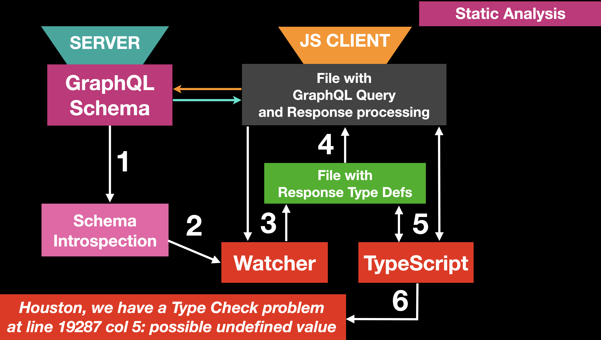
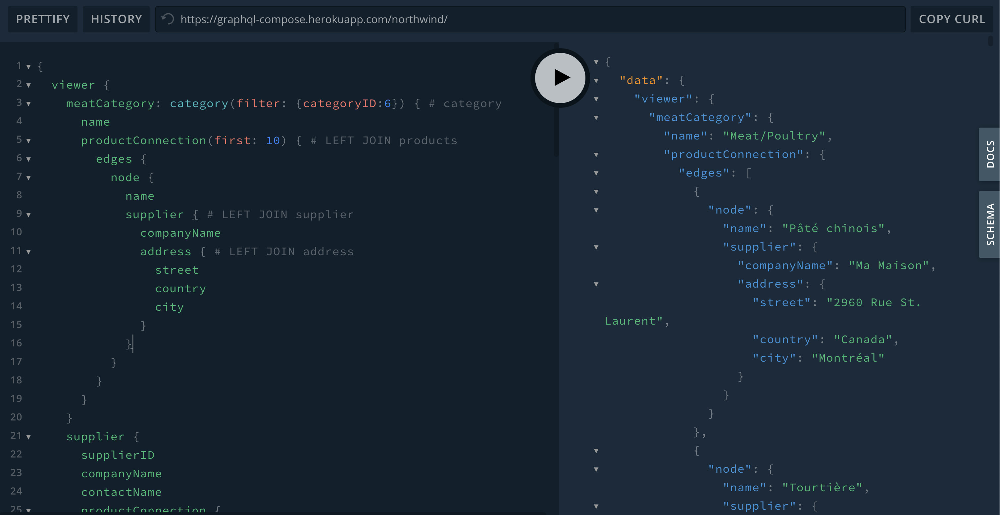
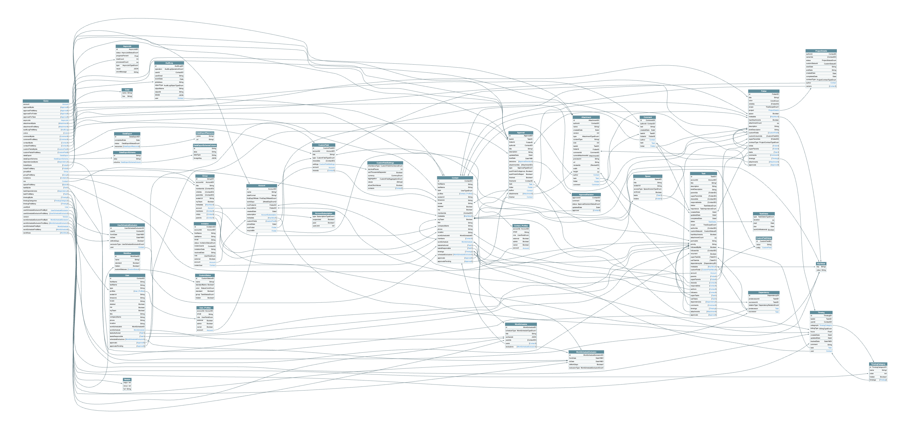
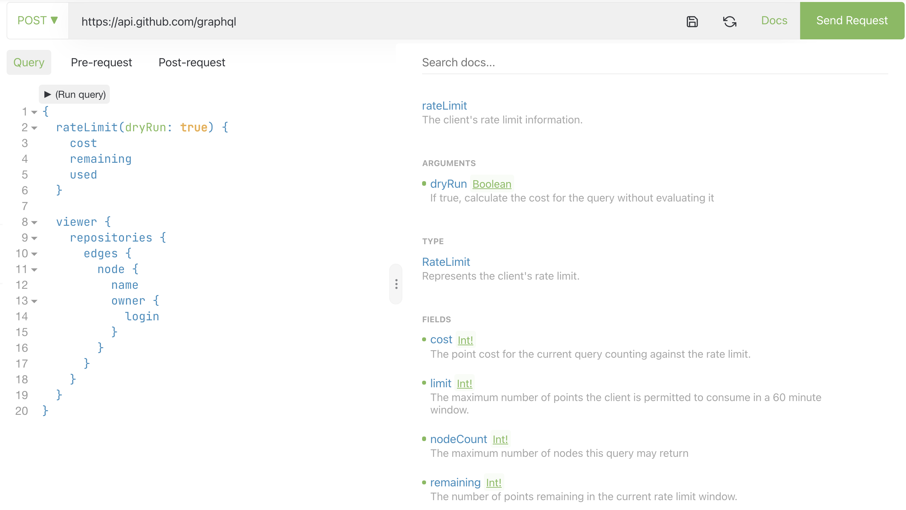

# GraphQL нужен, если

-----

### GraphQL нужен, если <!-- .element: class="green" -->

- взаимодействие между бэком и фронтом
- боль от мульёна микросервисов со своими эндпоинтами
- у вас большие Entity и затратно таскать все 100 полей, когда нужно всего два
- нужны тонкие клиенты на фронтенде
- нужен статический анализ кода
- вам тесно в парадигме 4 операций CRUD в RESTfull API (изменения состояния)
- много разных entity (models) со связями и клиенты хотят сами собирать агрегации (а-ля LEFT JOIN)

-----

### GraphQL нужен, если <!-- .element: class="green" -->

- взаимодействие между бэком и фронтом <!-- .element: class="green" -->
- боль от мульёна микросервисов со своими эндпоинтами <!-- .element: class="gray" -->
- у вас большие Entity и затратно таскать все 100 полей, когда нужно всего два <!-- .element: class="gray" -->
- нужны тонкие клиенты на фронтенде <!-- .element: class="gray" -->
- нужен статический анализ кода <!-- .element: class="gray" -->
- вам тесно в парадигме 4 операций CRUD в RESTfull API (изменения состояния) <!-- .element: class="gray" -->
- много разных entity (models) со связями и клиенты хотят сами собирать агрегации (а-ля LEFT JOIN) <!-- .element: class="gray" -->

-----

 <!-- .element: class="plain" -->

-----

 <!-- .element: class="plain" -->

-----

## Взаимодействие между бэком и фронтом <!-- .element: class="green" -->

- GraphQL разрабатывался для удобства фронтендеров <!-- .element: class="fragment" -->
- Предоставляет строгий контракт для общения между клиентом и сервером <!-- .element: class="fragment" -->
- Это язык запросов для передачи и получения типизированных данных <!-- .element: class="fragment" -->
- Это описания схемы данных, документация и богатый тулинг <!-- .element: class="fragment" -->
- в SPA и мобилках желательно использовать "умные стейт-менеджеры" (Apollo Client, Relay, urql), которые упрощают выполнение запросов, кешируют и нормализовывают данные <!-- .element: class="fragment" -->

-----

### GraphQL нужен, если <!-- .element: class="green" -->

- взаимодействие между бэком и фронтом <!-- .element: class="gray" -->
- боль от мульёна микросервисов со своими эндпоинтами <!-- .element: class="green" -->
- у вас большие Entity и затратно таскать все 100 полей, когда нужно всего два <!-- .element: class="gray" -->
- нужны тонкие клиенты на фронтенде <!-- .element: class="gray" -->
- нужен статический анализ кода <!-- .element: class="gray" -->
- вам тесно в парадигме 4 операций CRUD в RESTfull API (изменения состояния) <!-- .element: class="gray" -->
- много разных entity (models) со связями и клиенты хотят сами собирать агрегации (а-ля LEFT JOIN) <!-- .element: class="gray" -->

-----

 <!-- .element: class="plain" -->

-----

## Мульён микросервисов со своими эндпоинтами <!-- .element: class="green" -->

- когда список ендпоинтов начинает идти на сотни, то знание о них и связях между ними можно заложить в GraphQL. <!-- .element: class="fragment" -->
- зачем мучить бедных фронтендеров безумным пластом знаний и учить их тому, как устроена наша бэкендерская кухня, которая постоянно меняется?! Ещё и документация постоянно устаревает. <!-- .element: class="fragment" -->
- у GraphQL один endpoint <!-- .element: class="fragment" -->

-----

### GraphQL нужен, если <!-- .element: class="green" -->

- взаимодействие между бэком и фронтом <!-- .element: class="gray" -->
- боль от мульёна микросервисов со своими эндпоинтами <!-- .element: class="gray" -->
- у вас большие Entity и затратно таскать все 100 полей, когда нужно всего два <!-- .element: class="green" -->
- нужны тонкие клиенты на фронтенде <!-- .element: class="gray" -->
- нужен статический анализ кода <!-- .element: class="gray" -->
- вам тесно в парадигме 4 операций CRUD в RESTfull API (изменения состояния) <!-- .element: class="gray" -->
- много разных entity (models) со связями и клиенты хотят сами собирать агрегации (а-ля LEFT JOIN) <!-- .element: class="gray" -->

-----

 <!-- .element: class="plain" -->

-----

## у вас большие Entity и затратно таскать все 100 полей, когда нужно всего два (как у GitHub) <!-- .element: class="green" -->
  
- GraphQL явно требует от клиентов указывать в запросе список полей, которые необходимо вернуть <!-- .element: class="fragment" -->
- в OpenAPI, json-rpc в спецификации (из коробки) не заложена фильтрация возвращаемых полей <!-- .element: class="fragment" -->
- [GraphQL can reduce the size of the JSON documents returned by REST APIs in 94% (in number of fields) and in 99% (in number of bytes) 🤪](https://www.youtube.com/watch?v=1L7tGvtCzPY) <!-- .element: class="fragment" -->

-----

### GraphQL нужен, если <!-- .element: class="green" -->

- взаимодействие между бэком и фронтом <!-- .element: class="gray" -->
- боль от мульёна микросервисов со своими эндпоинтами <!-- .element: class="gray" -->
- у вас большие Entity и затратно таскать все 100 полей, когда нужно всего два <!-- .element: class="gray" -->
- нужны тонкие клиенты на фронтенде <!-- .element: class="green" -->
- нужен статический анализ кода <!-- .element: class="gray" -->
- вам тесно в парадигме 4 операций CRUD в RESTfull API (изменения состояния) <!-- .element: class="gray" -->
- много разных entity (models) со связями и клиенты хотят сами собирать агрегации (а-ля LEFT JOIN) <!-- .element: class="gray" -->

-----

 <!-- .element: class="plain" -->

-----

## Нужны тонкие клиенты на фронтенде согласно серверной схеме данных <!-- .element: class="green" -->
  
- если для OpenAPI, json-rpc генерируются полные клиенты со всеми методами, типами и полями. <!-- .element: class="fragment" -->
- то graphql-codegen точечно генерируются фетчеры данных согласно GraphQL-запросов, которые написали фронтендеры. <!-- .element: class="fragment" -->
- с GraphQL не будет генерироваться "мертвый" код для неиспользуемых типов и полей на клиенте <!-- .element: class="fragment" -->
- graphql-codegen (помимо JS/TS, может в Java и С#). <!-- .element: class="fragment" -->

-----

### GraphQL нужен, если <!-- .element: class="green" -->

- взаимодействие между бэком и фронтом <!-- .element: class="gray" -->
- боль от мульёна микросервисов со своими эндпоинтами <!-- .element: class="gray" -->
- у вас большие Entity и затратно таскать все 100 полей, когда нужно всего два <!-- .element: class="gray" -->
- нужны тонкие клиенты на фронтенде <!-- .element: class="gray" -->
- нужен статический анализ кода <!-- .element: class="green" -->
- вам тесно в парадигме 4 операций CRUD в RESTfull API (изменения состояния) <!-- .element: class="gray" -->
- много разных entity (models) со связями и клиенты хотят сами собирать агрегации (а-ля LEFT JOIN) <!-- .element: class="gray" -->

-----

 <!-- .element: class="plain" -->

-----

 <!-- .element: class="plain" -->

-----

## Нужен статический анализ кода <!-- .element: class="green" -->
  
<ul>
  <li class="fragment">
    <a href="https://www.graphql-code-generator.com/">graphql-codegen</a> генерирует TypeScript дефинишены согласно GraphQL-запросам (любое неправильное употребление полей можно будет отловить на этапе билда приложения)
  </li>
  <li class="fragment">
    <a href="https://graphql-inspector.com/">graphql-inspector</a> может отлавливать breaking changes в GraphQL-схемах со стороны бэкенда
  </li>
  <li class="fragment">
    <a href="https://github.com/apollographql/eslint-plugin-graphql">eslint-plugin-graphql</a> или <a href="https://github.com/dotansimha/graphql-eslint">graphql-eslint</a> со стороны клиентского приложения может проверять корректность GraphQL-запросов согласно GraphQL-схеме и активным eslint-правилам
  </li>
</ul>

-----

### GraphQL нужен, если <!-- .element: class="green" -->

- взаимодействие между бэком и фронтом <!-- .element: class="gray" -->
- боль от мульёна микросервисов со своими эндпоинтами <!-- .element: class="gray" -->
- у вас большие Entity и затратно таскать все 100 полей, когда нужно всего два <!-- .element: class="gray" -->
- нужны тонкие клиенты на фронтенде <!-- .element: class="gray" -->
- нужен статический анализ кода <!-- .element: class="gray" -->
- вам тесно в парадигме 4 операций CRUD в RESTfull API (изменения состояния) <!-- .element: class="green" -->
- много разных entity (models) со связями и клиенты хотят сами собирать агрегации (а-ля LEFT JOIN) <!-- .element: class="gray" -->

-----

 <!-- .element: class="plain" -->

-----

## Если вам тесно в парадигме 4 операций CRUD в RESTfull API <!-- .element: class="green" -->
  
- например операции "провести оплату", "приостановить подписку" и пр. достаточно плохо ложатся в CRUD (изменение состояния). <!-- .element: class="fragment" -->
- тут нужно смотреть в сторону RPC (вызов процедур) <!-- .element: class="fragment" -->
- GraphQL лучше json-rpc в следующих вещах: <!-- .element: class="fragment" -->
  - фильтрация полей из коробки; <!-- .element: class="fragment" -->
  - вызвать получение вложенных данных на результате выполнения родительской операции; <!-- .element: class="fragment" -->
  - удобные IDE для написания запросов и их проверки; <!-- .element: class="fragment" -->
  - побогаче туллинг кодогенерации и статического анализа <!-- .element: class="fragment" -->

-----

### GraphQL нужен, если <!-- .element: class="green" -->

- взаимодействие между бэком и фронтом <!-- .element: class="gray" -->
- боль от мульёна микросервисов со своими эндпоинтами <!-- .element: class="gray" -->
- у вас большие Entity и затратно таскать все 100 полей, когда нужно всего два <!-- .element: class="gray" -->
- нужны тонкие клиенты на фронтенде <!-- .element: class="gray" -->
- нужен статический анализ кода <!-- .element: class="gray" -->
- вам тесно в парадигме 4 операций CRUD в RESTfull API (изменения состояния) <!-- .element: class="gray" -->
- много разных entity (models) со связями и клиенты хотят сами собирать агрегации (а-ля LEFT JOIN) <!-- .element: class="green" -->

-----

 <!-- .element: class="plain" -->

-----

### Много разных entity (models) со связями и клиенты хотят сами собирать агрегации (а-ля LEFT JOIN). <!-- .element: class="green" -->
  
- часто удобно для всяких админок и дашбордов на клиентских приложениях <!-- .element: class="fragment" -->
- клиенты могут самостоятельно писать сложные выборки данных, которые позволил бэкендер в GraphQL-схеме <!-- .element: class="fragment" -->
- когда много разработчиков, нужен какой-то инструмент для хранения знаний о DataDomain, нужен удобный язык общения, жесткий контракт и стабильная спецификация. <!-- .element: class="fragment" -->
- и даже на бэкенде сервисы могут общаются через GraphQL, если нужны сложные "управляемые" выборки <!-- .element: class="fragment" -->

-----

[graphql-voyager](https://github.com/APIs-guru/graphql-voyager)

-----

-----

