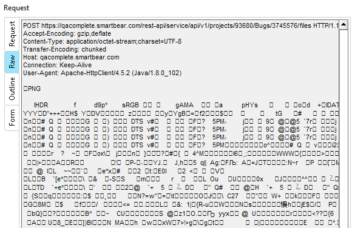
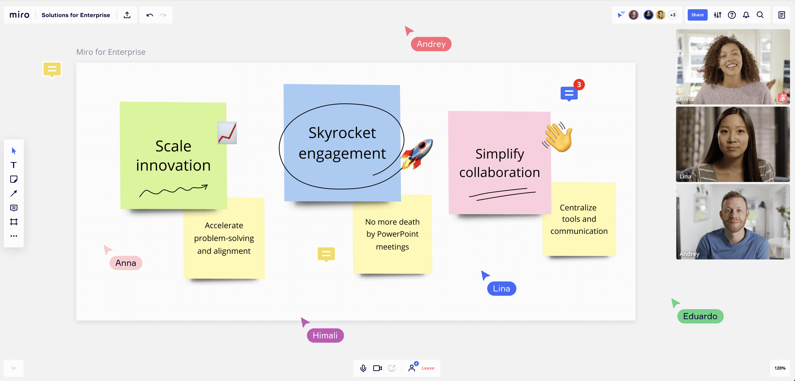
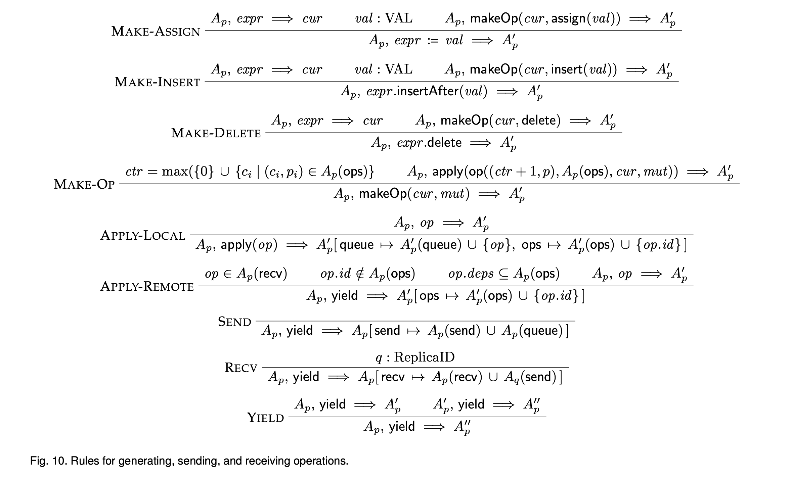
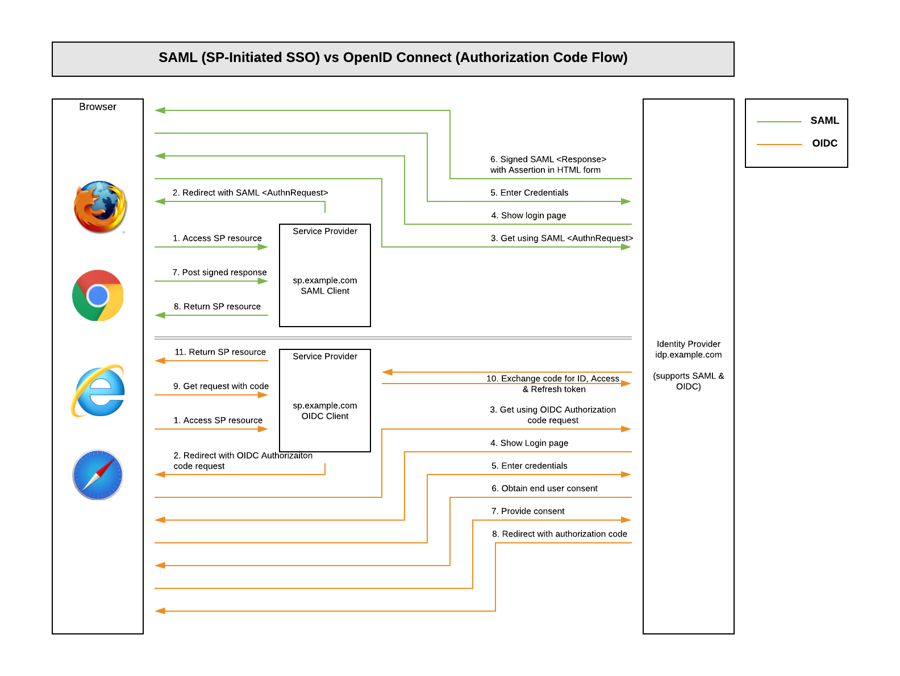
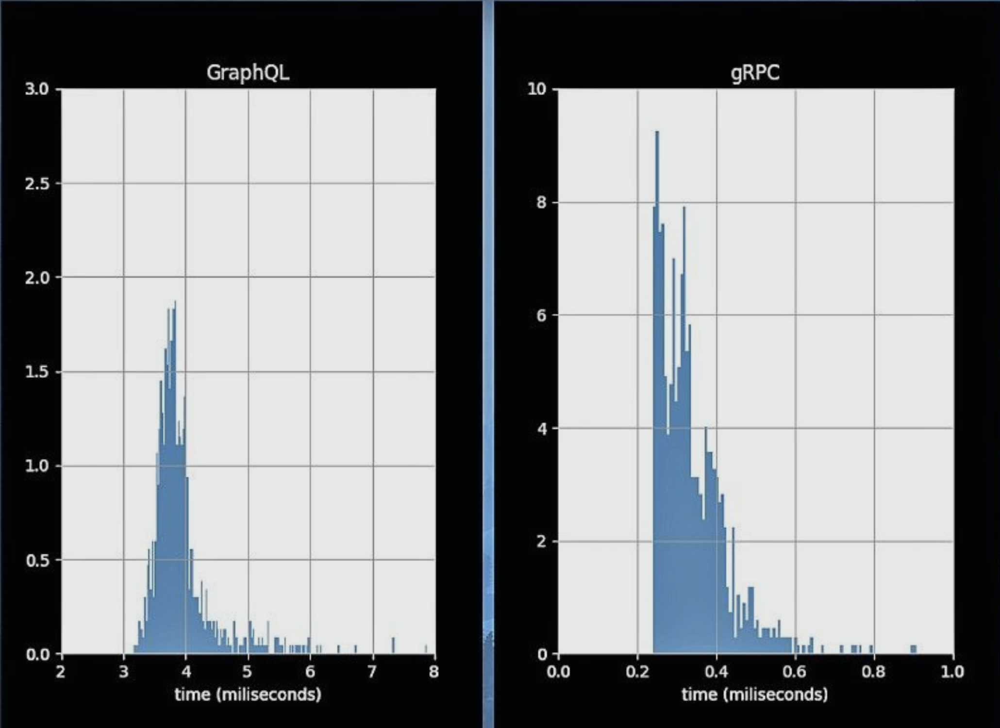
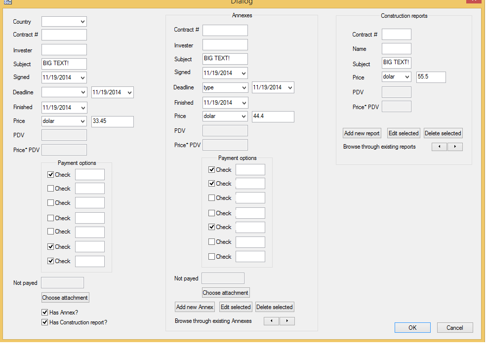

# GraphQL не нужен, если

-----

### GraphQL не нужен, если вам нужно <!-- .element: class="red" -->

- работать с файлами или другими бинарными данными
- многопользовательское редактирование с версионированием (CRDT)
- создать сервис Аутентификации пользователей
- активное межсерверное взаимодействие, требовательное к скорости, памяти и трафику
- стриминг данных
- создавать сложные формы с вариативными инпутами (input-union типы)

-----

### GraphQL не нужен, если вам нужно <!-- .element: class="red" -->

- работать с файлами или другими бинарными данными <!-- .element: class="red" -->
- многопользовательское редактирование с версионированием (CRDT) <!-- .element: class="gray" -->
- создать сервис Аутентификации пользователей <!-- .element: class="gray" -->
- активное межсерверное взаимодействие, требовательное к скорости, памяти и трафику <!-- .element: class="gray" -->
- стриминг данных <!-- .element: class="gray" -->
- создавать сложные формы с вариативными инпутами (input-union типы) <!-- .element: class="gray" -->

-----

 <!-- .element: class="plain" -->

-----

## Работа с файлами или другими бинарными данными <!-- .element: class="red" -->

<ul>
  <li class="fragment">
    GraphQL создавался для типизированных структур, бинарные данные он может передавать только в виде base64 строки. А это увеличивает более чем на 30% исходный размер файла. Тратим сеть, память, процессор. И можем передать файл не более 380MB.
  </li>
  <li class="fragment">
    альтернатива — это микс GraphQL и http-multipart <a href="https://github.com/jaydenseric/graphql-multipart-request-spec">https://github.com/jaydenseric/graphql-multipart-request-spec</a>. Правда это уже "франкенштейн" из GraphQL и Multipart из REST API. Тут много что делает Server, который тюнит транспорт.
  </li>
</ul>

-----

## Работа с файлами или другими бинарными данными <!-- .element: class="green" -->

<ul>
  <li class="fragment">
    <a href="https://github.com/nodkz/conf-talks/tree/master/articles/graphql/fileUploads">используйте S3 signed-urls</a> для загрузки бинарных данных через REST. GraphQL может передавать эти ссылки, но не сами бинарные данные.
  </li>
  <li class="fragment">
    🤗 но никогда не говори никогда: у нас сервис биллинга формирует уведомление со счетом на оплату в PDF, и сервис уведомлений принимает это через GraphQL с файлом в base64 🤗
  </li>
</ul>

-----

### GraphQL не нужен, если вам нужно <!-- .element: class="red" -->

- работать с файлами или другими бинарными данными <!-- .element: class="gray" -->
- многопользовательское редактирование с версионированием (CRDT) <!-- .element: class="red" -->
- создать сервис Аутентификации пользователей <!-- .element: class="gray" -->
- активное межсерверное взаимодействие, требовательное к скорости, памяти и трафику <!-- .element: class="gray" -->
- стриминг данных <!-- .element: class="gray" -->
- создавать сложные формы с вариативными инпутами (input-union типы) <!-- .element: class="gray" -->

-----

 <!-- .element: class="plain" -->

-----

## Многопользовательское редактирование с версионированием (CRDT) <!-- .element: class="red" -->
  
- Conflict-free Replicated Data Types <!-- .element: class="fragment" -->
- Пример: Google docs, онлайн рисовалки <!-- .element: class="fragment" -->
- Еще их называют коллаборативными приложениями <!-- .element: class="fragment" -->
- Это целая наука — разбирать конфликты и синхронизировать состояние между несколькими клиентами и сервером <!-- .element: class="fragment" -->
- Пока проще взять готовые решения (типа yjs, Logux), чем крутить свой велосипед <!-- .element: class="fragment" -->

-----

#### В GraphQL нет алгоритмов разрешения конфликтов  <!-- .element: class="red" -->

 <!-- .element: style="width: 650px" -->

<https://arxiv.org/pdf/1608.03960.pdf>

-----

## По сути,  GraphQL на сервере в рантайме  это простой маппер GraphQL-запроса  в вызов ваших resolve-методов.

-----

### GraphQL не нужен, если вам нужно <!-- .element: class="red" -->

- работать с файлами или другими бинарными данными <!-- .element: class="gray" -->
- многопользовательское редактирование с версионированием (CRDT) <!-- .element: class="gray" -->
- создать сервис Аутентификации пользователей <!-- .element: class="red" -->
- активное межсерверное взаимодействие, требовательное к скорости, памяти и трафику <!-- .element: class="gray" -->
- стриминг данных <!-- .element: class="gray" -->
- создавать сложные формы с вариативными инпутами (input-union типы) <!-- .element: class="gray" -->

-----

 <!-- .element: class="plain" width="800" -->

<https://www.wgcgllc.com/netsuite_sso/>

-----

## Аутентификация <!-- .element: class="red" -->

- ох, сколько копий мы поломали, пытаясь запихнуть ввод логина и пароля через GraphQL <!-- .element: class="fragment" -->
- операция "login" – это Query или Mutation? <!-- .element: class="fragment" -->
- хорошо, а это законно — в резолвере устанавливать куку пользователю? Ведь GraphQL вроде как протоколо-независим <!-- .element: class="fragment" -->
- 🤗 но у нас есть GraphQL-метод "loginAsClient", он устанавливает куку 🤗 <!-- .element: class="fragment" -->
- а еще сброс пароля по ссылке, oidc (oauth2) <!-- .element: class="fragment" -->

-----

- большинство современных систем аутентификации построены поверх HTTP c кучей редиректов <!-- .element: class="red" -->
- работа с HTTP, редиректами, куками – это не про GraphQL <!-- .element: class="fragment red" -->
- и не понятно, зачем вам нужна типизация при вводе логина и пароля от GraphQL <!-- .element: class="fragment red" -->
- проще сервис аутентификации пилить без GraphQL <!-- .element: class="fragment green" -->
- а вот, к примеру, просмотр и редактирование профиля клиента уже вполне хорошо ложится на GraphQL. Тут просто тупая работа с типизированными данными <!-- .element: class="fragment green" -->

-----

### Немного про Индетификацию/Авторизацию <!-- .element: class="gray" -->

- индетифицикация пользователя должна происходить до формирования GraphQL-контекста <!-- .element: class="fragment" -->
- авторизацию (проверку прав), вам придется крутить в каждом резолвере. Это дело могут облегчить мидлвары для резолверов <!-- .element: class="fragment" -->
- "глобальную" авторизацию (админ, не админ) можно проводить на уровне формирования GraphQL-контекста <!-- .element: class="fragment" -->
- рекомендую заводить два GraphQL, отдельно для неавторизированных пользователей, отдельно — для авторизированных <!-- .element: class="fragment green" -->

-----

### GraphQL не нужен, если вам нужно <!-- .element: class="red" -->

- работать с файлами или другими бинарными данными <!-- .element: class="gray" -->
- многопользовательское редактирование с версионированием (CRDT) <!-- .element: class="gray" -->
- создать сервис Аутентификации пользователей <!-- .element: class="gray" -->
- активное межсерверное взаимодействие, требовательное к скорости, памяти и трафику <!-- .element: class="red" -->
- стриминг данных <!-- .element: class="gray" -->
- создавать сложные формы с вариативными инпутами (input-union типы) <!-- .element: class="gray" -->

-----

 <!-- .element: class="plain" width="800" -->

<https://blog.q42.nl/graphql-keep-alive-4379fe1a8b58/>

-----

## Активное межсерверное взаимодействие, требовательное к скорости, памяти и трафику <!-- .element: class="red" -->

- GraphQL использует JSON (в нем нет small int, decimal и пр). Тупо гзипить (бротлить) строку менее эффективно <!-- .element: class="fragment" -->
- Protobuf — отличное решение для межсерверного общения. Имея много разных типов, их можно хорошо сжимать <!-- .element: class="fragment" -->
- Когда в проде крутятся сотни серверов, то бизнесу выгодно занимался сокращением байтов и тактов. И в gRPC/protobuf это уже неплохо отточено <!-- .element: class="fragment" -->
- trade-off: перформанс или прозрачность <!-- .element: class="fragment" -->

-----

gRPC, json-rpc, GraphQL

<https://youtu.be/HMTIUQPAbRs>

-----

### GraphQL не нужен, если вам нужно <!-- .element: class="red" -->

- работать с файлами или другими бинарными данными <!-- .element: class="gray" -->
- многопользовательское редактирование с версионированием (CRDT) <!-- .element: class="gray" -->
- создать сервис Аутентификации пользователей <!-- .element: class="gray" -->
- активное межсерверное взаимодействие, требовательное к скорости, памяти и трафику <!-- .element: class="gray" -->
- стриминг данных <!-- .element: class="red" -->
- создавать сложные формы с вариативными инпутами (input-union типы) <!-- .element: class="gray" -->

-----

 <!-- .element: class="plain" -->

-----

## Стриминг данных <!-- .element: class="red" -->

- хоть в GraphQL есть Subscriptions, которыми удобно пользоваться через Apollo Client или Relay <!-- .element: class="fragment" -->
- то вот стримить, например, котировки для бирж — выглядит сомнительным решением – уж больно много накладных расходов, как по сети, так и по CPU <!-- .element: class="fragment" -->
- стримить видео – это вообще не про GraphQL <!-- .element: class="fragment" -->

-----

### GraphQL не нужен, если вам нужно <!-- .element: class="red" -->

- работать с файлами или другими бинарными данными <!-- .element: class="gray" -->
- многопользовательское редактирование с версионированием (CRDT) <!-- .element: class="gray" -->
- создать сервис Аутентификации пользователей <!-- .element: class="gray" -->
- активное межсерверное взаимодействие, требовательное к скорости, памяти и трафику <!-- .element: class="gray" -->
- стриминг данных <!-- .element: class="gray" -->
- создавать сложные формы с вариативными инпутами (input-union типы) <!-- .element: class="red" -->

-----

 <!-- .element: class="plain" -->

-----

## Сложные формы с вариативными инпутами (union типы) <!-- .element: class="red" -->
  
<ul>
  <li class="fragment">
    для какого-то аргумента вы хотите передать строку или сложный объект. Передать такой аргумент можно, используя тип JSON, но у вас не будет статической типизации. </li>
  <li class="fragment">
    в GraphQL нет InputUnionType. <a href="https://github.com/graphql/graphql-spec/blob/main/rfcs/InputUnion.md">Спецификация</a> по ним уже обсуждается года три. Когда она выйдет в свет, то скорее всего этот пункт станет неактуальным.
  </li>
</ul>

-----

- например, в Контуре есть команда, у которой 2000 сложных форм и там используют DTO с кодогенерацией — такой подход в разы удобнее и безопаснее 
- правда можно накостылить стороннюю валидацию JSON типов в GraphQL, но с ней не будет взаимодействовать большинство существующего инструментария – кодогенерация, линтинг, автоподстановка полей в GraphiQL.
