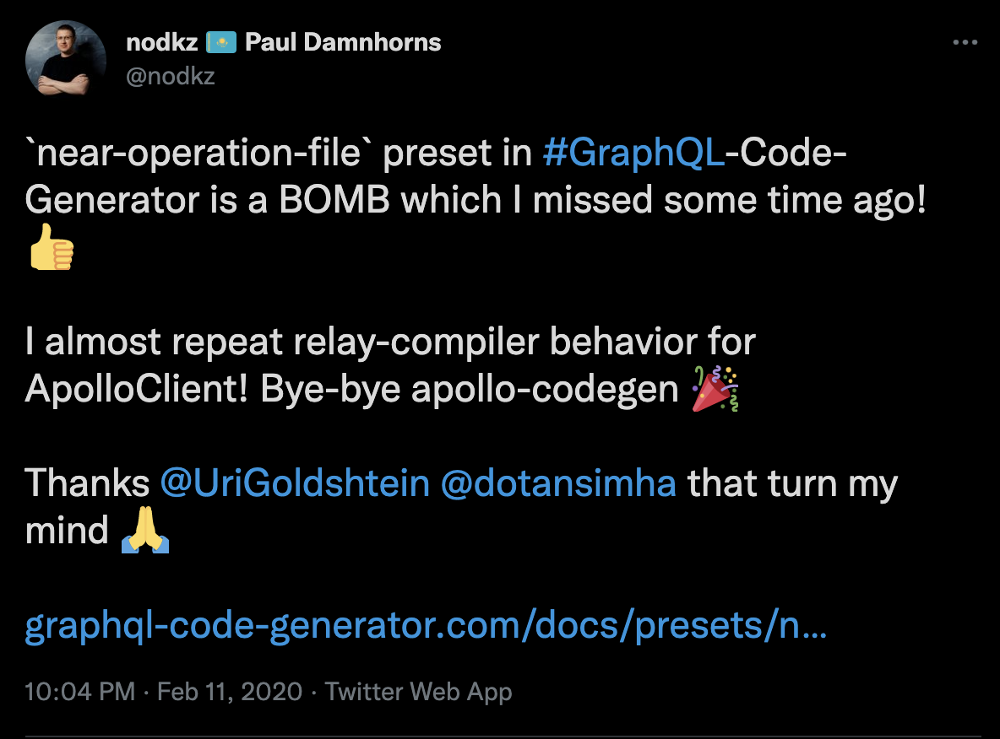

# Пару слов  о героях пьесы

-----

## GraphQL <!-- .element: class="green" -->

язык запросов, для получения данных с бэкенда

-----

## Не знаете, что такое GraphQL? <!-- .element: class="red" -->

Полина шикарно за 40 минут все разложила по полочкам.
<https://youtu.be/wko-uoILG_w>

-----

## Is GraphQL enterprise ready? <!-- .element: class="red" -->

- GraphQL Foundation under Linux Foundation <!-- .element: class="fragment" -->
- Stable spec <!-- .element: class="fragment" -->
- FAANG, Github, PayPal, KLM и тысячи других<!-- .element: class="fragment" -->

-----

Я сейчас консультирую норвежскую софтверную компанию для энергетического и индустриального секторов.

И там GraphQL жестко используют. <!-- .element: class="fragment orange" -->

А они уж намного консервативнее, чем финтех. <!-- .element: class="fragment red" -->

-----

## ApolloClient 3 <!-- .element: class="green" -->

стейт-менеджер для хранения и обновления данных полученных через GraphQL

-----

## 30% компаний <!-- .element: class="orange" -->

### у которых GraphQL на бэке,  используют ApolloClient на фронте

-----

[17 августа](https://www.apollographql.com/blog/announcement/apollo-raises-130m-to-pioneer-the-graph-for-app-developers/)

### Apollo raises $130M, now valued at over $1.5B 🦄

-----

### Про аполло клиент, и как я хаю редакс

<https://youtu.be/5h7zX45YPuQ>

-----

## GraphQL Code Generator <!-- .element: class="green" -->

утилита для генерации хуков и тайп дефинишенов из `.graphql`-файлов

-----

<https://www.graphql-code-generator.com/>

#### Если вы его ни разу не пробовали,  и все еще на темплейт литерале gql  – то много потеряли и в докладе вы это увидите. <!-- .element: class="fragment" -->

-----

### В феврале 2020 с Дотаном мы довели его  до состояния relay-compiler

 <!-- .element: width="600" class="plain" -->

https://github.com/nodkz/example-apollo2/pull/3

-----

## TypeScript <!-- .element: class="green" -->

JavaScript на стероидах, дает возможность проводить статический анализ кода

(какой-никакой) <!-- .element: class="red fragment" -->

-----

#### Илья накидывает на тайпскрипт.

<https://youtu.be/H9-F8uhKMRk>

Но где его пирамида или цифры врут, я понять не могу. <!-- .element: class="red fragment" -->

-----

## Eslint <!-- .element: class="green" -->

проверяет код в проекте на соответствие code style.

-----

### Плюс плагины eslint

- prettier
- @graphql-eslint/eslint-plugin

-----

### TypeScript и eslint отлично тренирует джунов, <!-- .element: class="orange" -->

### и по моим скромным оценкам с потолка, <!-- .element: class="gray" -->

### ускоряет CodeReview минимум на 80%. <!-- .element: class="orange" -->

-----

## Второстепенные роли <!-- .element: class="green" -->

- VSCode – бесплатный и навернутый редактор кода с плагином 'graphql.vscode-graphql' <!-- .element: class="fragment" -->
- NextJS – фреймворк для React, который решает головную боль роутингом, билдом приложения и его рантаймом <!-- .element: class="fragment" -->
- Ant.design – живой UI-kit с приятными компонентами <!-- .element: class="fragment" -->
